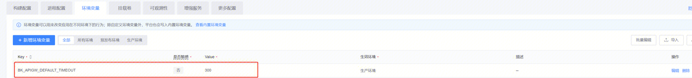
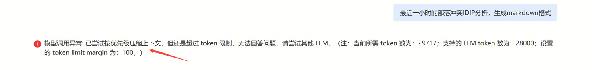
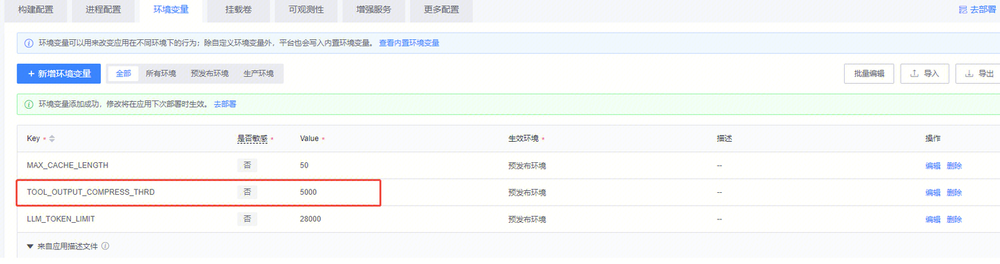
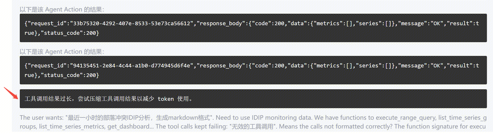
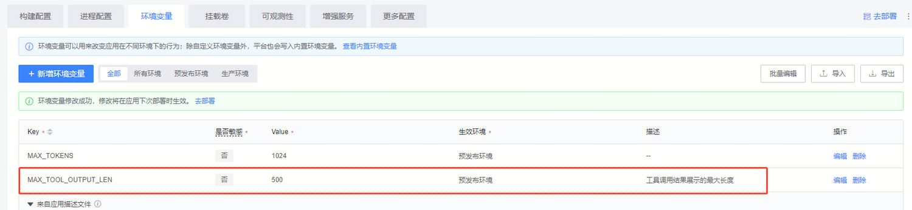
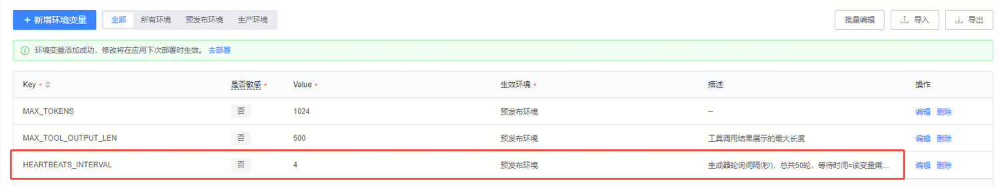
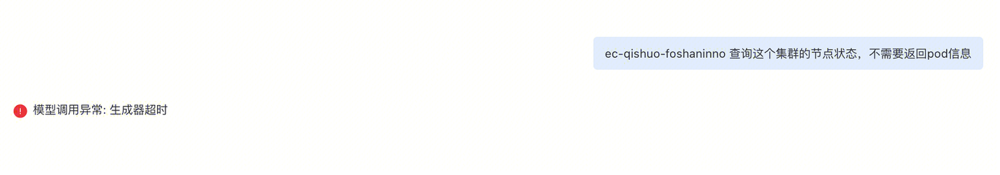
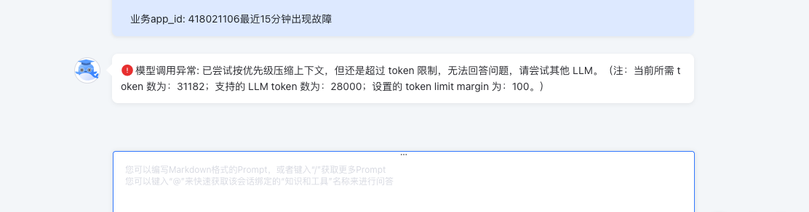
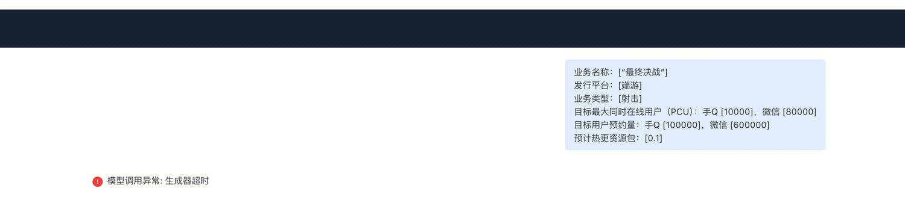

# 常见问题

## 智能体开发常见问题

Q： 本地开发报错日志没法显示

A： 可以尝试配置以下local_settings.py，这个文件会覆盖默认的django settings

```
from blueapps.conf.log import get_logging_config_dict

LOG_DIR_PREFIX = "./logs"
LOGGING = get_logging_config_dict(locals())
LOGGING["loggers"]["root"]["handlers"] = ["root", "console"]
```

Q： 3.2 mysql_config not found


A：安装mysql-devel和gcc
```
yum install mysql-devel gcc
```


Q： 需要修改网关默认的超时时间

A： 如人手修改了智能体网关的超时时间，重新部署后发现配置又被更改回去。
可以配置以下环境变量，静态设置网关超时时间



然后重新发布一下这个智能体，应该网关的超时时间就能固定为300了。

Q： 如何查看我的Agent执行日志

A： 可以在任意位置添加一下配置项，打开agent的执行日志

```
from langchain.globals import set_debug, set_verbose

set_verbose(True)
set_debug(True)
```

## 环境变量相关问题

Q：智能体相关环境变量有哪些

A：智能体相关环境变量如下：

| 变量名 | 默认值 | 描述 | 适用场景 |
|:---|:---:|:---:|---:|
| LLM_TOKEN_LIMIT | 36000 | LLM最大Token限制，调大不容易token超限，不容易触发知识库压缩和工具压缩，最大值需要根据模型支持的上下文长度决定。 | 智能体提示超过最大上下文限制，可根据模型支持的最大上下文调大该环境变量，注意修改完环境变量需要重新进行部署。 |
| TOOL_OUTPUT_COMPRESS_THRD | 5000 | 工具调用结果压缩阈值，调大该环境变量不容易触发工具压缩，最大值可参考模型的最大上下文长度。 | 出现“工具调用结果过长，尝试压缩工具调用结果以减少 token 使用”的提示，且压缩结果为无效或者不准确，希望不进行工具压缩。 |
| MAX_TOOL_OUTPUT_LEN | 500 | 	工具调用结果前端的展示长度，超过该长度的结果会被截断，但后端的结果不会被截断。 | 工具调用结果有（内容过长，已截断）的提示，但用户希望看到更多工具结果，可调大该环境变量显示更多结果。 |
| HEARTBEATS_INTERVAL | 4 | 生成器轮询间隔(秒)，总共轮询50轮，生成器最大等待时间=该变量乘以50，默认是4×50=200秒，等待生成内容超过这个时间则会有“生成器超时”的报错。 | 使用智能体出现“生成器超时”的异常提示，可调大该环境变量以增加生成器等待时间。 |
| MAX_CACHE_LENGTH | 80 | 流式输出缓存最大长度，新版的deepseek-v3、hunyuan等非思考模型在工具调用之前会输出一些文字说明，如果工具调用之前模型会输出很多文字，需要把这个缓存调大。 | 使用 deepseek-v3 出现多个思考的异常格式问题，可调大该环境变量（可先尝试调到100左右），调的太大可能会影响首token输出的时间。 |
| MAX_TOKENS | 1024 | 该环境变量决定LLM最大回复的长度，默认为1024。 | 需要控制模型最大回复长度的场景。 |

Q：最大上下文长度如何修改

A：最大上下文长度：LLM_TOKEN_LIMIT（默认：36000）


LLM最大Token限制，调大不容易token超限，不容易触发知识库压缩和工具压缩，最大值需要根据模型支持的上下文长度决定。

**适用场景：**

智能体提示超过最大上下文限制，可根据模型支持的最大上下文调大该环境变量，注意修改完环境变量需要重新进行部署



Q：工具输出压缩阈值如何修改

A：工具输出压缩阈值：TOOL_OUTPUT_COMPRESS_THRD（默认：5000）



工具调用结果压缩阈值，调大该环境变量不容易触发工具压缩，最大值可参考模型的最大上下文长度。

**适用场景：**

出现 "工具调用结果过长，尝试压缩工具调用结果以减少 token 使用" 的提示，且压缩结果为无效或者不准确，希望不进行工具压缩



Q：工具调用结果展示的最大长度如何修改

A：工具调用结果展示的最大长度：MAX_TOOL_OUTPUT_LEN（默认：500）



工具调用结果前端的展示长度，超过该长度的结果会被截断，但后端的结果不会被截断。

**适用场景：**

工具调用结果有（内容过长，已截断）的提示，但用户希望看到更多工具结果，可调大该环境变量显示更多结果

Q：生成器轮询间隔时间如何修改

A：生成器轮询间隔时间(秒)：HEARTBEATS_INTERVAL（默认：4）



生成器轮询间隔(秒)，总共轮询50轮，生成器最大等待时间=该变量乘以50，默认是4×50=200秒，等待生成内容超过这个时间则会有 "生成器超时" 的报错。

**适用场景：**

使用智能体出现“生成器超时”的异常提示，可调大该环境变量以增加生成器等待时间



Q：流式输出缓存最大长度如何修改

A：流式输出缓存最大长度：MAX_CACHE_LENGTH（默认：80）


新版的deepseek-v3，hunyuan等非思考模型在工具调用之前会输出一些文字说明，目前是以思考内容的形式呈现。

但如果工具调用之前模型会输出很多文字，需要把这个缓存调大，以保证调用工具前的输出都放在思考内容里，否则可能会有格式问题。

**适用场景：**

使用 deepseek-v3 出现多个思考的异常格式问题，可调大该环境变量（可先尝试调到100左右），调的太大可能会影响首token输出的时间

Q：模型最大回复长度如何修改

A：模型最大回复长度：MAX_TOKENS（默认：1024）


该环境变量决定LLM最大回复的长度，默认为1024。

**适用场景：**

需要控制模型最大回复长度的场景

## 常见使用问题

Q：上下文token数超限怎么解决？



A：目前已提供给用户最大token数的配置参数，后续会继续优化压缩token

Q：工具调用的结果压缩有时会把可用的结果判断为无效，尤其是并行调用多个工具的情况，导致重复调用工具从而使上下文过长。实验表明，思考模型压缩效果优于非思考模型，非思考模型中，SRE-32B 和 qwen3-nothinking 表现优于 hunyuan系列和 deepseek-v3。

A：目前优化了压缩总结的prompt，并在prompt里告诉大模型总结失败则提醒用户，避免重复调用，但调用多个工具的压缩效果还需改进。

Q： 在知识库知识数量很大时，有时会出现召回许多和提问问题无关的知识，相关的知识排到了topk以后的位置，导致无法根据知识库回答。

A： 目前建议用户调整topk和重排序方法来调整召回效果，重排序方法和分块方法可能还可以优化。

Q：对于包含表格类型的知识无法进行合理分块，导致分块不完整，无法引用到完整的知识。

A：目前建议用户调整topk和重排序方法来调整召回效果，重排序方法和分块方法可能还可以优化。

Q：目前发一个query会调用大模型12次，分别是：对 chat history 进行总结，并跟 query 进行拼接（1次）使用LLM并发进行query和召回文档相关性判断（10次）（分别对top10个文档进行判断）agent调用大模型进行回答（1次）另外在token超限的情况，还会并发调用LLM进行压缩总结，可能不止12次调用

A：目前建议用户通过调整topk值和切换重排序方法（换成原始排序）来减少LLM并发调用量，后续可能可以考虑将文档的LLM相关性判断由每个变成每五个

Q：gpt-oss看起来喜欢在思考过程中先复述一遍用户的话，然后再回答，将系统提示词暴露在思考过程中。

A：通过修改提示词优化该现象，待合到平台上测试。

Q：在需要获取实时信息的时候没有调用工具，而是使用知识库进行回答。

A：目前已优化提示词，帮助大模型更智能的进行资源选择的决策。

Q：qwen3调用MCP工具出错

A：目前已升级为qwen3-235B

Q：gptoss-120b 调用工具生成参数不稳定，改用原生function calling调用工具会有responded和调用结果，导致会有两个回答

A：目前已通过stream流的适配，支持gptoss-120b原生function calling

Q：生成器超时



A：目前加了可调整的配置

Q：MCP工具调用失败应该把报错信息显示出来，并返回给大模型，让大模型理解错误原因并在下次调用时修改正确

A：已加上

Q：提示词能否添加版本管理功能

A：暂无该功能

Q：能否添加一个隐藏思考内容和参考文档的开关

A：暂无该功能

Q：使用大模型出现不遵循角色设定的提示词的情况

A： 目前把预设角色放在了系统提示词中，提升看看后续遵循效果

Q：企微聊天机器人选择空间没有看到可以绑定的空间

A：按如下图打开按钮


