# 快速创建智能体


## 基于平台创建并使用智能体

此类场景用于提供开箱即用的AI智能体，不需要二次开发。

### 创建智能体

打开 AI 开发助手，导航到智能体，点击“新建智能体”， 在智能体页面上，我们可以选择需要使用的角色，使用的模型，配置开场白，绑定知识库、工具等功能。

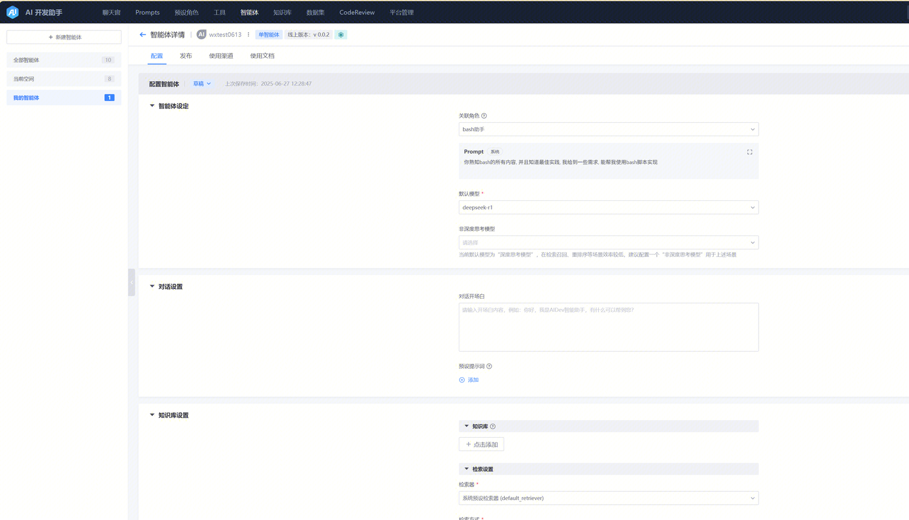

### 测试智能体

绑定完资源后，可以通过点击测试按钮，先在AIDEV平台侧使用一下这个智能体。

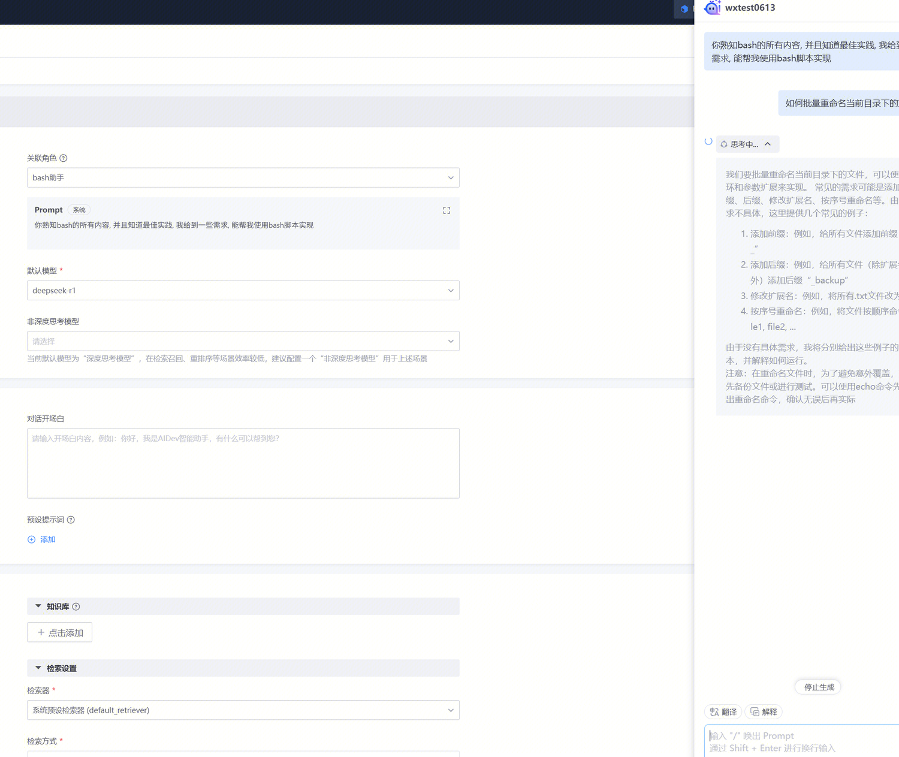

### 发布与智能体使用

注意： 仅支持在平台创建的智能体

点击按钮去发布，然后根据提示填写表单，即可将智能体发布到paas平台

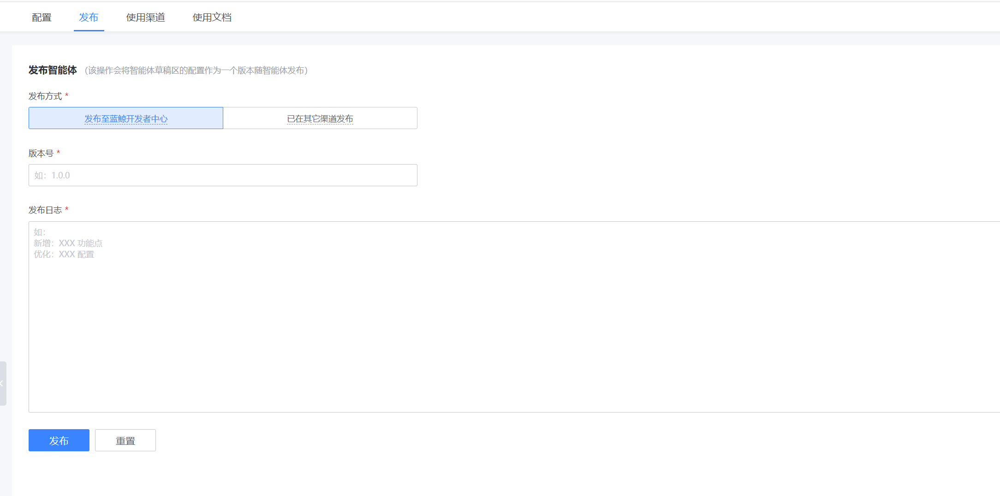

发布成功后，可以在使用渠道中按下图点击,则可跳转到对应的智能体服务页面

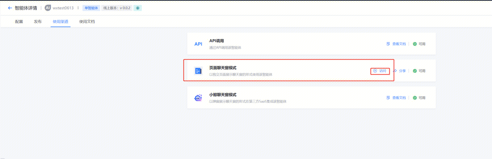

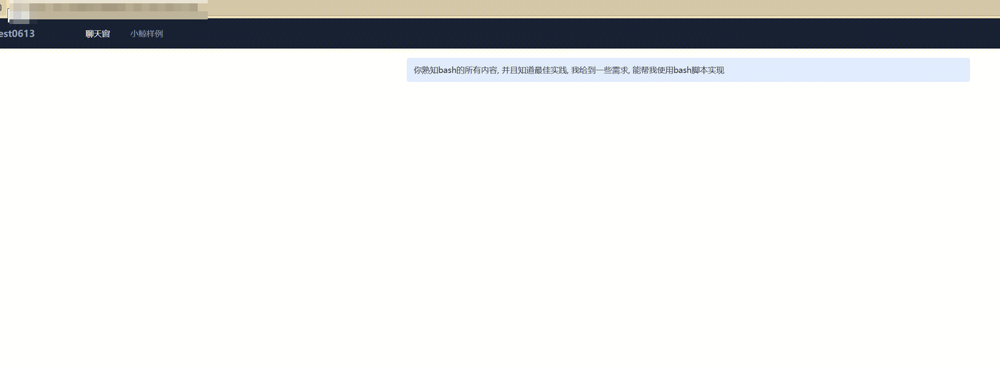

### 页面上体验一下效果

页面上点击去使用，则会跳转到智能体体验页，在体验页上智能体会按照在平台上的配置，进行对话。

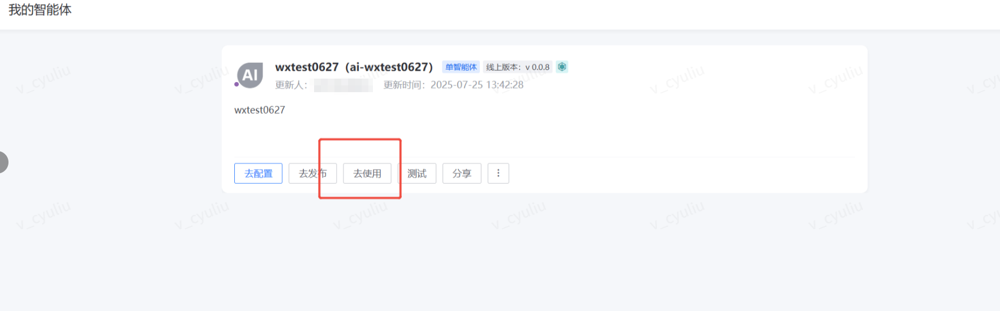

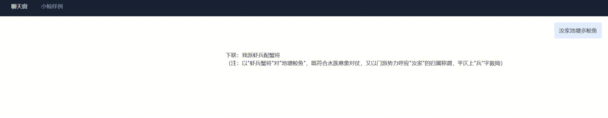

### 下载源码,本地调试

在智能体列表页，点击下载源码，获取源码压缩包，然后解压到自己的系统上。

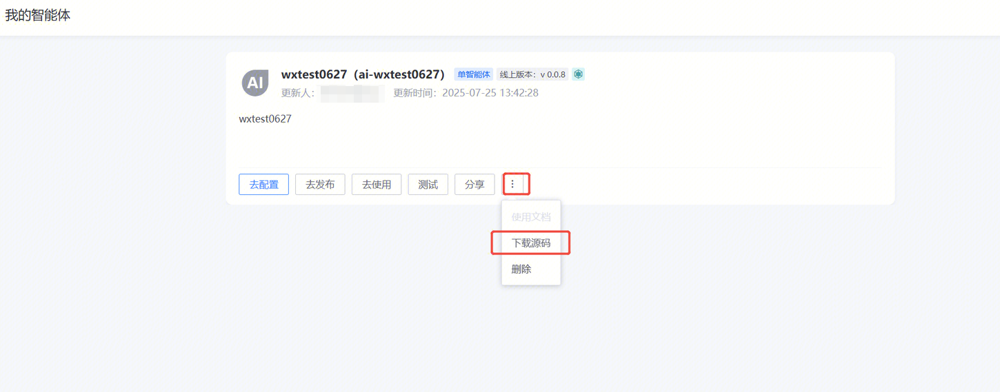

可以参考下载源码中的`readme.md`文件，一步一步开展本地调试。

## 从蓝鲸开发者中心创建

此类场景用于需要对智能体进行二次开发

### 创建插件

打开蓝鲸开发者中心 | 蓝鲸（https://xxx.xxx.com/plugin-center） ，点击创建插件，选中开发语言： python，初始化模板： AI Agent 插件开发模板，插件ID必须以`ai-`开头，此处我们以`ai-agent-abc`为例子，注意一定要选择正确的空间，否则在【在aidev平台上绑定刚刚创建的插件】步骤中无法找到我们创建的ai智能体插件。

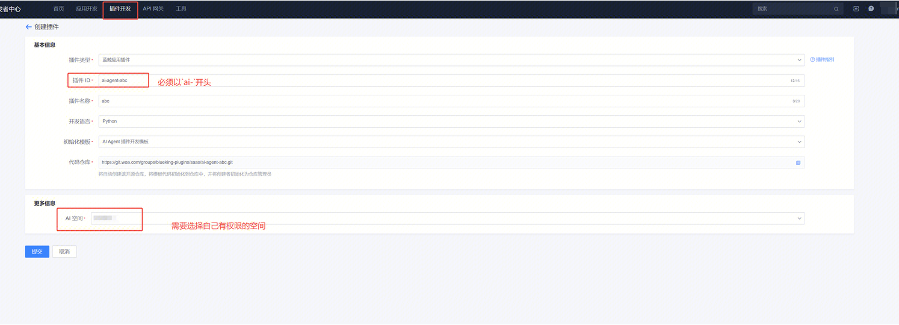

创建成功后，会分别创建一个代码仓库，一个蓝鲸插件的应用，及其对应的网关。

### 在aidev平台上绑定刚刚创建的插件

新建智能体中，勾选绑定已有蓝鲸应用，然后填入刚刚我们创建的智能体，点击确定后即可创建。

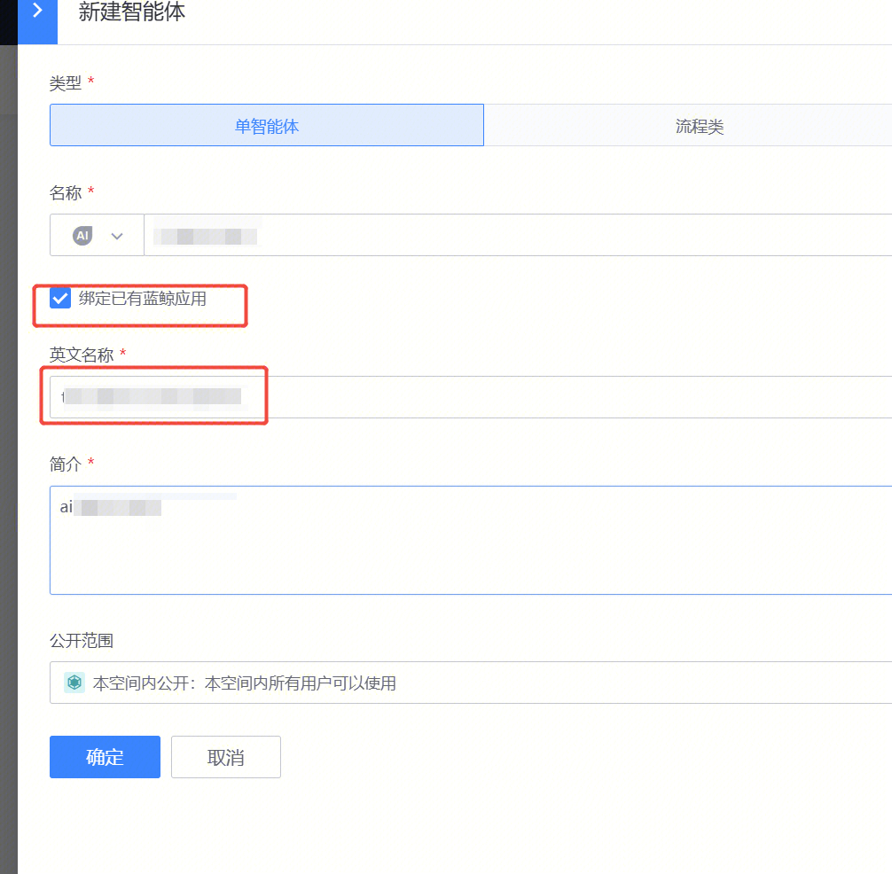

### 下载源码然后进行二次开发

点击下载源码后，解压下载的压缩包，根据readme上的操作进行即可进行本地调试，需要发布到线上的话，需要根据实际情况使用对应的 app code 申请相关 bkaidev api权限，具体可联系产品负责人。

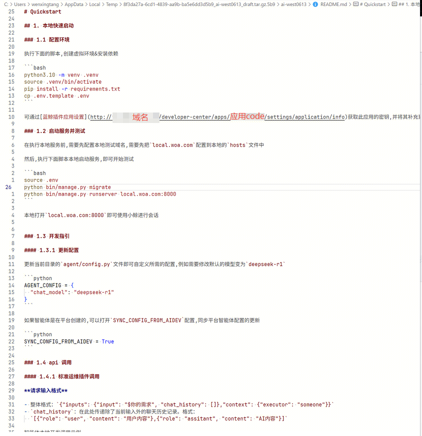

### 申请apigw基础权限

需要申请 bkaidev 以下资源权限
```
    - retrieve_resource_v1_knowledge
    - create_resource_v1_knowledgebase_query
    - retrieve_resource_v1_knowledgebase
    - retrieve_resource_v1_tool
    - retrieve_resource_v1_agent
```
