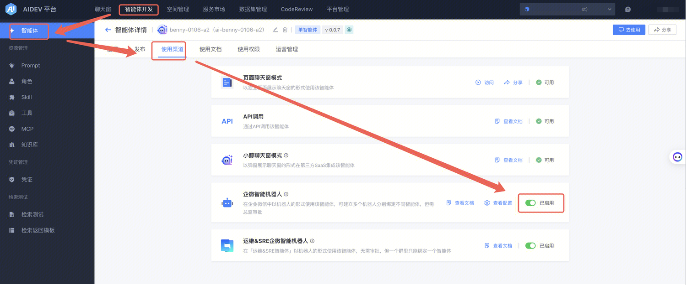
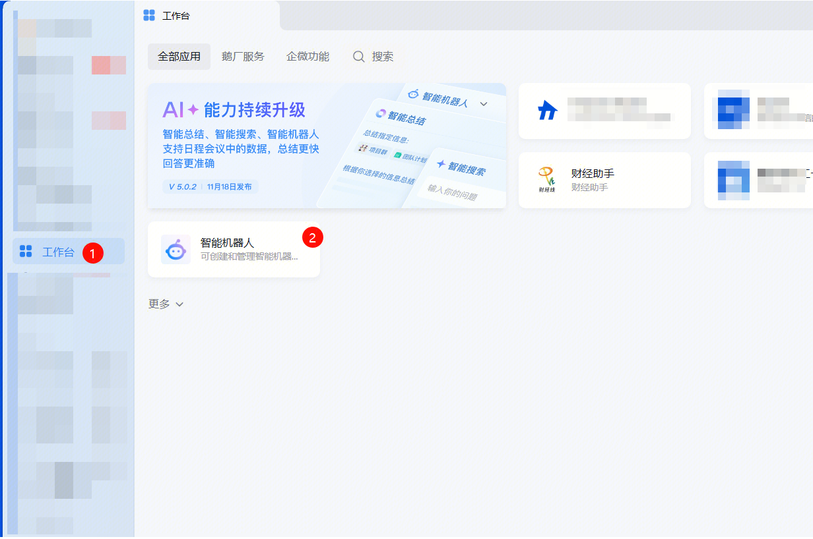
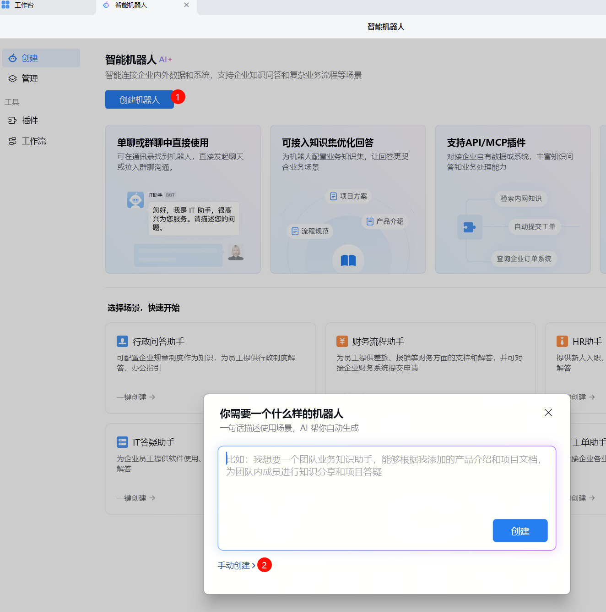
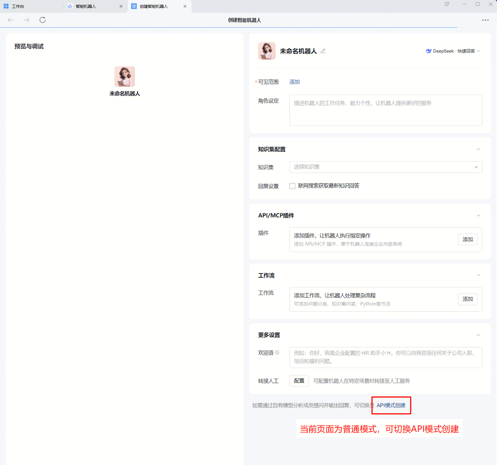
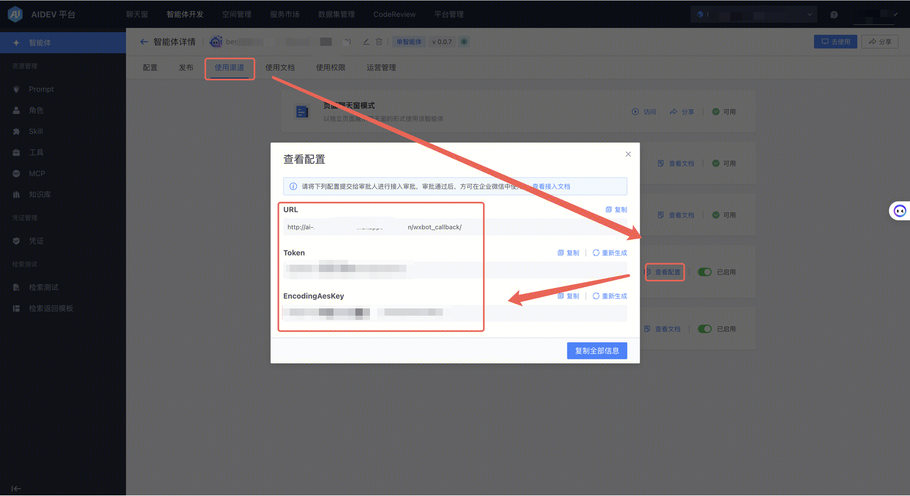
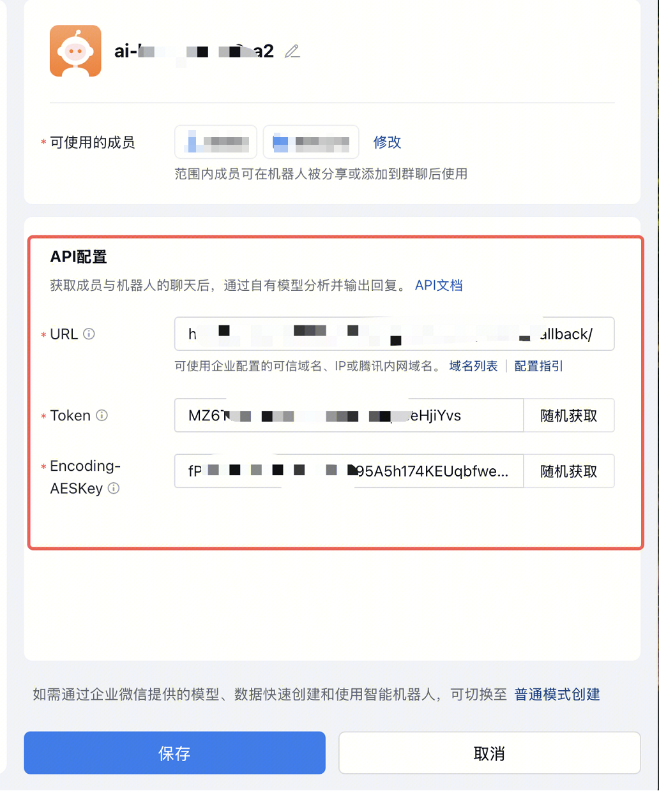

# 企业微信智能机器人

> 摘要：本文档介绍了企业微信智能机器人申请流程，个人创建的智能机器人可见范围的成员不能默认在通讯录看到，要通过分享或添加到群聊才能使用。

##  初始化

在智能体使用渠道打开「企微智能机器人」渠道

## 个人创建

[https://open.work.weixin.qq.com/help2/pc/21663?person_id=1&searchData=&vid=1688850561601079&deviceid=b7fd2c3f-da31-4272-b084-5c069fcd3476&version=5.0.7.6005&platform=win](https://open.work.weixin.qq.com/help2/pc/21663?person_id=1&searchData=&vid=1688850561601079&deviceid=b7fd2c3f-da31-4272-b084-5c069fcd3476&version=5.0.7.6005&platform=win)

个人创建的智能机器人可见范围的成员不能默认在通讯录看到，要通过分享或添加到群聊才能使用，同时也需要将企业微信更新至 **5.0.6.99829** 及以上版本

### 创建机器人

1. 打开企业微信->工作台->智能机器人->创建机器人->可自由选择普通模式使用企微自带模型或者API模式

### 将智能体渠道配置复制至企业微信

