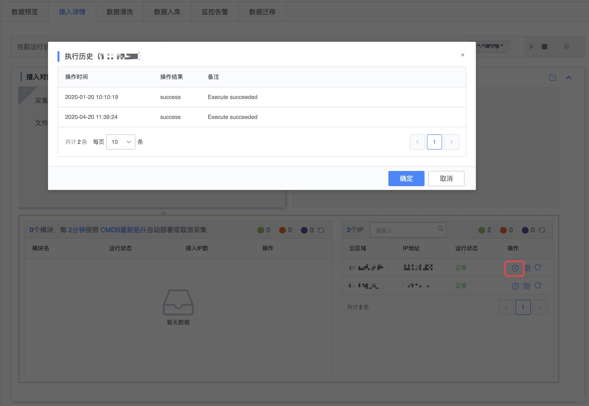

## 日志采集常见问题

### 无数据上报原因排查

* 确认日志文件有数据更新
* 确认日志回滚不是直接被清空
* 日志结尾需要换行

### 上报 HDFS 文件

> 目前数据集成的采集方式中没有直接对接 HDFS，可将 HDFS 以文件的方式通过 **日志采集** 上报。

HDFS 下载文件默认先创建临时文件，再重命名文件到目标文件名，为系统的 MOVE 事件。 

针对 MOVE 事件，采集器默认不采集存量数据。

建议下载文件后, cp 复制到目标采集路径下。

### Nginx 使用 logrotate 日志切分

当 Nginx 使用 logrotate 切分日志时，配置需要使用 create，不支持 copytruncate。

### 接入异常原因排查

点击异常 IP 执行历史，查看最近的执行历史信息。

