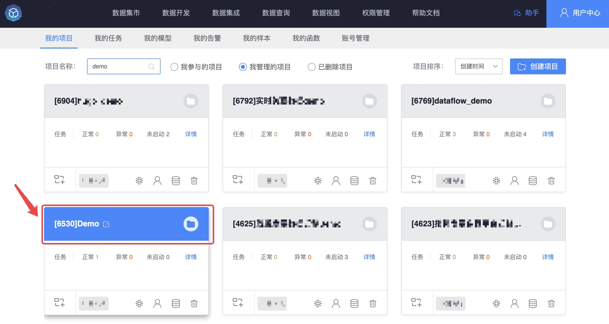
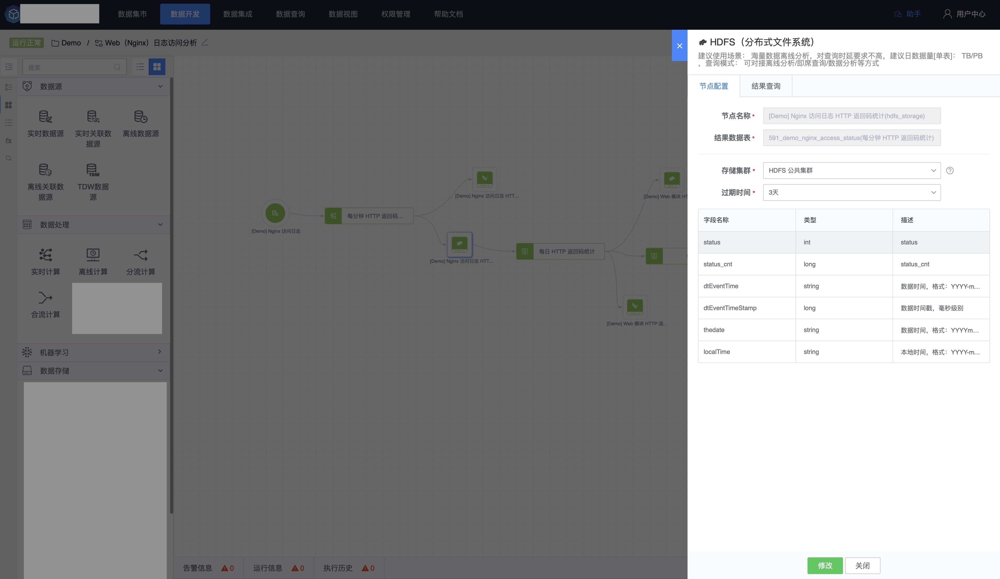
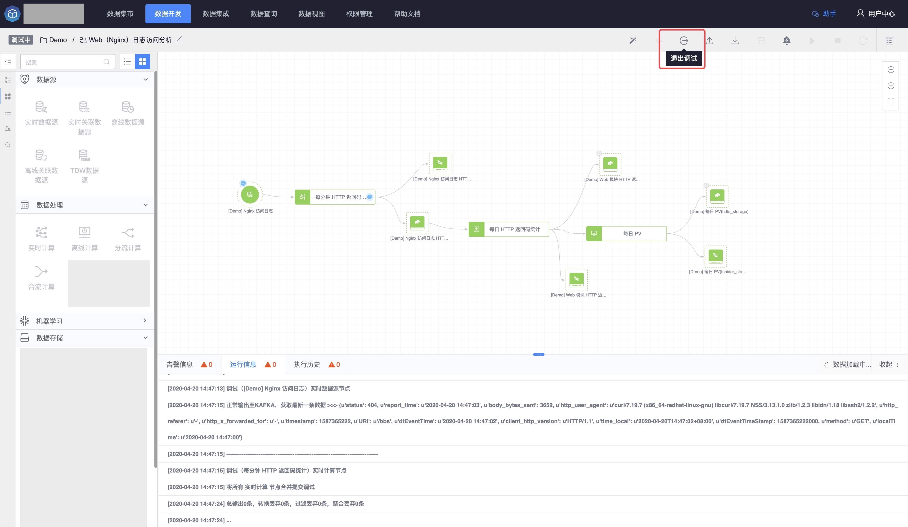
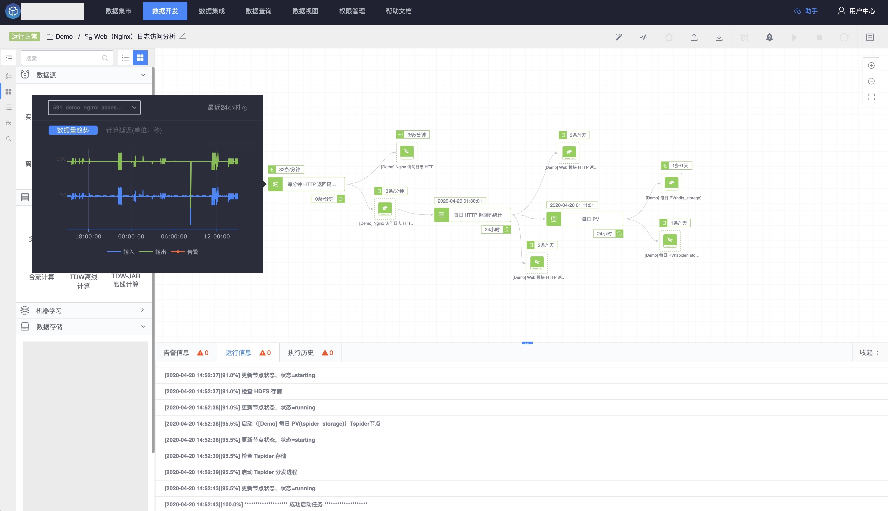
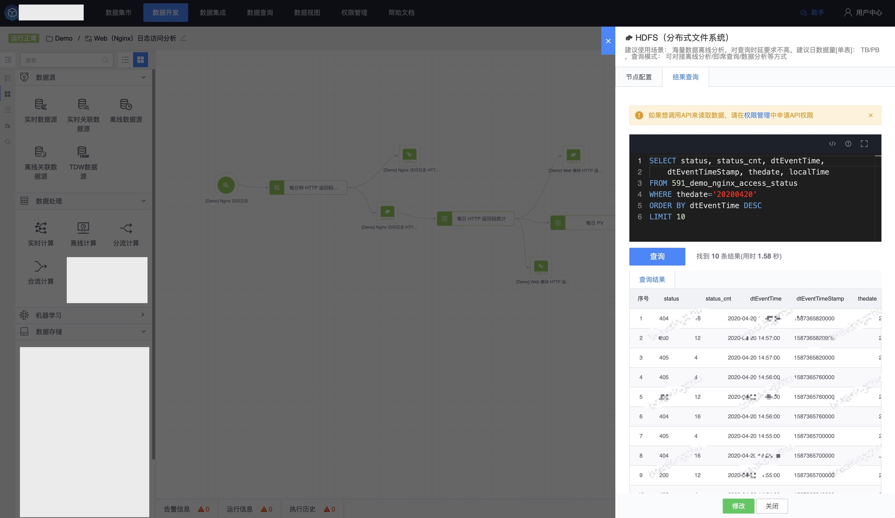

# 10 分钟玩转大数据开发

2003 年 Google 发布了 Google FS、MapReduce、BigTable 三篇论文，带领大家进入大数据时代，在 Storm，Spark 等大数据计算框架出现之后，海量数据的并行计算有个新的解决方案，新的技术伴随着更高的要求，大数据计算框架自身只有一些基础的处理逻辑，需要数据使用方自己构建自定义处理函数，再者计算框架支持的编程模型支持有限像 Java，Scala 高阶语言等，不同的数据形态还需要不同计算框架处理，对于非大数据开发人员来说学习成本非常高，如何快速玩转大数据开发呢？

本节会讲解从【创建项目】->【创建任务】->【选择数据源】->【数据处理】->【数据存储】->【数据查询】的完整的数据开发案例。

### 第一步：创建项目

在平台中，所有复杂的数据开发都是在项目内完成的，"项目"是平台中的一个概念，主要作用是申请业务的数据，做数据开发和挖掘，并管理多个数据开发任务，目前版本项目中角色有两个类：项目管理员和数据开发员（项目成员。

项目管理员：具有该项目的所有操作权限，包括项目信息管理、人员管理、资源管理、数据开发。
数据开发员：具有该项目内的任务管理权限，包括实时计算、离线计算、数据视图、模型的开发和调试。

### 第二步：创建任务

创建完项目之后，可以在项目创建一个任务，目前有两种方式创建任务，一种是在用户中心，【我的任务】中创建任务。

另一种是在【数据开发】的左侧任务列表中创建任务。

创建任务之后，要进入数据开发，可以根据左侧的组件库，在数据开发 IDE 画布中构建自己的数据处理流程。

### 第三步：选择数据源

大数据开发所需要的组件库，分为三类：数据源、数据处理和数据存储

数据源中有三类数据源：

> 实时数据源：清洗、实时计算的结果数据，数据延迟低，可用于分钟级别的实时统计计算。

> 离线数据源：落地到 HDFS（分布式文件系统）的数据，可用于小时级以上的离线统计计算。

> 关联数据源：在 KV 存储的状态数据，可用作维度表与实时数据 join。

在本节案例中选择一个实时数据源，作为数据开发的起点。点击【实时数据】，在数据权限范围之内选择一个业务和实时数据表。同时获取到最新的一条数据内容。

### 第四步：数据处理

数据源选择之后，开始进行数据处理，大数据处理目前有多种开源的计算框架，像 Spark、Flink 等，他们功能强大，可以处理海量的数据，但是每个框架都有自己的编程模型和支持的编程语言，像 Java，Scala 等高级语言，对于急需数据处理能力的用户来说，实现一个简易的数据处理程序，有很高的学习成本和使用门槛。

平台提供了基于 SQL 语法的编程模型，可以屏蔽各种框架的复杂模型，用户只需要关注具体处理逻辑的表达，让只要会 SQL 的人就可以玩转大数据处理。

平台目前支持多种大数据处理方式：

> 实时计算 SQL：基于流式处理的实时计算_支持秒级和分钟级的计算

> 离线计算 SQL：基于批处理的离线计算_支持小时级和天级的计算

> 合流计算：支持表结构相同的多个数据源节点合并成为一个结果数据表

> 分流计算：支持一个数据源根据业务维度切分成若干数据结构相同的结果数据表

> AI模型：基于机器学习等算法自定义构建的算法模型

在实时数据源之后，选择链接一个实时计算 SQL 节点，节点配置包括两部分：SQL 计算逻辑编辑区和节点信息配置，左侧的 SQL 编辑区，支持常用的 SQL 函数，嵌套以及关联等 SQL 语法，具体 SQL 语法请参考 BKSQL 函数介绍。

节点信息配置，主要是输入数据和输出数据，以及计算窗口类型，目前支持滚动窗口、滑动窗口和累加窗口，每个窗口还有统计频率和延迟统计时间（可以尽量避免数据乱序造成的数据丢失）

### 第五步：数据存储

数据源和数据处理配置完成后，需要将处理后的结果数据指定保存介质，平台目前支持多种数据存储系统：

> 关系型数据库：MySQL

> 时序型数据库：VictoriaMetrics

> 分析型存储：ElasticSearch

> 全文检索：ElasticSearch

> 分布式文件系统：HDFS

> 消息队列：Kafka、Redis

本节案例选择关系型存储 HDFS 作为最终数据存储节点。

### 第六步：调试与启动

数据源，数据处理和数据存储都配置完成后，一个基本数据开发流水线（DataFlow）就搞定了，接下来需要验证配置的这个流水中计算逻辑是否符合预期，点击右上角【调试】，【运行信息】中会显示本次调试的任务信息。**注意：目前仅支持实时计算任务的调试。**

调试如果可以顺利通过的话，下一步可以点击【启动】运行整个任务了，DataFlow 是一个一直运行的任务，如果任务执行有失败，会有红色显示警告⚠️。

任务启动之后，正在运行的任务是可以查询实时数据流监控的，包括离线计算节点中的调度状态信息和实时计算节点的数据处理趋势信息、延时信息以及数据丢失情况。

### 第七步：数据查询

数据开发任务启动之后，需要用户验证结果数据是否符合预期，数据查询功能可以达到这个目的，通过业务筛选结果数据表，并选择数据保存的存储

结束语，恭喜你完成一个大数据开发的简单流程，如果你的数据量很大，那么建议你向平台申请自己项目的独立计算集群和存储计算，如果你想了解平台中详细的功能介绍，请阅读平台功能详解章节。

