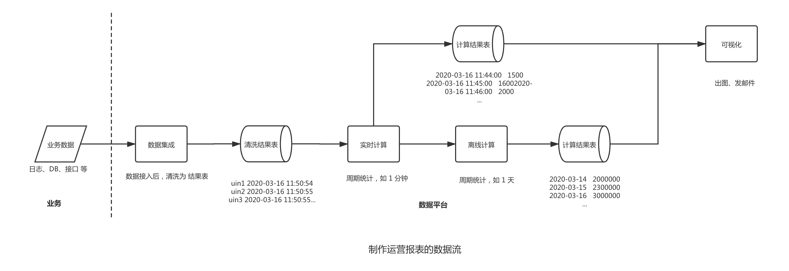
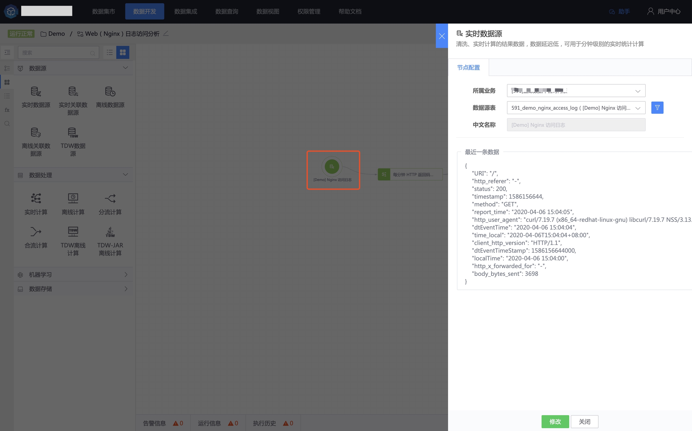
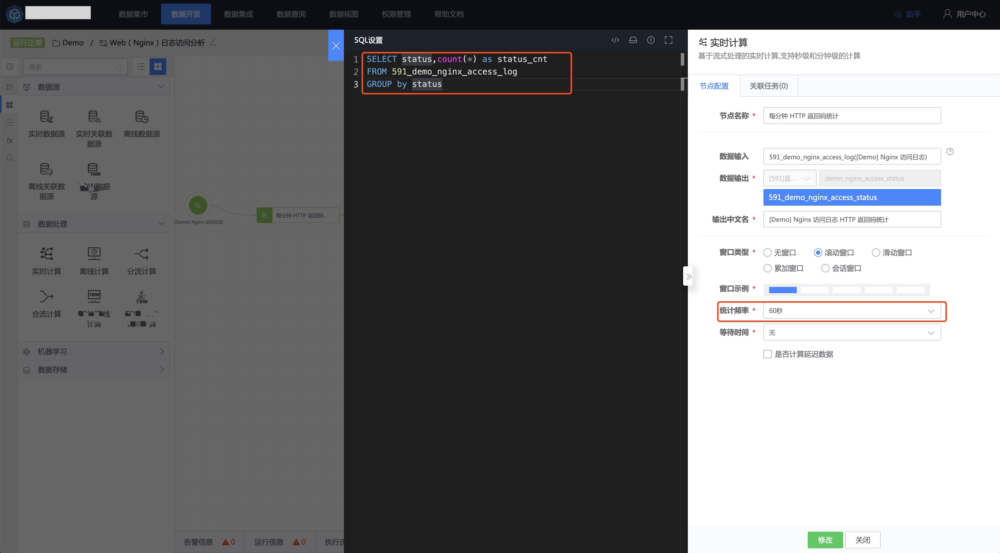
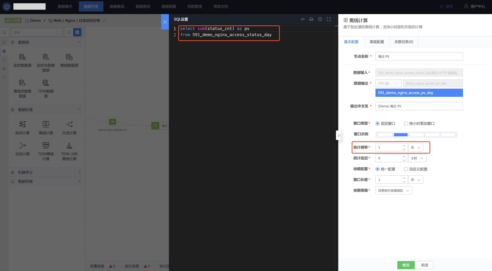
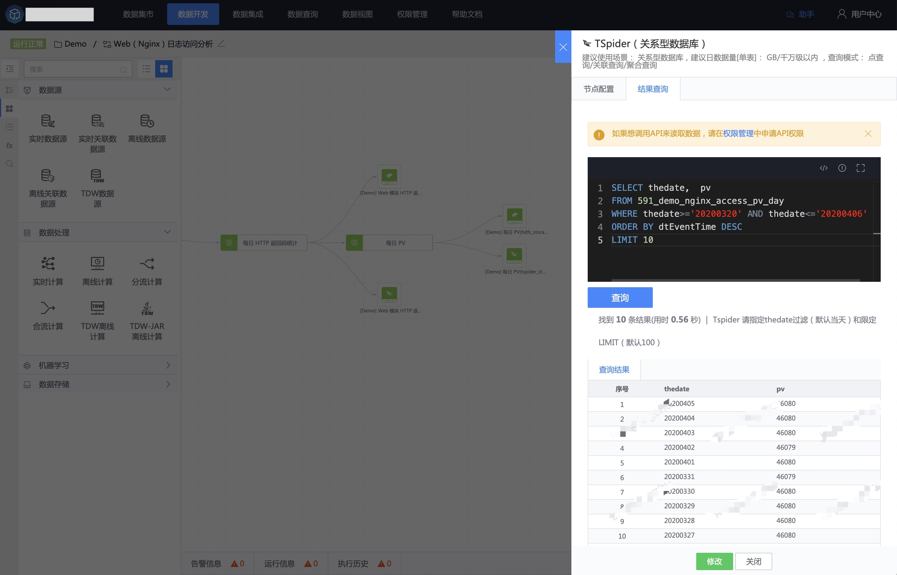
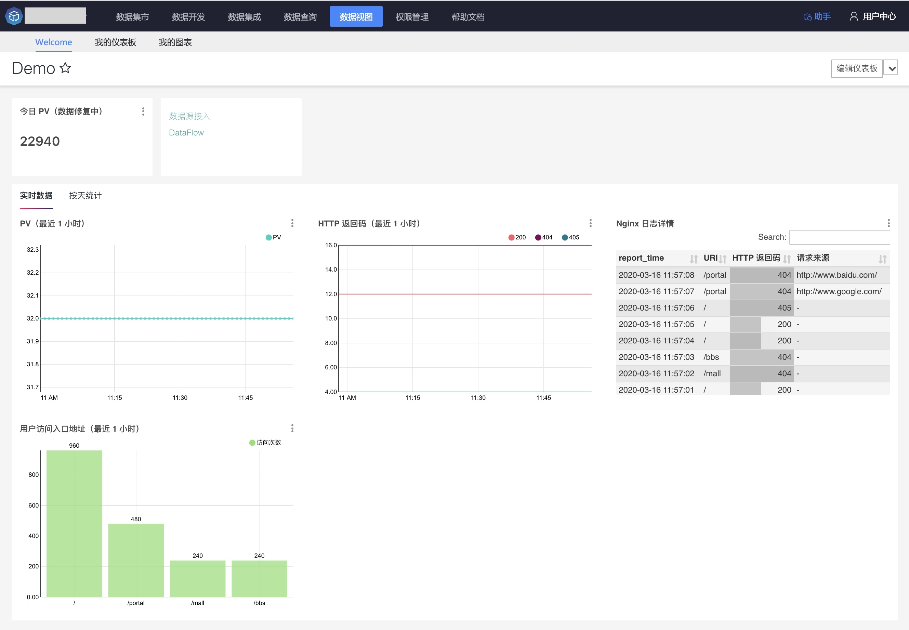

## 通过报表呈现页面访问数

## 情景

产品新上线了一个新功能，想通过报表呈现页面的实时访问数以及每天的访问趋势，以便对下一步迭代提供数据支撑。

由于业务数据量非常大，直接查询数据库将会导致慢查询，所以通过数据开发任务将呈现的图表数据预计算好。

## 前置条件

- 已完成 [数据上报](../user-guide/datahub/data-access/concepts.md)。
- 已完成 [数据清洗](../user-guide/datahub/data-clean/detail.md)。
- 了解 [数据开发](../user-guide/dataflow/ide/concepts.md) 的 [实时计算](../user-guide/dataflow/stream-processing/concepts.md)、[离线计算](../user-guide/dataflow/batch-processing/concepts.md)。
- 了解 [Superset BI](../user-guide/dataview/superset.md)。

## 操作步骤

### 梳理数据流

- 通过 **实时计算** 统计 **每分钟** 的访问人数。
- 通过 **离线计算** 统计 **每天** 的访问人数。

### 创建 数据开发任务

新建 1 个 [数据开发任务](../user-guide/dataflow/ide/concepts.md)，通过 [实时计算节点](../user-guide/dataflow/stream-processing/concepts.md) 完成 每分钟的访问人数统计，[离线计算节点](../user-guide/dataflow/batch-processing/concepts.md)统计每天的访问人数，效果如下：

接下来介绍如何创建数据开发任务。

#### 选择数据源

在画布中选择数据入库、清洗后的 **实时数据源**。

#### 新建 实时计算节点

新建一个 **实时计算节点**，连接在数据源后面，每分钟统计一次。

在节点后 **连接一个存储**，启动任务后，可以查询每分钟的统计数据如下：

同时连接一个 HDFS 存储，用于离线任务的数据源。（离线计算的数据源存储类型是 HDFS）

> 为什么实时计算节点后连接了 Tspider（MySQL）、HDFS 两种存储，因为 MySQL 响应少量数据查询响应时间更快，用于图表呈现。

#### 新建 离线计算节点

在上一步产生的结果数据表（ HDFS 存储）后连接一个离线计算节点，统计频率选择 1 天，用于每天统计一次每日 PV。

在上述节点后，连接一个存储，启动任务后，第 2 天可以查看每天的统计数据如下：

> 如果离线任务数据源中的数据有多天的，希望对过去的数据进行计算，可以使用 [离线补算](../user-guide/dataflow/batch-processing/rerun.md) 功能。

数据都准备好了，接下来使用 Superset BI 出图。

### 创建 Superset BI 图表

参照 [Superset BI](../user-guide/dataview/superset.md) 的指引完成报表制作，效果如下。

 
