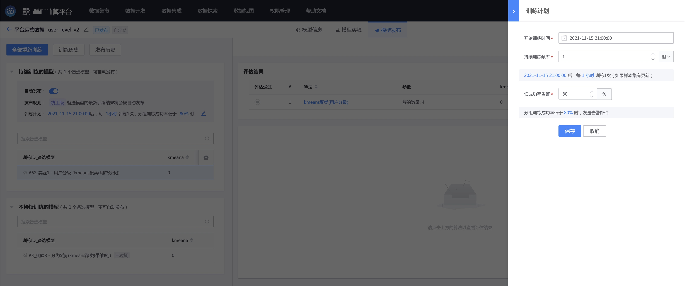
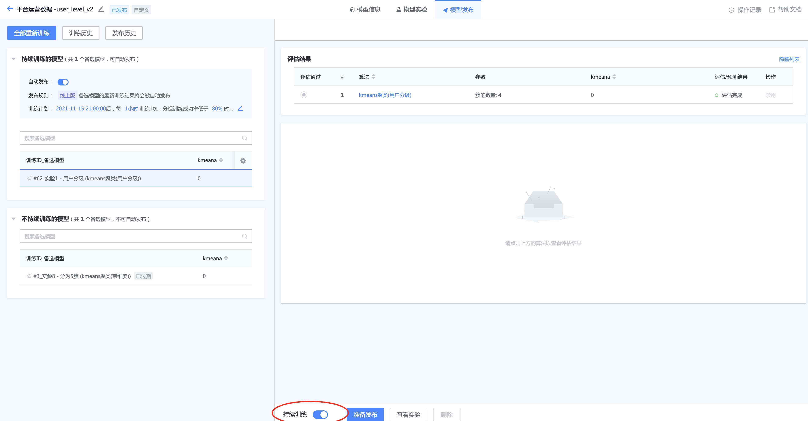
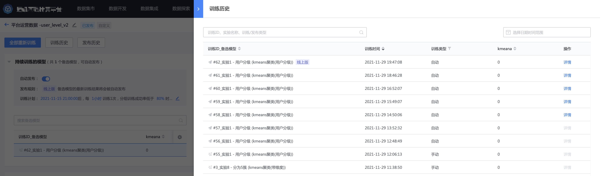

开启持续训练
----

持续训练，让模型适应变化的数据。

模型发布后，可以为模型 **配置持续训练计划**。

可以设置持续训练的频率，比如每小时或每天训练一次。

注：在启动持续训练时会检查实验使用的样本相对于上次训练是否有更新，如果没有更新，将不启动持续训练。请确保样本添加了自动反馈或自动添加样本。

然后为选中的实验开启持续训练。

观察一段时间后，可以看到每小时都有自动的训练记录。

