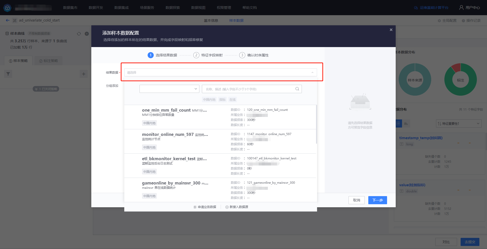
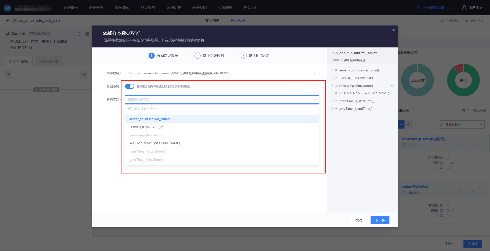
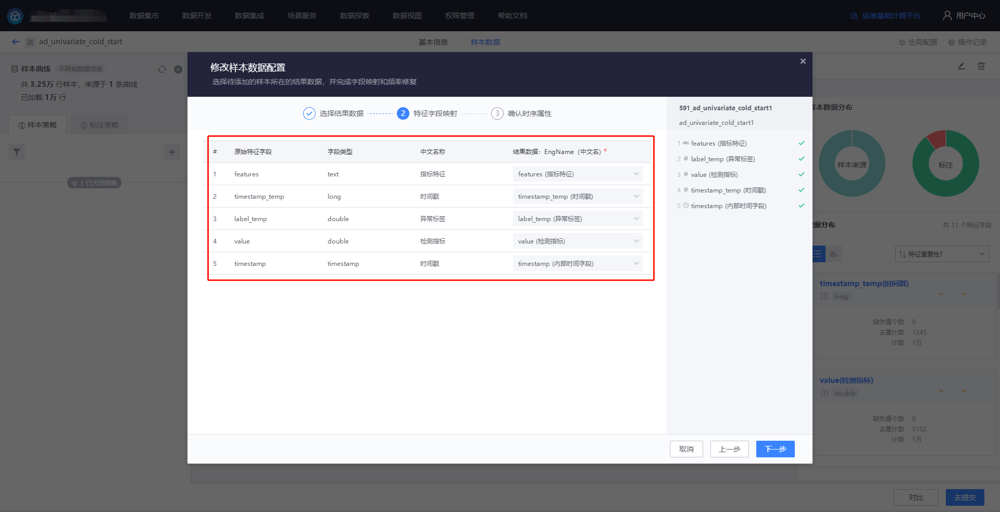
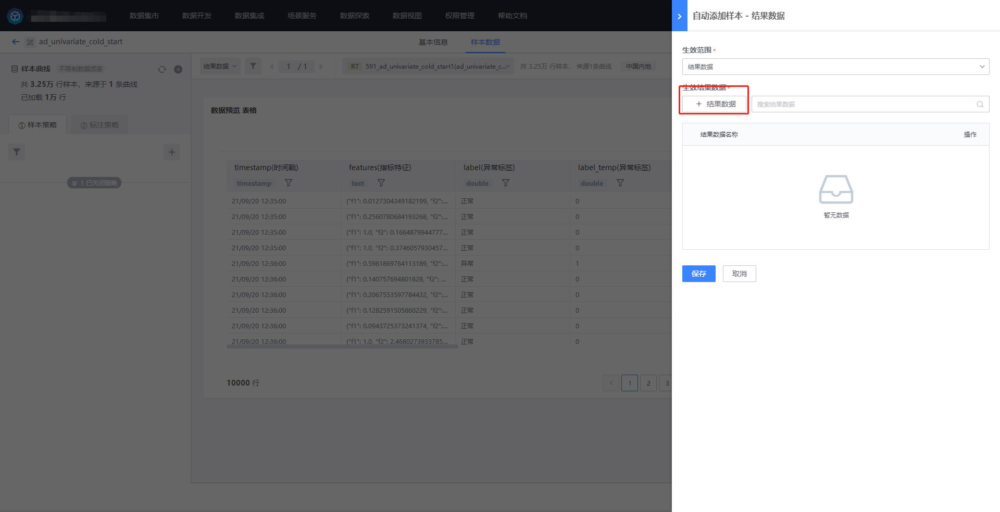
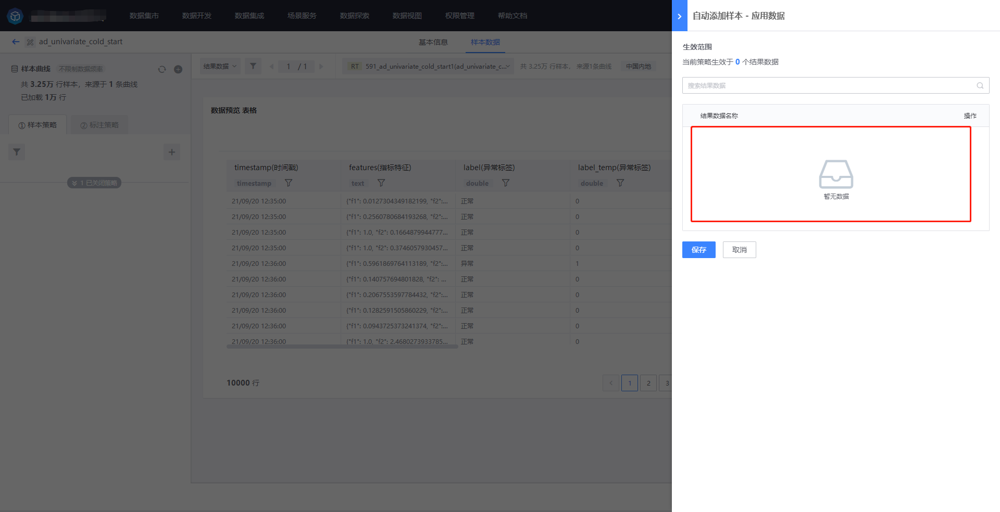
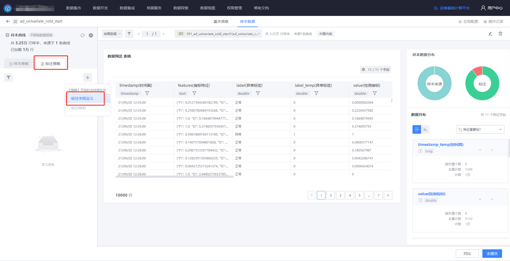
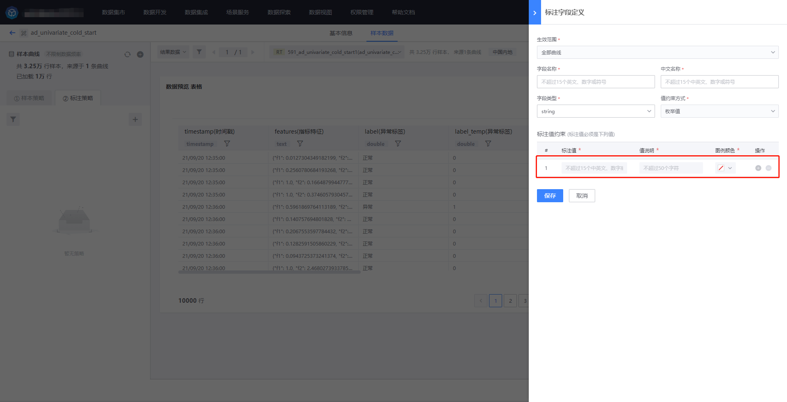
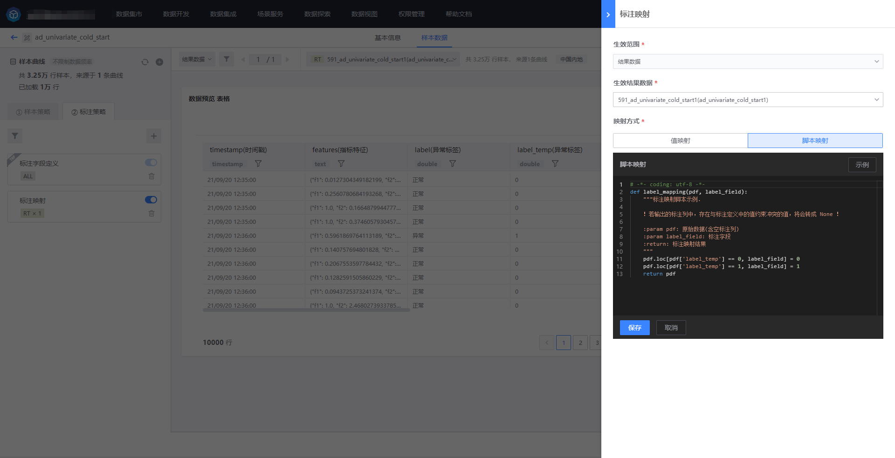
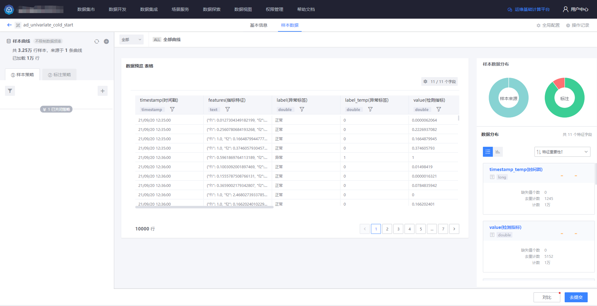

# 样本集

场景化建模中需要使用样本集功能，完整流程如下

1)   确认场景：根据需求确认建模场景；

2)   样本准备：构建样本数据、并进行标注；

3)   特征工程：模型构建时和模型应用时，不同的数据流都会经过相同的步骤；

4)   模型训练&评估：选择算法进行训练，根据评估结果调整超参；

5)   发布模型：包括模型记录的发布、管理；

6)   应用模型：将业务数据应用到已发布的模型；

7)   样本闭环：在场景化建模中将为模型应用者提供应用数据的标注反馈功能。经过人工确认、修改后的模型检测结果将作为已标注的样本数据反馈至样本集，以供模型后续优化升级，形成闭环。在单指标异常检测场景中，从样本集的构建到样本集的使用（模型构建），用流程图表示如下，其中红框部分需要依赖样本集管理：

# 使用流程

## 创建样本集

用户可在自己的项目下创建样本集，入口位于用户中心。目前仅支持自定义场景的样本集管理。

## 添加样本数据配置

在样本数据 tab 可添加样本数据，首先选择待添加样本所在的结果数据。

可以根据需要对结果数据进行分组。

选择完结果数据后，可以配置/映射该结果数据的其他特征字段。首次添加样本数据时将以该结果数据的字段和数据频率作为样本集的原始字段和数据频率标准，不可再修改，后续添加的其他结果数据都必须满足此标准。

确认时序属性，如果与样本集数据频率不一致则需要进行聚合。

## 增删样本数据

添加一个【自动添加样本】策略，以将数据自动导入样本集。目前支持三种类型的添加方式：结果数据、应用数据、API。

【自动添加样本 - 结果数据】，将当前样本集中的一个或多个结果数据，进行自动添加

【自动添加样本 - 应用数据】，可以在这里查看和管理【数据开发】的【模型应用】节点中开启了应用反馈的结果数据。

【自动添加样本 - API】，可以通过接口的形式向样本集写入数据。

还可以通过【自定义样本添加/删除】策略，对特定范围的数据进行添加或删除。

通过【频率规范化】策略，可以将非样本集频率的数据聚合成样本集的频率。

可以为各个特征统一或分别配置聚合函数。

## 标注样本数据

首先添加标注定义。

然后进行样本数据标注。目前仅支持通过【标注映射】策略进行样本数据标注。可以通过【值映射】、【脚本映射】两种方式进行。

## 提交样本集

完成样本集的编辑后，即可提交。

等待计算任务执行完成，即可进行数据预览。

基本信息 tab 也可查看当前样本集的各种属性和概览。

