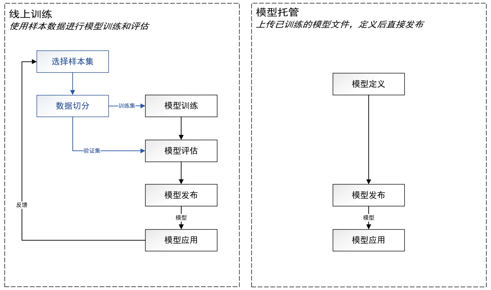
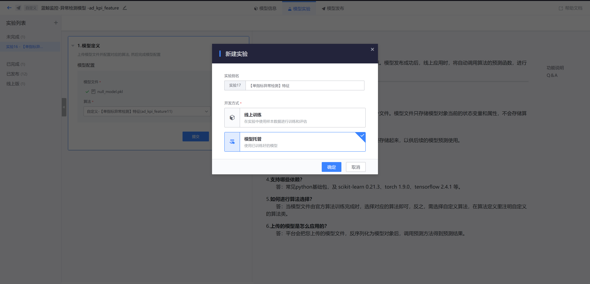
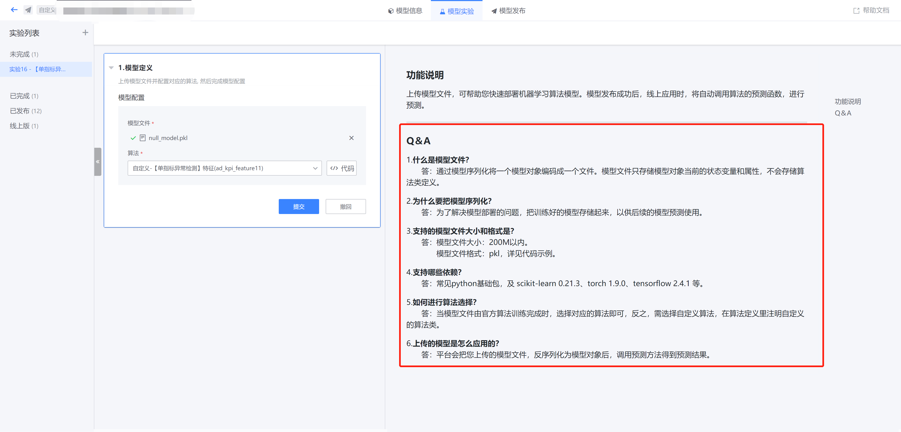
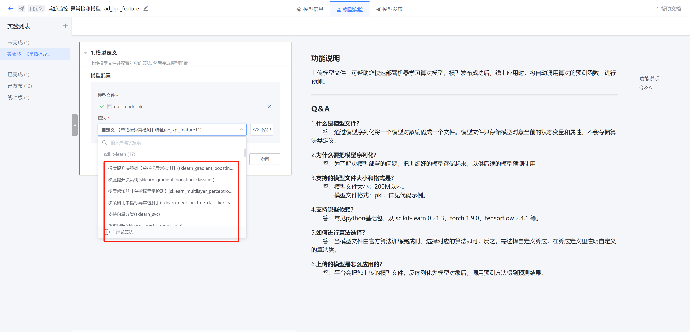
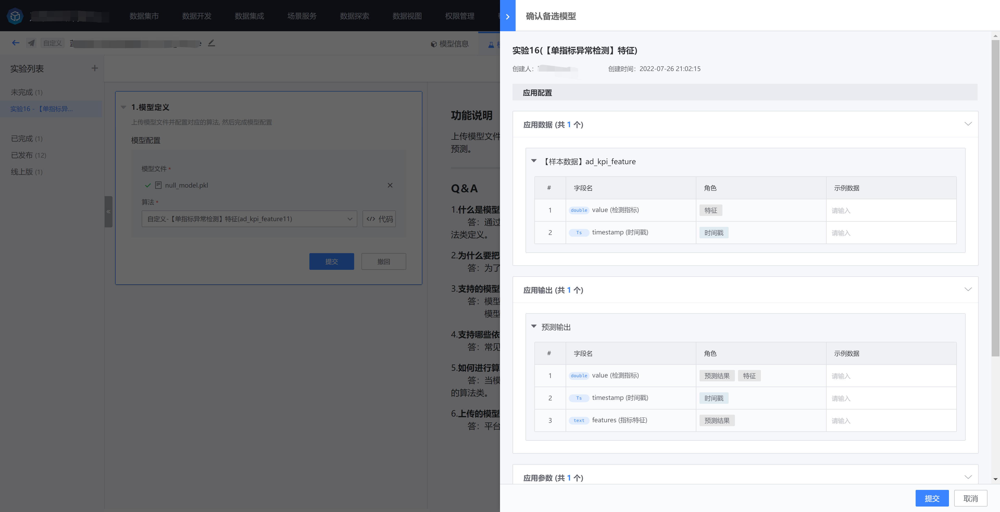

# 模型托管
模型构建的步骤，依据是否在实验内进行训练，稍有不同。如下图所示：



1)   线上训练：实验内 开启 训练/评估。需要在平台上准备样本集（训练数据），并选择算法依次进行训练和评估，才能得到模型进行发布和应用

2)   模型托管：实验内 关闭 训练/评估。在线下已经训练并打包好了模型，上传到实验中进行模型定义，然后就可以对模型进行发布和应用

# 功能介绍

## 创建模型

创建模型的入口与场景化建模一致，在场景信息的 选择场景 中选择 自定义，并填写模型信息，即可完成创建。


创建模型后会为您展示模型实验的两种开发方式，即上文介绍的：实验内 开启或关闭 训练/评估。


## 模型实验

创建一个模型实验，并选择开发方式（模型托管）：



### 上传模型文件

选择完开发方式后，可上传模型文件并选择对应的算法。

请按照页面右侧的模型文件规范上传模型文件，并填写配置。



###  选择算法

您可以选择平台提供的算法或者自定义算法，这取决于您的模型文件中使用的算法。官方算法可以直接选择，自定义算法则必须先定义再使用。



自定义算法必须填写以下内容：

1)   基本信息

2)   训练/预测输入：必填。训练/预测函数的输入字段，支持可变输入（使用算法时除了已配置的输入，可新增其他输入）

3)   预测输出：必填。预测函数的输出字段

4)   训练参数：非必填。训练函数的参数

5)   预测参数：非必填。预测函数的参数


您可以编辑算法的输入输出字段的角色，整个建模数据流中的角色含义介绍如下：

```
【时间戳】：'timestamp_column'，时序数据中用于识别样本时序属性的字段。
【特征】：'feature_columns'，算法用于训练和预测的数据字段。
【标注】：'label_column'，算法用于训练的数据字段。
【索引】：'index_columns'，包含2种：__index__，系统索引，是系统自动生成的随机标识；__id__，用户索引，是基于用户所选的【分组索引】和【时间戳】拼成的，在业务含义上识别一行独立的时序样本。
【分组索引】：'group_columns'，__group_id__，用于识别一个分组的字段。
【系统】：'system_columns'，系统自动生成的字段，不可删除或修改。
【业务】：用户指定的业务字段。
【可变】：'dynamic_columns'，用户在训练或预测时指定的输入字段。
【透传】：'passthrough_columns'，需要在函数逻辑中原样输出的输入字段。
【预测输出】：'predict_output'，预测函数输出的字段。
【分组构成】：用户指定的分组字段。
```
注意：

- 可以按需指定一定个数的可变特征字段，用于训练或预测
- 预测时可以继承训练时使用的可变特征字段
- 可以为训练和预测分别指定【参考数据】输入，在代码中通过查询的方式，直接使用样本集以外的平台数据


确认模型信息无误，即可提交备选模型。




## 模型发布

【模型托管】的模型发布流程与【线上训练】一致，请参考相应章节。

## 模型应用

【模型托管】的模型应用流程与【线上训练】一致，请参考相应章节。