# 线上训练

自定义建模的步骤，依据是否在实验内进行训练，稍有不同。如下图所示，线上训练为左图：

1)   实验内 开启 训练/评估：需要在平台上准备样本集（训练数据），并选择算法依次进行训练和评估，才能得到模型进行发布和应用

2)   实验内 关闭 训练/评估：模型托管。在线下已经训练并打包好了模型，上传到实验中进行模型定义，然后就可以对模型进行发布和应用

# 功能介绍

## 创建模型

创建模型的入口与场景化建模一致，在场景信息中选择自定义场景，并填写模型信息，即可完成创建。

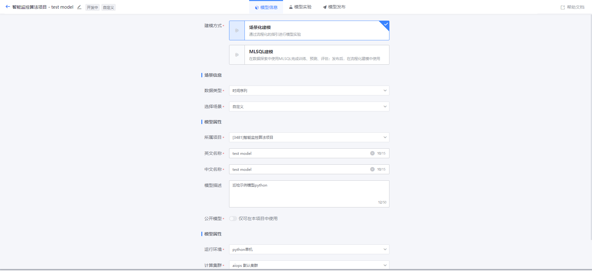

创建模型后会为您展示模型实验的两种开发方式，即上文介绍的：实验内 开启或关闭 训练/评估。

## 模型实验

创建一个模型实验，并选择开发方式（实验内训练/评估）：

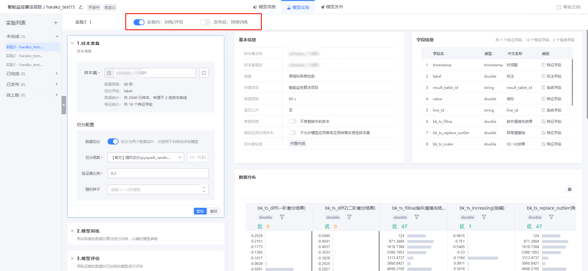

### 样本准备

选择完开发方式后，可选择样本集并对其进行切分。以下是注意事项：

1)   开启了实验内训练/评估的实验，将使用同一套样本准备配置。

2)   如果开启了数据切分，样本集将被切分为两个数据切片，分别用于训练和评估模型；如果关闭了数据切分，则整个样本集的数据用于训练和评估模型。

除了官方提供的切分函数，您还可使用自定义的切分函数。

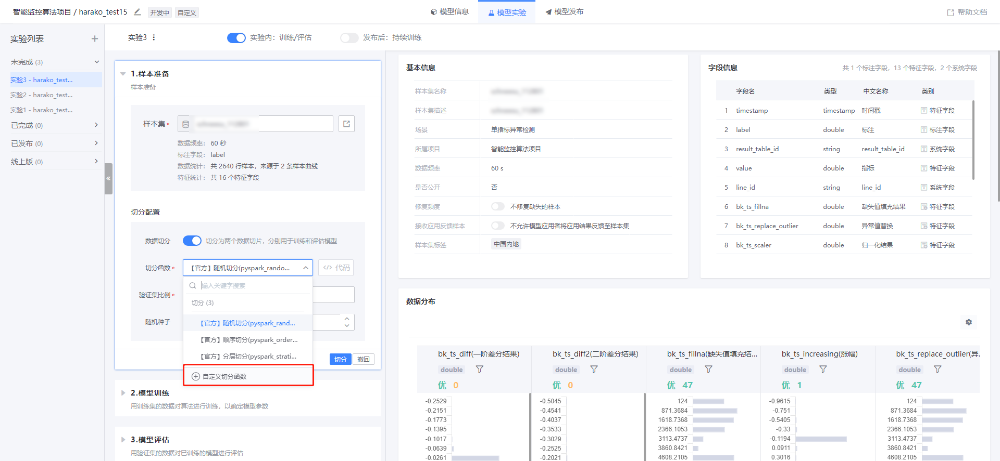

自定义切分函数必须填写以下内容：

1)   基本信息

2)   切分参数：非必填。切分函数的参数

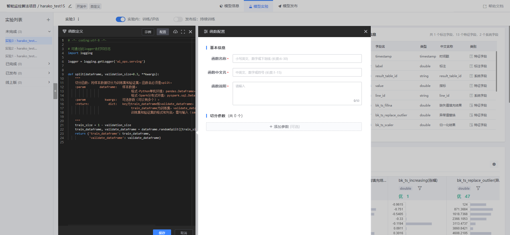

执行切分之后，可以在右侧查看切分结果。

### 模型训练

您可以选择平台提供的算法或者自定义算法，官方算法可以直接选择，自定义算法则必须先定义再使用。

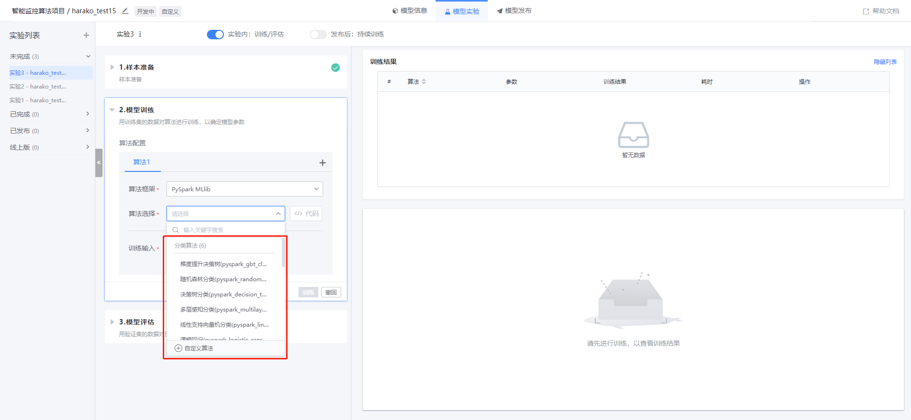

自定义算法必须填写以下内容：

1)   基本信息

2)   训练/预测输入：必填。训练/预测函数的输入字段，支持可变输入（使用算法时除了已配置的输入，可新增其他输入）

3)   预测输出：必填。预测函数的输出字段

4)   训练参数：非必填。训练函数的参数

5)   预测参数：非必填。预测函数的参数

选择完算法后，需要配置算法的训练输入（特征）。

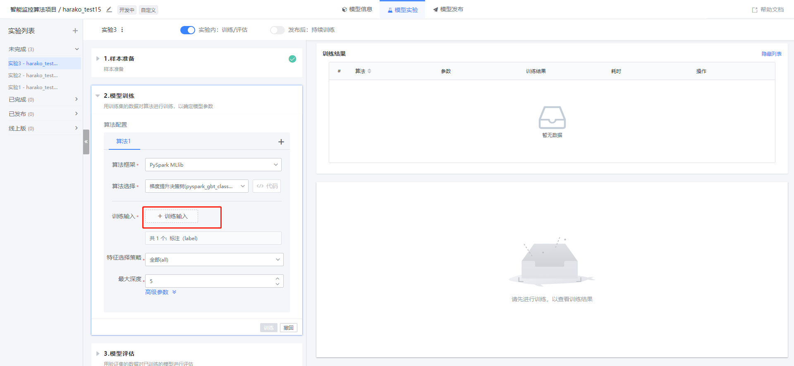

您可以根据需求选择算法使用的特征，目前提供特征重要性和特征质量用于参考。如果您使用的算法已经指定了训练/预测输入，此处会您自动添加这些字段，您只需为其匹配特征即可。

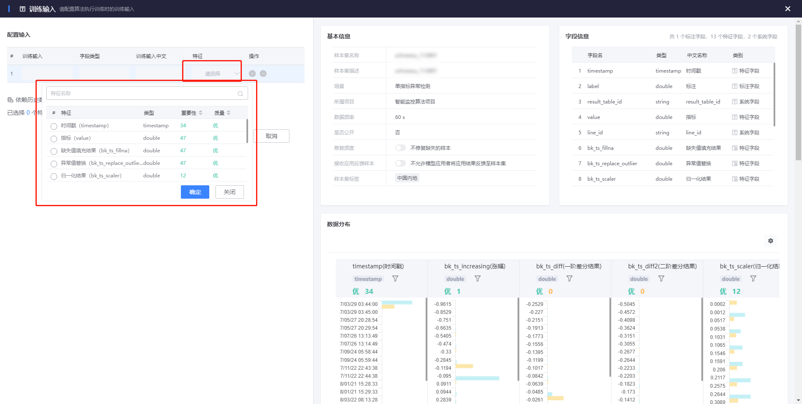

您选择的特征对应的原始特征，将作为当前模型工程的输入标准，后续实验只能在此原始特征的子集中进行特征选择。

目前最多允许同时添加三个算法进行对比训练。

训练完成后，可在右侧查看各个算法的训练结果、调试日志。

### 模型评估

完成模型训练后，可以选择一个公共的评估函数，对每个算法进行评估，评估函数同样支持自定义。

自定义评估函数必须填写以下内容：

1)   基本信息

2)   评估输入：必填。评估函数的输入字段 

3)   评估输出：必填。评估函数的输出字段

4)   评估参数：非必填。评估函数的参数

评估完成后，可在右侧查看各个算法的评估结果、调试日志。

您可以选择其中一个评估结果最好的算法作为备选模型，用于后续发布。

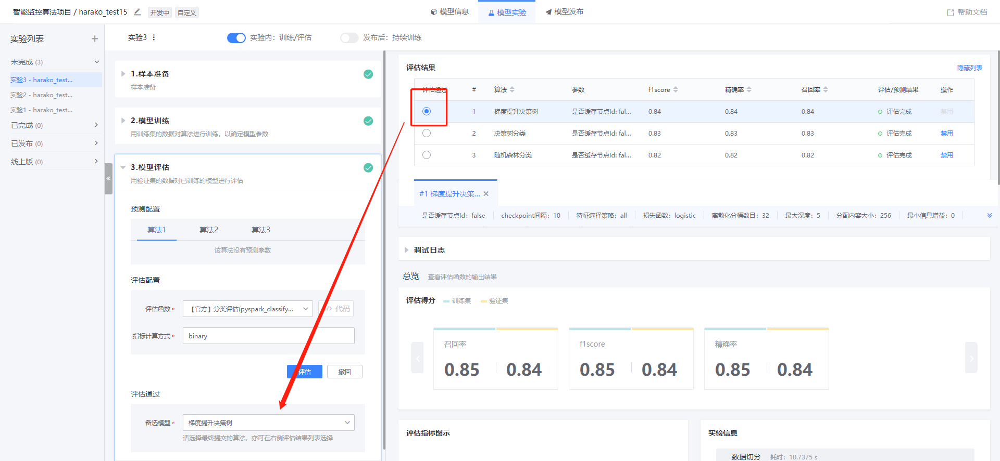

确认模型信息无误，即可提交。

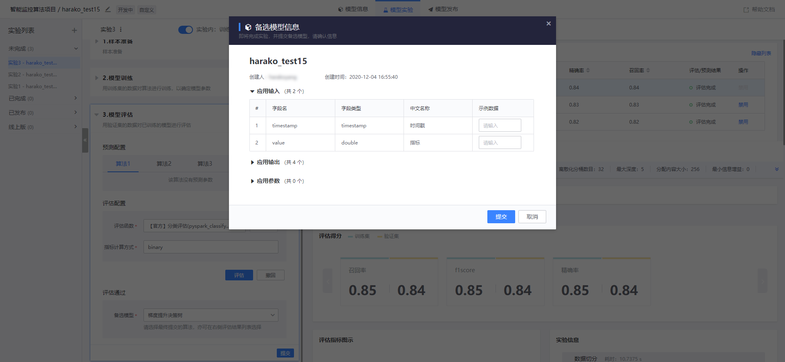

## 模型发布

您可以在模型发布 tab 查看所有实验的备选模型评估结果。

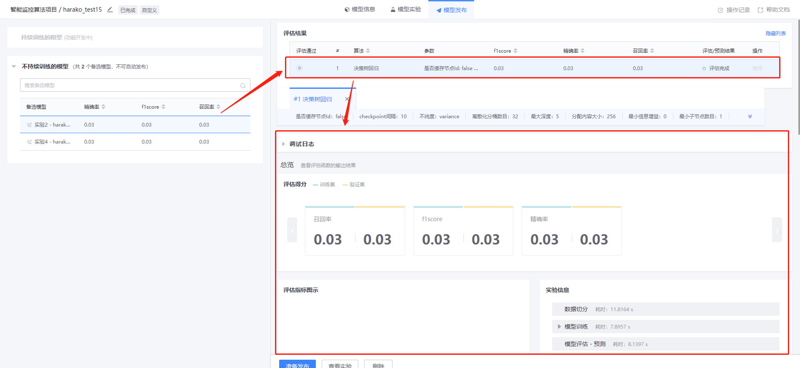

选择需要发布的备选模型，点击准备发布。

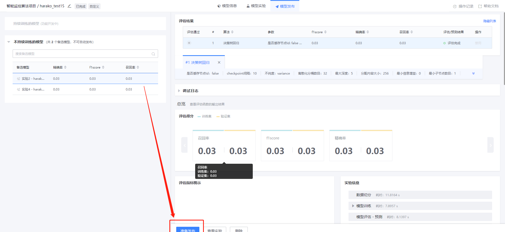

填写发布配置，然后将模型发布至线上。

## 模型应用

在数据开发工作台中应用模型的步骤与场景化建模一致，详情请参考【单指标异常检测】的介绍文档。