# 场景服务

场景服务的使用流程，如下图所示： 

 

1)   创建场景：由第一个方案开发者提交所属场景的创建申请单，平台管理方审核后，即可完成场景创建

2)   方案开发：在已有的场景中创建一个方案，平台管理方审核后，即可开始该方案的开发

	- 选择测试数据，用于调试和评估该方案
	- 编排能力项，构建好上下游节点的输入输出字段映射关系
	- 配置评估指标，用于评估该方案的效果和性能。每个方案可以有独立的评估指标，应用者应用时根据需要选取评估指标的结果查看
	- 发布方案，然后即可在【数据开发】的【场景应用】节点选择该方案

3)   场景应用

	- 选择场景，然后根据用户的输入应用数据，过滤该场景下可使用的方案 
	- 选择方案，提取各方案的公共输入，分别配置各方案的数据映射和参数
	- 择优配置，为该应用的各方案配置评估指标
	- 应用反馈，当发生不符合预期的输出结果时，可以进行标注反馈

# 基础概念

* 场景：目前主要是【运维场景】，指在运维领域中，对业务运维过程中产生的一些特定活动情境，包含异常检测、根因定位、故障自愈、智能变更、甚至一些更为复杂的复合运维场景等。

  	复合运维场景的举例：
  	① 一个时序异常检测模型，输出每个时间戳粒度的检测结果；
  	② 检测结果中的异常点事件会经过去重和过滤，收敛得到告警事件；
  	③ 告警事件通过多维下钻，找到更明细的异常维度；
  	④ 多类告警事件经过汇聚和关联，转为故障；
  	⑤ 结合拓扑数据（调用、网络、资源）进行故障的根因分析；
  	⑥ 执行运维操作推荐或自动化的自愈逻辑。

* 方案：特定【场景】中对应的一个完整的处理逻辑，一个【方案】是独立完成该【场景】的处理逻辑的最小单元，一个【方案】是由多个【能力项】编排而成。

* 能力项：独立的处理逻辑，在平台中，数据模型、算法模型、UDF（自定义函数）、实时计算、离线计算都属于能力项。

# 功能介绍

## 场景服务入口

用户可在【场景服务】tab 下创建场景，或者使用已经创建好的场景。

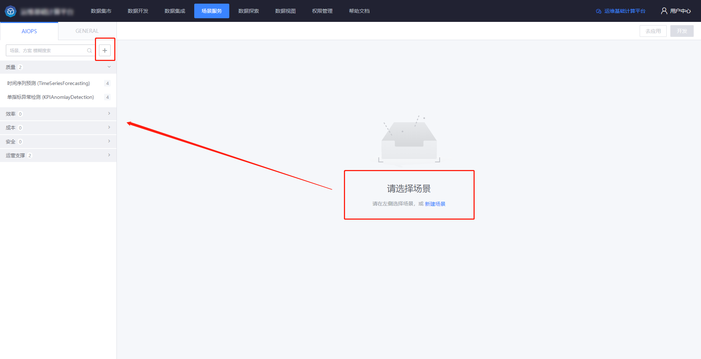

## 创建场景

点击创建场景，填写基本信息。

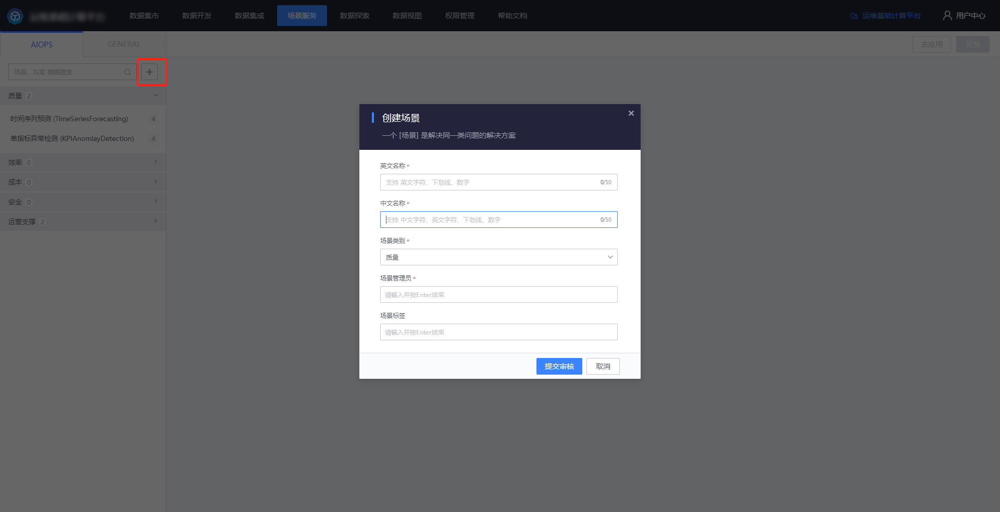

 

## 场景配置

可以查看场景的基本信息、权限信息。刚创建的场景需要填写场景描述文档。

## 方案开发

### 创建方案

创建方案，填写基本信息。

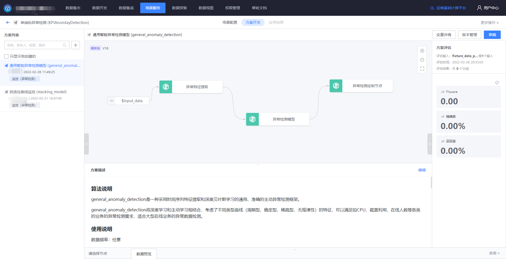

 

填写方案描述文档。

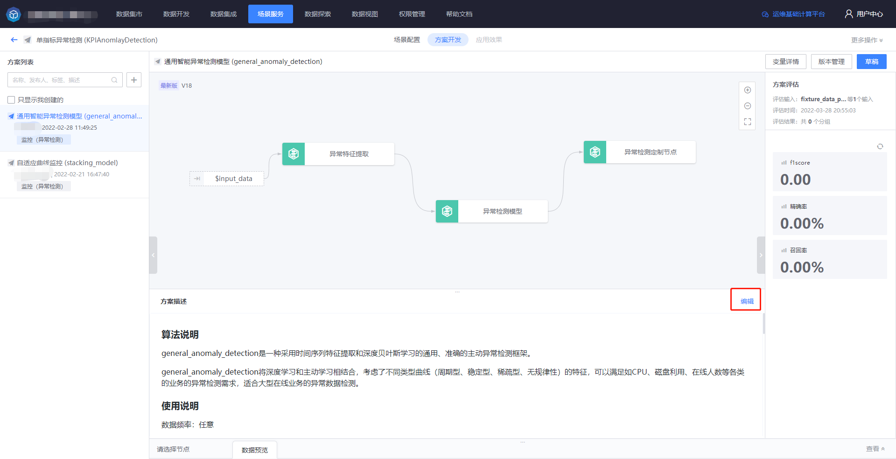

 

点击【草稿】进入编辑态。从左侧组件库拖拽节点到画布，构建方案的各个能力项，目前支持：测试数据、场景化建模。

### 选择测试数据

配置【测试数据】节点，选择一个样本集或结果数据用于测试。

### 编排能力项

配置【场景化建模】节点，选择一个已发布的模型，与测试数据进行映射，填写模型参数等配置。

### 配置评估指标

在右侧栏添加评估指标，与测试数据进行映射，填写评估指标参数等配置。

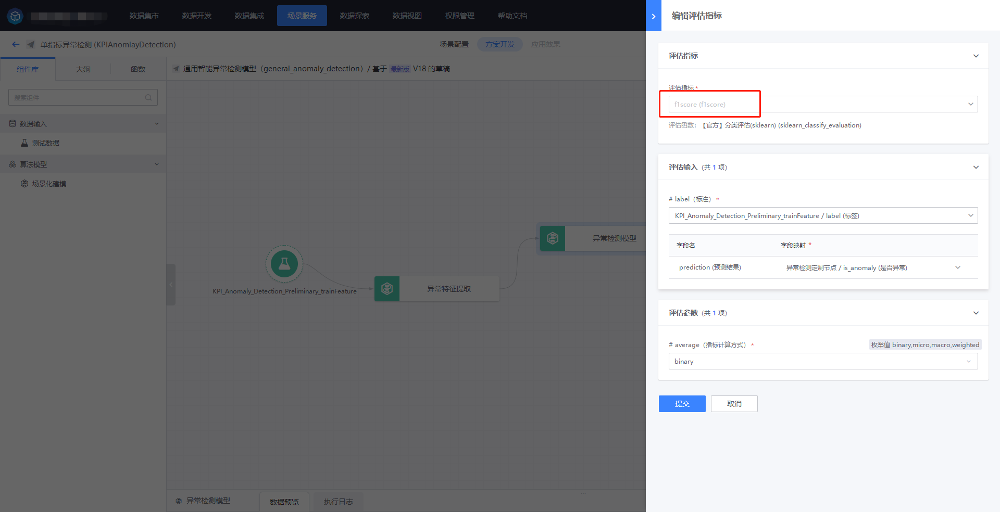

方案开发过程中所使用的变量，均可在【变量管理】页进行管理，例如：可以控制开放给应用者的参数变量。

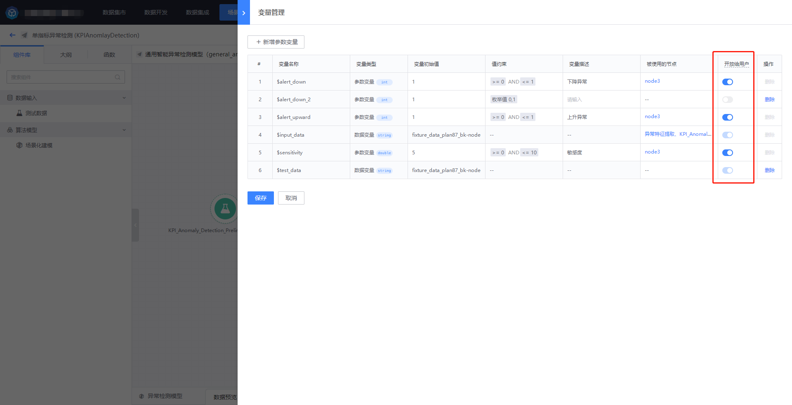

## 方案发布

调试完成，确认方案输出无误，并且对评估指标结果满意之后，可以发布该方案，点击右上角的【去发布】。

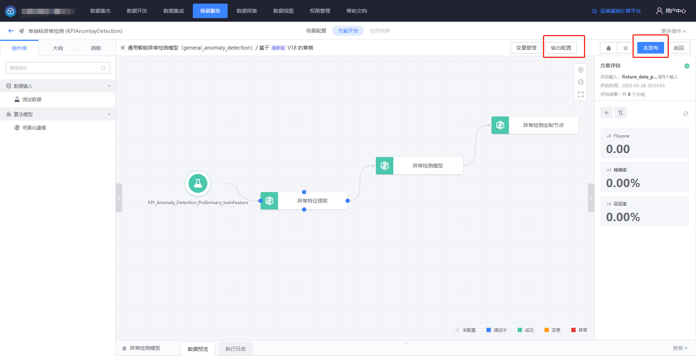

预览确认方案的编排逻辑、输入、输出、参数等内容无误，即可填写发布信息，进行发布。

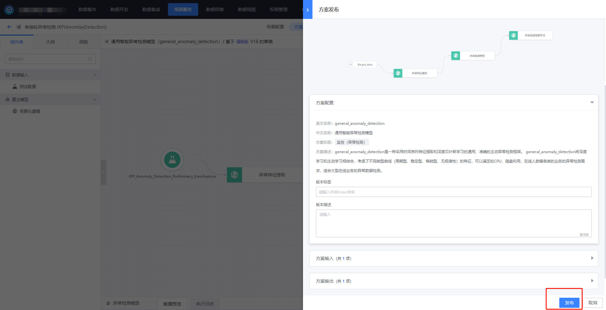

## 场景应用

在数据开发工作台中应用场景，请选择【场景应用】节点，连接上游数据，进行配置。

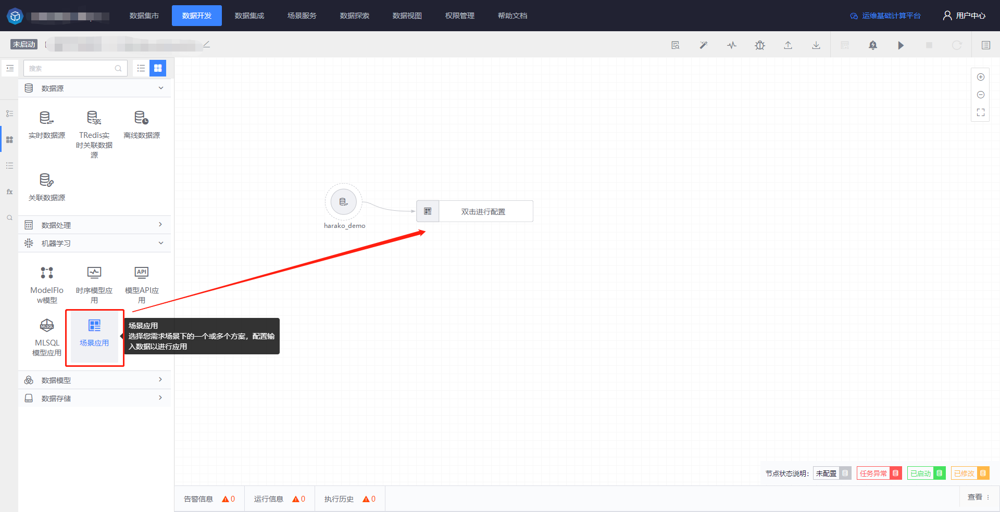

选择所需场景和方案。

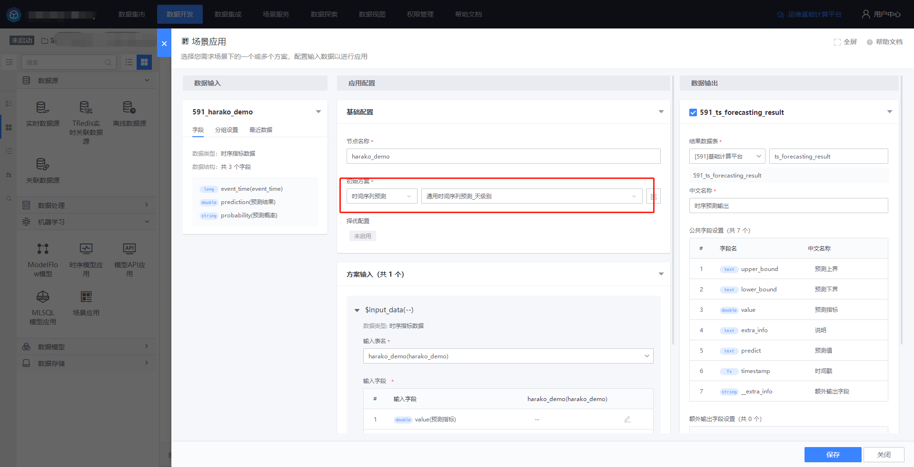

配置输入和方案所需参数，保存即可。

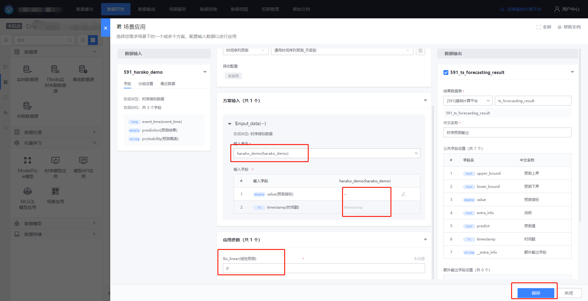