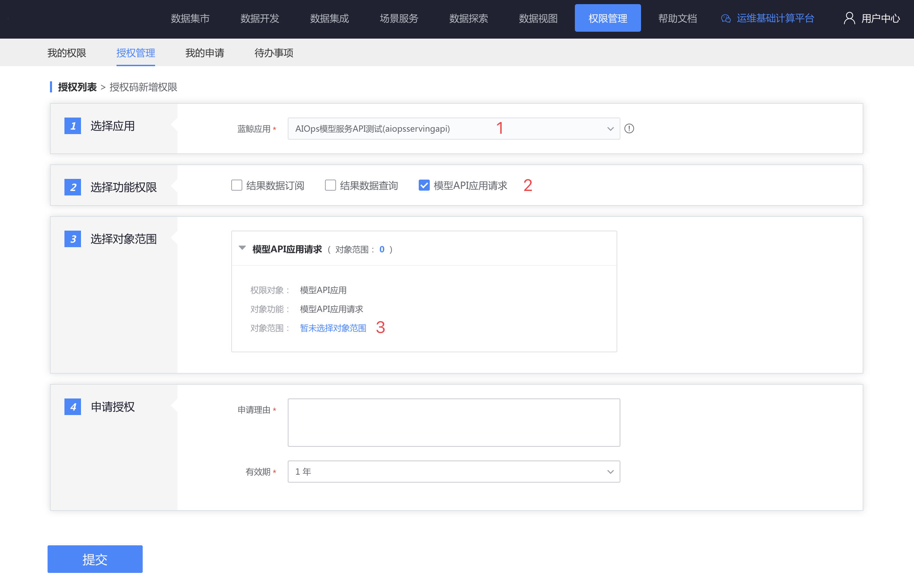
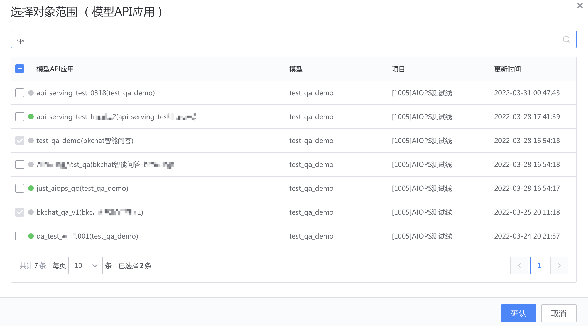
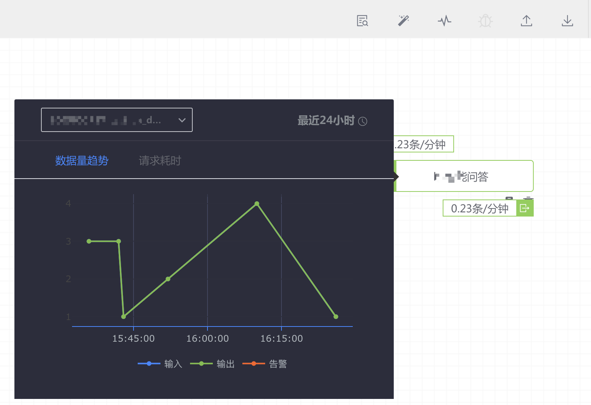
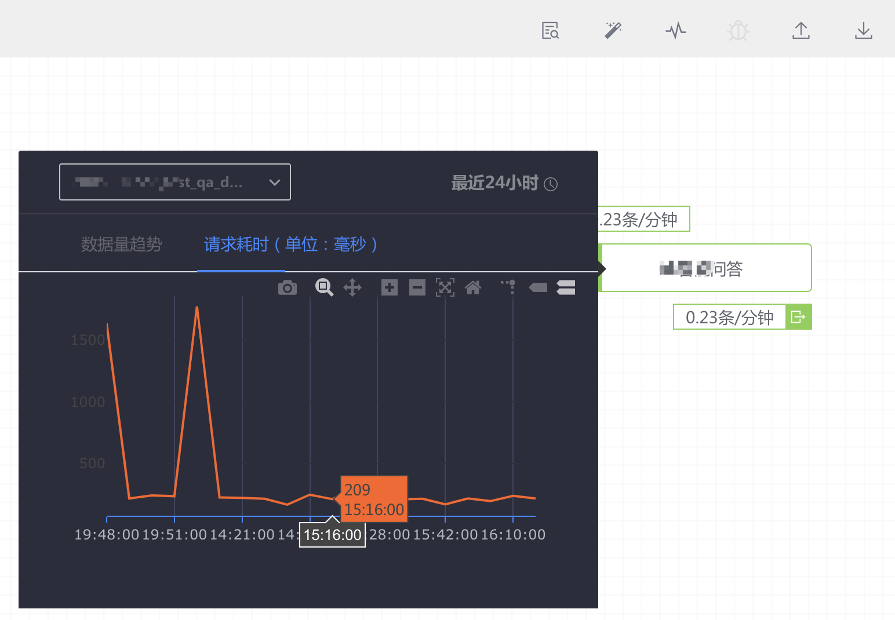
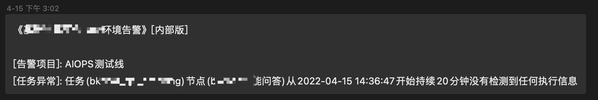
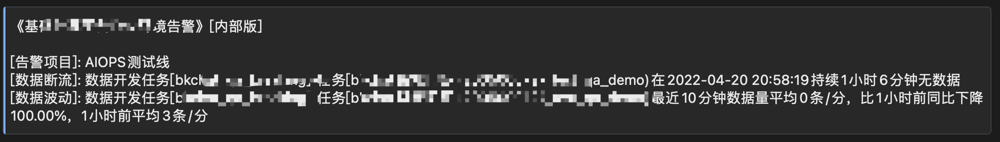

# 模型 API 应用
以 **API 方式提供模型应用服务**。

## 使用场景
蓝鲸应用直接通过 API 与模型服务进行交互，比如在智能问答、即时预测等场景。

## 前置条件
项目中有 [已发布的模型](../release.md) 的应用权限 。如无，可按项目 [申请模型的应用权限](./apply_permission.md)。

## 使用流程
在数据开发中保存模型 API 应用节点 -> 启动数据开发任务 -> 为蓝鲸应用申请授权码 -> 发起 API 请求，更多详见 API 文档 (网关名称：bk-data, API 名称：api_serving_processing_execute)。


## 在数据开发中保存模型 API 应用节点
在 [数据开发](../../dataflow/ide/concepts.md) 中添加 **模型 API 应用节点** ，选择该项目下有权限的模型。

填写 模型 API 应用 的英文名和中文名，用于标识，便于后续为 蓝鲸应用申请授权码（蓝鲸应用请求该模型 API 应用的凭证）。


在该节点中，可以看到模型 API 应用的预测输入、预测参数、预测输出，其中示例数据部分是在 [模型实验提交备选模型阶段](../online_training.md) 填写的。

请求示例部分，可以用于后续发起请求的请求体。


## 启动数据开发任务
启动 [数据开发任务](../../dataflow/ide/concepts.md) 。

## 为蓝鲸应用申请授权码

在 [授权管理](../../auth-management/token.md) 页面为蓝鲸应用申请请求凭证：授权码（bkdata_data_token）。



在弹窗中选择需要请求的模型 API 应用。



运行模型 API 应用所在项目管理员审批后，查看授权详情，获取到授权码（bkdata_data_token），用于下一步的请求。


## 发起 API 请求
以下是请求 模型 API 应用的示例。

> 请替换请求 URL 中的地址，该地址可在模型 API 应用节点中找到。

```json
curl -s -XPOST  https://xxxxx/aiops/serving/processing/xxxxx/execute/ -H 'Content-Type: application/json' -d  '{"bkdata_authentication_method":"token","bkdata_data_token":"xxxxx","bk_app_code":"xxxxx","bk_app_secret":"xxxxx","data": {"inputs": [
                {
                    "timestamp": 1648180582000,
                    "question": "xxxxx"
                }
            ]
        },
        "config": {"predict_args": {}
        }
    }'
```

返回示例


```json
{
  "errors": null,
  "message": "ok",
  "code": "1500200",
  "data": {
    "result": true,
    "data": {
      "data": [
        {
          "output": [
            {
              "answer": "xxxxxxxxxxxxx",
              "timestamp": 1648180582000,
              "question": "IDIP"
            }
          ],
          "input": [
            {
              "timestamp": 1648180582000,
              "question": "XX"
            }
          ]
        }
      ],
      "status": "success"
    },
    "code": "","message":"APIServing execute success","errors": null
  },
  "result": true
}
```

更多详见 API 文档 (网关名称：bk-data, API 名称：api_serving_processing_execute)。

## 监控和告警

### 请求量和请求延迟
- 请求量



- 请求耗时



> 注：模型 API 应用启动后，第一次请求会加载模型，后续请求无需加载。 


### 告警配置
在数据开发任务工具栏中，可以配置告警策略。


- 通用任务异常：模型 API 应用异常，比如 Crash，**建议开启该项**。



- 数据源无数据：持续 10 分钟没有请求。

> 如果应用的请求不是连续的，建议不开启该项。


- 数据波动：请求数与同期相比有下降



> 如果应用的请求不是连续的，建议不开启该项。


