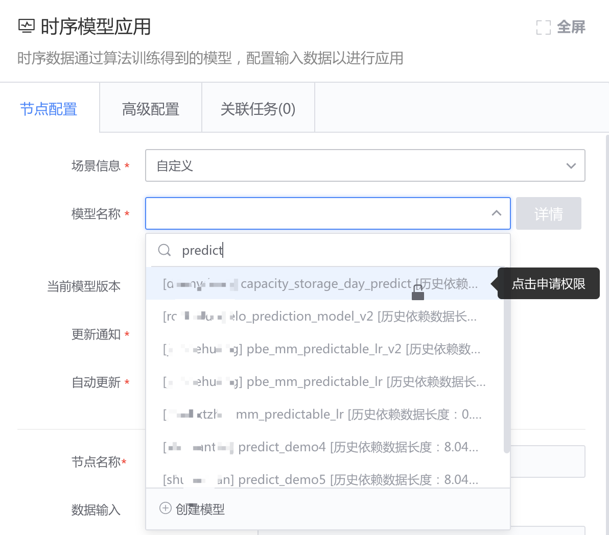
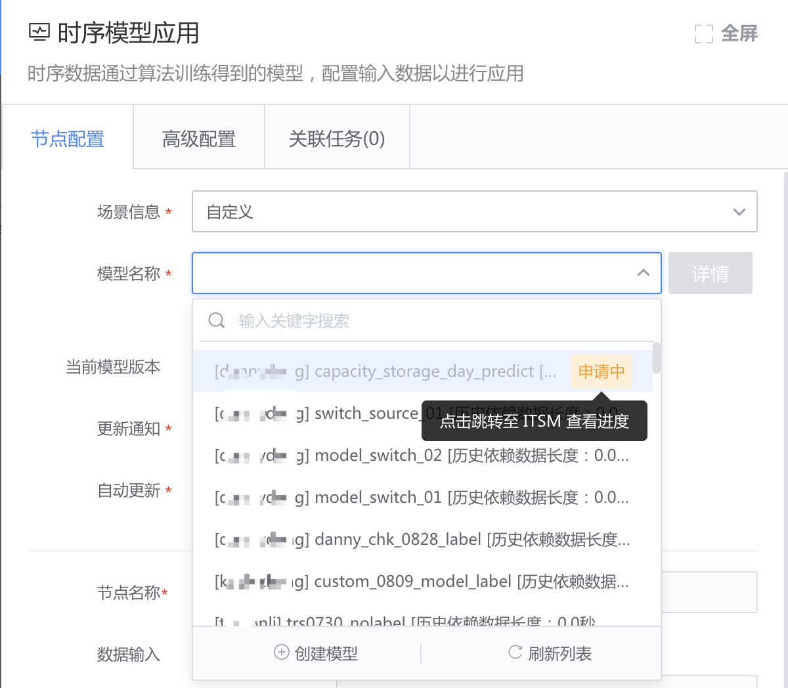

# 申请模型应用权限

## 模型应用权限介绍
模型应用权限：数据开发中应用模型的权限。

在创建模型时，可以选择该模型的应用权限为 ` 项目私有 ` 、` 公开。`

- 项目私有：只能在当前项目下应用该模型，其他项目使用前需申请应用权限。

- 公开：所有项目可以应用该模型。

## 按项目申请模型应用权限

打开模型应用节点的模型名称下拉框，搜索模型，该项目下没有应用权限的是灰色，点击申请权限即可。

填写申请理由。

接下来，申请中的模型会在最上方，点击跳转至至 ITSM 跟进审批进度。
> 审批者：模型所在项目的项目管理员

审批成功后，可点击 刷新列表来刷新状态。

选中刚申请成功的模型，保存节点即可。

