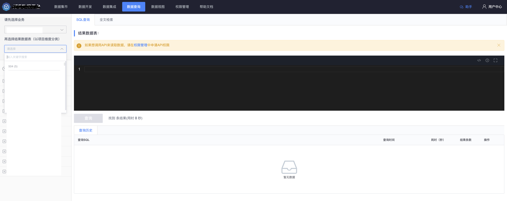
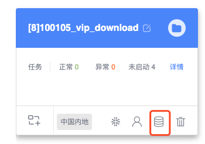
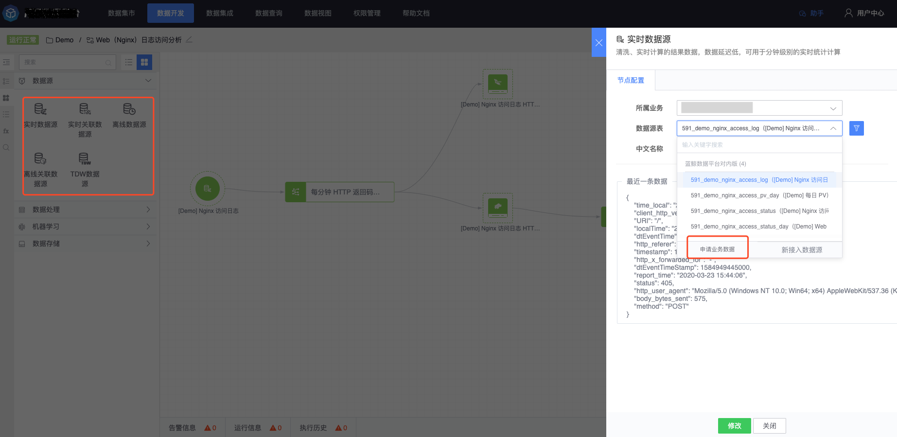
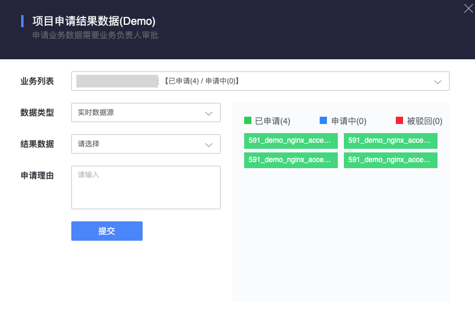

## 如何使用平台数据

> 请选择合适的方式使用平台数据

结果数据支持查询，也可进行二次计算。

- 在《数据集成》和《数据开发》入库的结果数据支持用户和第三方应用查询。
- 结果数据可在项目中进行二次计算，**在使用非项目内的结果数据时，需要以项目的角度去申请授权，一旦申请成功，项目内所有成员均可对申请的数据进行二次处理**

## 用户查询数据

在《数据集市》中，可以查询数据基本信息和内容，以及血缘关系，没有权限会提示申请权限。

在《数据查询》中，如果列表中没有预期的结果数据表，则说明没有该结果数据表的查询权限，请按照 [我的权限](./permission) 中关于《如何查看自己有权限的结果数据》章节指引确认或者申请对应的权限。

## 数据开发创建项目，项目中怎么看不到数据

**项目初始化后，是不会有任何结果数据可供二次计算，项目成员需要申请对应的结果数据。**项目申请结果数据后，项目成员可以在项目内查看数据内容，并对数据内容进行二次计算处理，产生新的结果数据。

在《我的项目》页面中，点击如图所示小图标申请平台内的结果数据。

在《数据开发》数据源节点中点击《申请业务数据》申请平台内的结果数据。

申请页面会显示项目内有权限的结果数据，申请时按照实时、离线、关联等维度进行分开申请。右侧会显示处于不同状态的结果数据，包含已申请、申请中和被驳回三个状态，点击可以查询具体的单据详情。

**如果提单人与审批人一致，则单据会自动过单，一般情况下，业务运维在提单后会立即过单。**

## 第三方应用查询数据

前往 [授权管理](./token.md)，指定结果数据表和应用名称，生成授权码。第三方携带 APP 账号信息和授权码调用平台接口进行数据查询。**授权码使数据会使使用范围扩大，请慎重申请和审批**

## 第三方应用订阅数据

前往 [授权管理](./token.md)，指定结果数据表和应用名称，生成授权码。第三方需要使用平台提供的 Kafka SDK，传递 APP 账号信息和授权码进行数据订阅，更多内容请参照 [数据订阅](../datahub/subscription/concepts.md) 文档指引。

