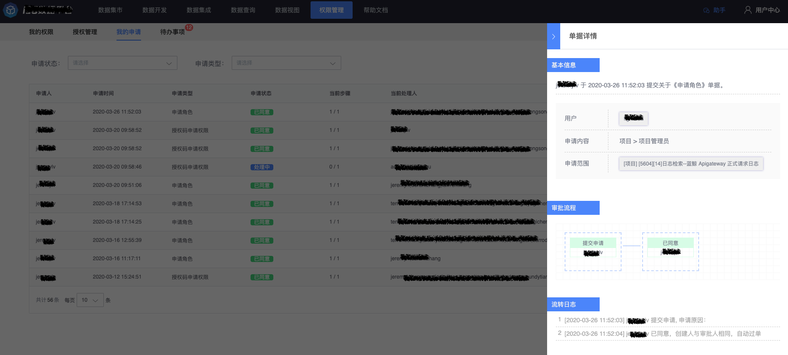
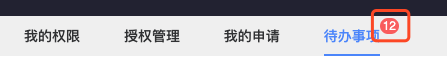

# 单据中心

## 我的申请

我的申请列表展示了当前登录用户作为申请人的所有单据列表，可根据申请状态（处理中、已同意、已驳回）进行快速过滤，也提供了根据申请类型的快速过滤。

在操作中点击【查看】可以查看单据详情，下图为一个简单的单据详情，在【单据详情】中可以查看到当前单据申请的概要，图中审批者与单据的申请人重合，为了节省用户自己提单-自己审批这个无意义繁琐的过程，因此单据自动通过。  

## 待办事项

我的待办列表中展示了当前登录用户作为审批者的所有单据列表。

在权限管理中，待办事项右上角会以角标数量的形式显示需要您进行审批的单据数量，当看到有数字时，请及时处理以免让申请者等待太久。

点击进入待办事项后，系统会帮您默认选中申请状态为“处理中”的单据进行过滤，以便您快速处理单据，当然，你也可以通过调整查询条件，来快速过滤出您期望看到的历史单据。

对于每条处理中的单据，您可以执行查看、同意、驳回者三个操作。

* 查看：查看单据的详情，与【我的申请】中的单据详情内容是一致的，如下图，这里就不重复描述了
* 同意：请确认申请者提交的单据内容无误后，即可同意此单据，同意且步骤都完成后，申请者就可以使用对应的权限了单据也会被标记为“已同意”

* 驳回：只要任意一位审批者认为申请的单据有问题，都可以进行驳回，驳回后审批流程终止，单据被标记为“已驳回”，审批人需要给出合理的驳回理由
