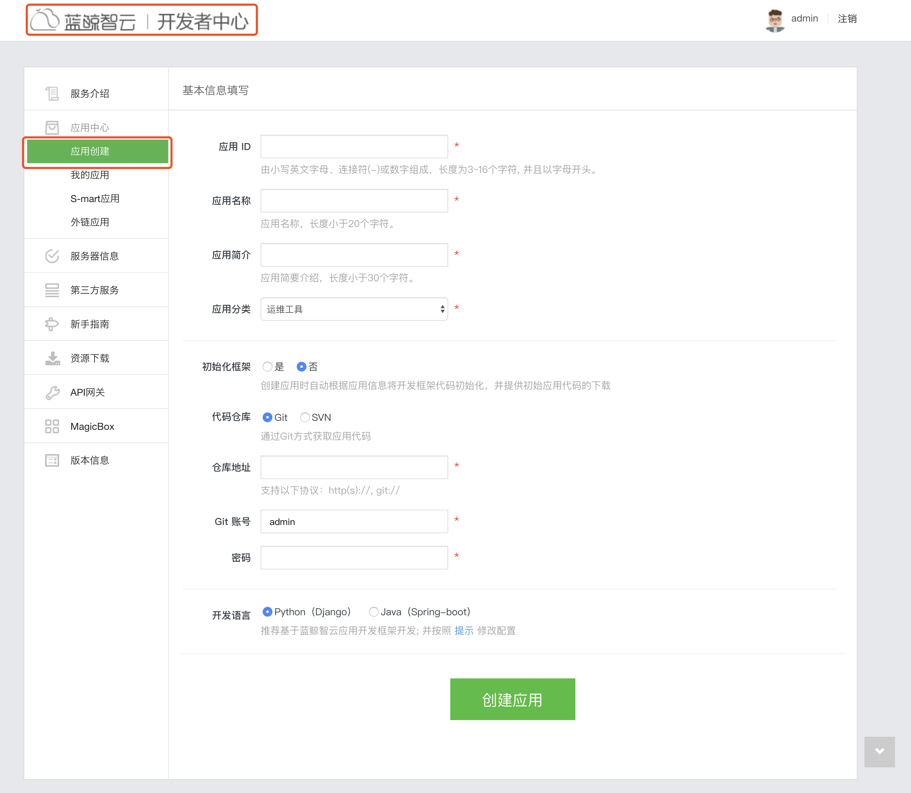

# 授权管理

授权码是构建平台 API 请求的重要凭证，使用平台 API 可以查询数据。 为了对象及数据的安全性，请妥善保存和定期更换授权码。


## 生成授权码查询结果数据
### 前置项：创建蓝鲸应用

1. 创建蓝鲸应用
用于访问数据查询接口的凭证，请前往 [蓝鲸开发者中心](../../../../PaaS平台/产品白皮书/产品功能/开发者服务/DevServicesBaseEE.md) 创建新的应用。

  


### 新增授权码


1. 选择蓝鲸应用，在蓝鲸的统一开发环境下，访问平台公开的接口，需要蓝鲸应用的访问凭证。

2. 选择功能权限，选择《数据查询》

3. 选择数据范围，这里需要指定访问范围，选择需要查询的结果表，支持多选

4. 注明申请理由和过期时间，过期授权码可以申请续期，提交成功后在授权管理的列表页面查看，点击详情可以授权内容（**请注意如果授权内容没有刚刚申请的结果表，那就是还未审批通过，请前往《我的申请》页面进行查询**）

### 调用 API 读取数据

1. 查看完整授权码，点击授权码详情，再点击小眼睛即可查看完整授权码


2. 输入参数说明

|   参数名称   |    参数类型  |  必须  |     参数说明     |
| ------------ | ------------ | ------ | ---------------- |
|   bkdata_authentication_method   |   string     |   是   |  平台认证方式，注明 token  |
|   bkdata_data_token   |   string     |   是   |  平台生成的授权码    |
|   bk_app_code   |   string     |   是   |  蓝鲸应用编码    |
|   bk_app_secret |   string     |   是   |  蓝鲸应用私密 key |
|   sql |   string     |   是   |  查询 SQL |
|   prefer_storage |   string     |   否   |  可选查询引擎，如 es |

3. API 调用样例

```python
# Install the Python Requests library:
# `pip install requests`

import requests
import json


def send_request():
    # Request Duplicate (2)
    # POST http://<BK_PAAS_HOST>/api/c/compapi/data/v3/dataquery/query/ 

    try:
        response = requests.post(
            url="http://<BK_PAAS_HOST>/api/c/compapi/data/v3/dataquery/query/",
            headers={
                "Content-Type": "application/json; charset=utf-8",
            },
            data=json.dumps({
                "bkdata_authentication_method": "token",
                "bkdata_data_token":"your_data_token",
                "bk_app_code": "your_app_code",
                "bk_app_secret": "your_app_secret",
                "sql": "select dteventtimestamp as ts,count from 477_ja_set_login where thedate=20160920  AND cc_set='4005' AND biz_id='477' limit 1",
                "prefer_storage": ""
            })
        )
        print('Response HTTP Status Code: {status_code}'.format(
            status_code=response.status_code))
        print('Response HTTP Response Body: {content}'.format(
            content=response.content))
    except requests.exceptions.RequestException:
        print('HTTP Request failed')
```


## 生成授权码订阅结果数据

基本申请流程请参照《生成授权码查询结果数据》，申请成功后推荐使用平台提供 SDK 进行数据订阅，具体使用指南请参考 [数据订阅](../datahub/subscription/concepts.md)。

### 


