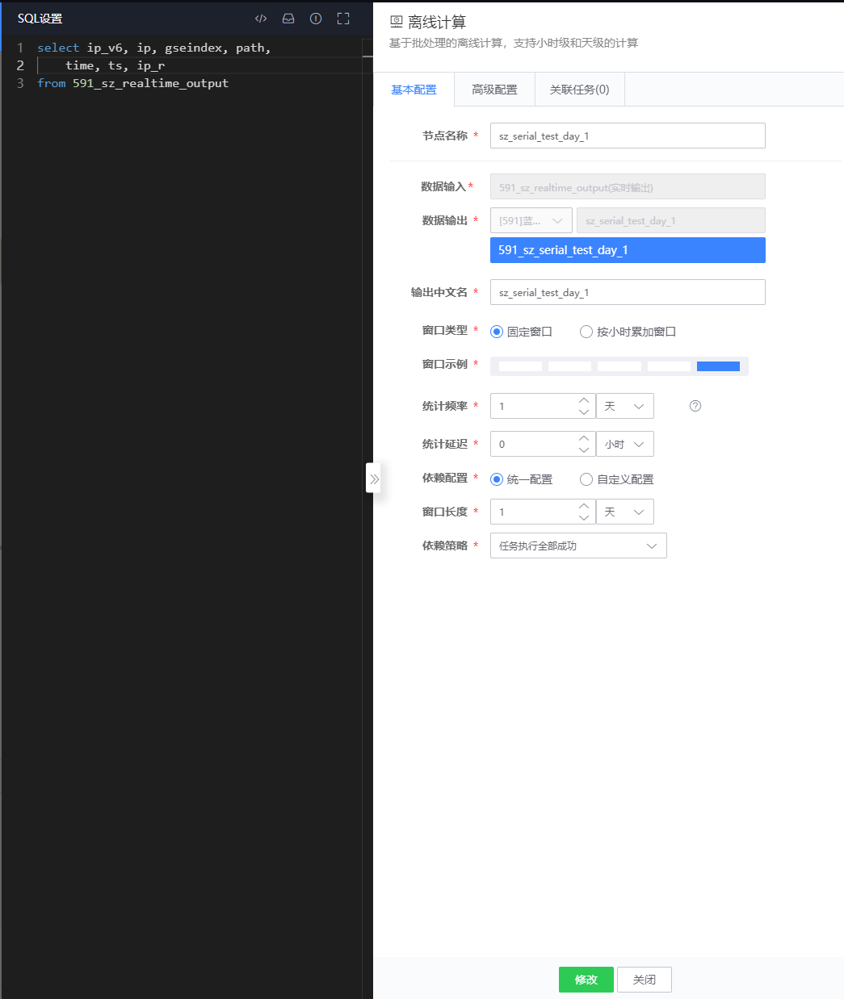
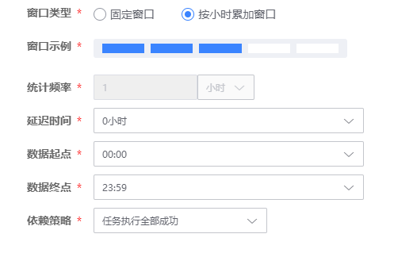
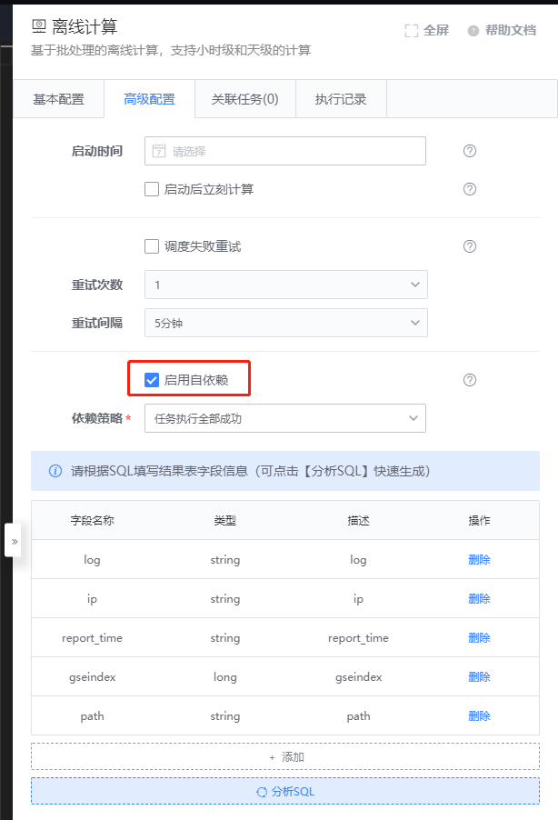

## 用户指南

### 支持连接的父节点类型 

* 离线计算
* 实时计算
* 实时数据源
* 离线数据源
* HDFS

### 支持连接的子节点类型 

* 离线计算
* HDFS
* Elasticsearch
* Druid
* Tspider
* Queue
* Hermes
* Tredis
* TSDB

### 如何配置离线计算

#### 基础配置



节点名称：给当前的离线计算节点取个中文名称，大致描述下计算内容，该中文名称会显示在 DataFlow 上；

数据输入：显示的是父节点输出的表名，当前节点将该表名作为 from 对象，通过 SQL 进行计算；

数据输出：计算输出的结果数据需要一个表名，保存成功后，系统会自动生成结果表（离线结果表），使用业务 id + 表名生成唯一标识结果表 id，如：120\_v4\_battle\_total，表名一旦成功保存，不可修改，对应的结果表 id 将作为数据查询的依据；

数据中文名：显示的是计算输出表的中文名称；

窗口类型：平台目前支持两种，固定窗口、按小时累加窗口，具体窗口类型配置选项请参考（要点 4 窗口类型）

#### 高级配置


启动时间：离线计算任务调度的开始时间（启动时间应大于当前时间）

启动后立即计算：选中后，离线计算任务启动后，立刻执行下次调度时间的计算任务

调度失败重试：选中后，任务失败会进行重试

重试次数：离线计算任务失败后，重新计算的次数

重试间隔：任务失败后的重试的间隔时间

### 窗口类型 

#### 固定窗口（周期性调度，每次加载固定长度数据） 

统计频率：多长时间执行一次，单位可选“小时”、“天”

延迟时间：任务是否需要延迟等待，单位固定“小时”

窗口长度：加载数据的长度，单位可选“小时”、“天”（针对父表的配置）

举个例子

```plain
A（实时）-> B（离线）

设置
    统计频率=1小时
    延迟时间=1小时
    窗口长度=1小时

计算任务每1小时执行一次，比如 3:00 执行，计算的是 A 节点（1:00 ~ 2:00）区间内的数据
```

自定义配置：当节点的数据来源于多个计算（实时、离线）节点，可以启动自定义配置，主要差异在父表的窗口长度和窗口延迟


窗口延迟：注意这里的窗口延迟与上文提及的延迟时间不同，这里指的是数据的延迟，窗口向前移动的时间（针对父表的配置）

举个例子

```plain
A（实时）-> C（离线）
           ^
           |
           B（实时）

设置
    统计频率=1天，延迟时间=1小时
    A 节点：窗口长度=1天，窗口延迟=2天
    B 节点：窗口长度=1天，窗口延迟=6天

计算任务每1天执行一次，比如 18日 01:00 执行，计算的是 A 节点（15日）区间内的数据，B 节点（11日）区间内的数据
```

依赖策略：

任务执行全部成功：上游任务执行全部成功，本任务即可执行

任务执行全部成功，数据非完整：上游任务执行成功或无数据，本任务即可执行

任务执行至少一次成功：上游任务执行至少成功一次，本任务即可执行

#### 按小时累加窗口（周期性调度，每次加载从窗口起点到窗口终点的数据） 



统计频率：固定每小时统计一次，不可更改

延迟时间：任务是否需要延迟等待，单位固定“小时”

数据起点：累加窗口的起点，最小 00:00，最大 23:00

数据终点：累加窗口的终点，最小 00:59，最大 23:59

举个例子

```plain
A（实时）-> B（离线）

设置
    延迟时间=1小时
    数据起点=00:00
    数据终点=06:59

计算任务每小时执行一次，于 02:00 计算的是 A 节点（00:00 ~ 00:59）区间内的数据，每个累加窗口计算出7条数据
A 节点（00:00 ~ 00:59）
A 节点（01:00 ~ 01:59）
A 节点（02:00 ~ 02:59）
A 节点（03:00 ~ 03:59）
A 节点（04:00 ~ 04:59）
A 节点（05:00 ~ 05:59）
A 节点（06:00 ~ 06:59）
```

#### 离线计算自依赖

离线计算自依赖功能表示当前节点不仅以上游节点作为数据源同时额外以当前节点上一周期输出数据作为输入，计算下一周期数据。



启用自依赖：激活自依赖功能。

分析 SQL：点击分析 SQL 可以生成当前 SQL 生成的字段，用户需自行指定字段类型。

举个例子（591_current_table 为当前节点，591_input_table 为数据源）：
```
select ip_v6, ip, gseindex, path, time, ts, ip_r
from 591_input_table
union all
select ip_v6, ip, gseindex, path, time, ts, ip_r
from 591_current_table
limit 100000
```
上述 SQL 表示将当前节点 591_current_table 上一周期的输出数据和输入数据源 591_input_table 做合并，取前 100000 的数据

注意：由于自依赖节点依赖当前节点上一周期数据，所以要求每一周期都需有数据，一旦数据中断，后续计算将无法进行。

### 计算使用场景 

3.1 多级离线计算

3.2 实时多源 JOIN 计算

3.3 离线多源 JOIN 计算

3.4 实时离线多源 JOIN 计算

### BKSQL 计算语法 

关于 BKSQL 计算语法可以参考链接[BKSQL 离线计算语法](../bksql-function/batch-processing.md)
