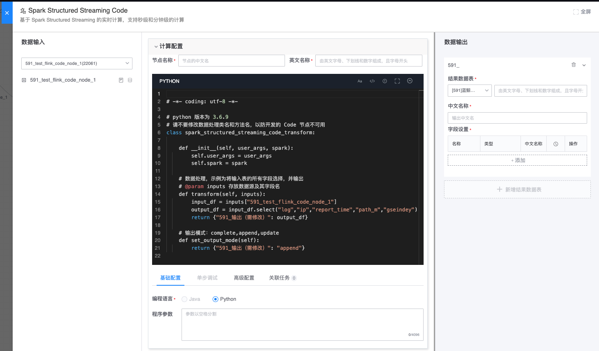
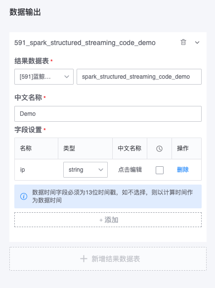
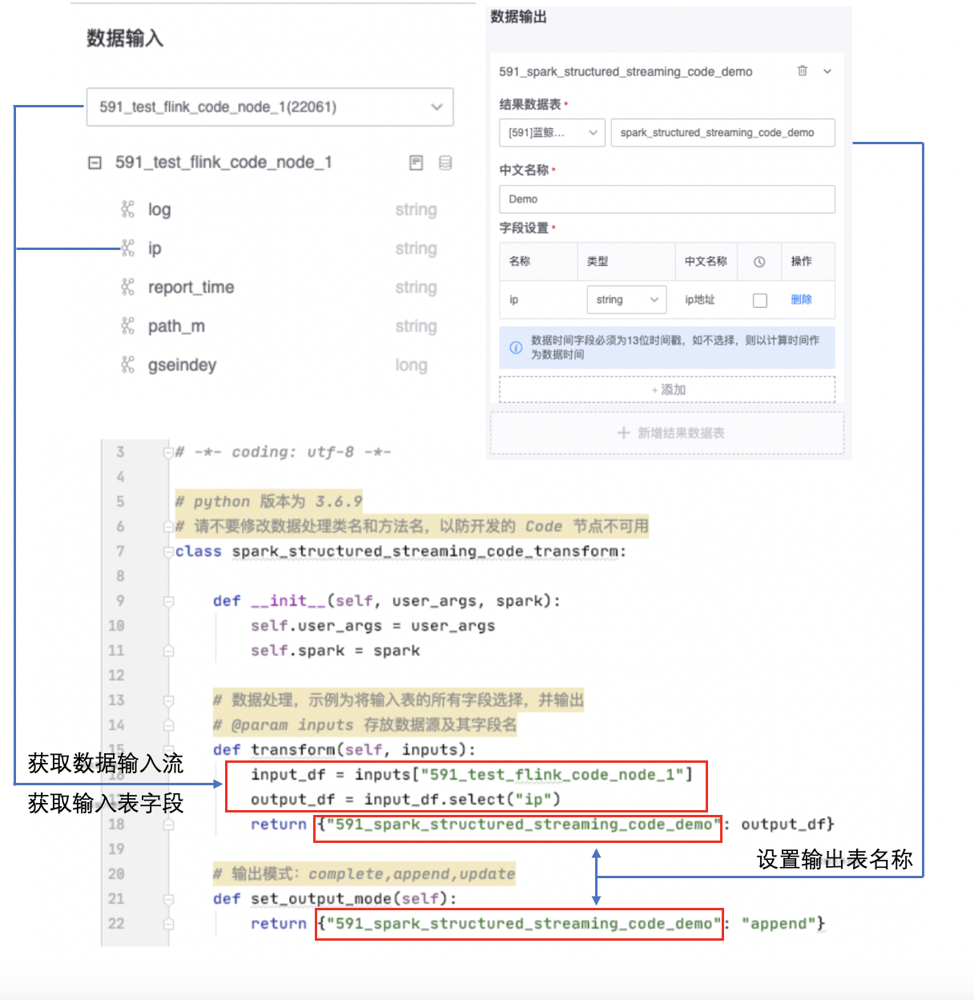

# Spark Structured Streaming Code 功能介绍
为了能够满足用户复杂的业务逻辑数据处理，我们基于目前业界比较流行的计算引擎框架增加了 Code 功能，本文主要介绍 Spark Structured Streaming Code 功能的使用。

## 使用流程
- Spark Structured Streaming Code 节点输入目前支持多个实时数据源和实时计算节点，可配置一个结果表输出。
- 由于 Spark Structured Streaming Code 属于实时计算，首先拖一个实时数据源，然后拖 Spark Structured Streaming Code 节点接在数据源后面。

  

- 双击 code 节点进入配置页面，选择熟悉的编程语言，编写数据处理代码，支持向代码中传入参数，参数以空格分隔。

  
    
- 配置数据输出，按照顺序配置输出的表名、中文名、输出字段信息，其中需要在字段中指定一个字段作为数据时间字段（event time），而且必须为 13 位的时间戳，如不指定，则以当前时间作为数据时间。

  
  
- 高级配置中包含 Savepoint 参数，即 spark 的 checkpoint，用于任务的故障自动恢复，默认开启。Checkpoint 详见：https://spark.apache.org/docs/2.4.4/structured-streaming-programming-guide.html#recovering-from-failures-with-checkpointing

  

## 开发须知
为了使用户专注于数据逻辑开发，平台封装了数据输入和数据输出的功能，用户只需要在代码中实现数据逻辑即可。code 功能支持开发语言为 <font color="#dd0000">**python 3.6.9 版本以上**</font>

#### 示例代码

- 数据处理代码模版是选取其中一个数据源的 ip 字段和参数拼接后输出。数据处理类为 spark_structured_streaming_code_transform 不可修改，示例如下：

```python
# -*- coding: utf-8 -*-

# python 版本为 3.6.9
# 请不要修改数据处理类名和方法名，以防开发的 Code 节点不可用
class spark_structured_streaming_code_transform:
    
    def __init__(self, user_args, spark):
        self.user_args = user_args
        self.spark = spark
    
    # 数据处理，示例为将输入表的所有字段选择，并输出
    # @param inputs 存放数据源及其字段名
    def transform(self, inputs):
        input_df = inputs["591_test_flink_code_node_1"]
        output_df = input_df.select("ip") 
        return {"591_spark_structured_streaming_code_demo": output_df}
    
    # 输出模式：complete,append,update
    def set_output_mode(self):
        return {"591_spark_structured_streaming_code_demo": "append"}

```

#### 示例配置

示例中任务配置了两个参数，获取第一个参数 user_args[0]，获取第二个参数 user_args[1]，参数类型均为 String, 参数配置如下图：


输入表 591_test_flink_code_node_1 有一个字段 ip， 输出表 591_spark_structured_streaming_code_demo 的字段也为 ip，配置如下图：


#### 示例代码，配置展示图




## 注意事项
- Spark Structured Streaming 使用的 Spark 版本为 2.4.4
- 代码中的数据输入和数据输出信息必须和 code 节点中基本配置中的输入、输出信息一致
- 当前开发语言版本分别为 python 3.6.9
