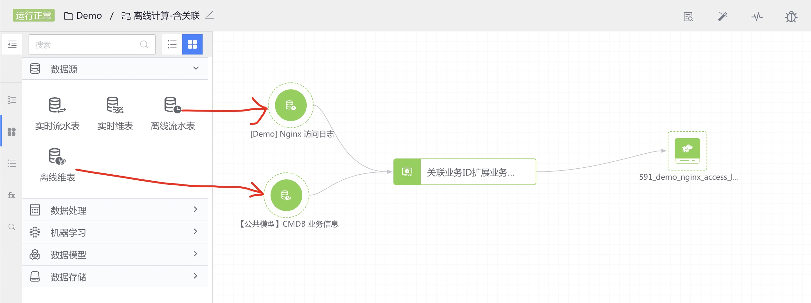
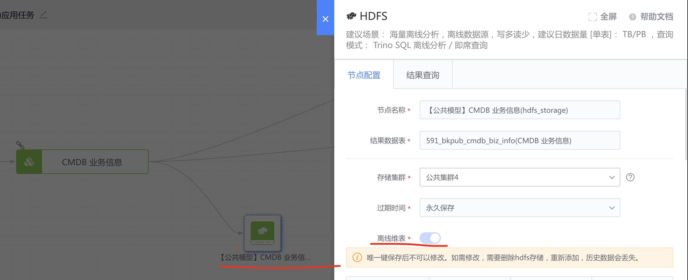
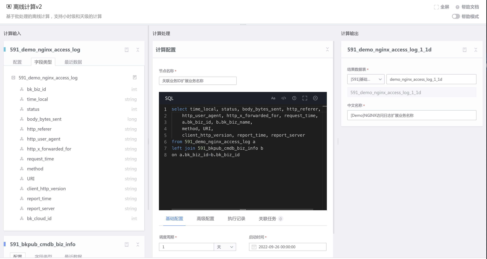

# 离线维表

入库到 HDFS 时开启 "离线维表" 特性的结果表，在离线计算中可用于关联计算（如 LEFT JOIN)，其中离线维表的数据窗口为所有数据。

场景：将 NGINX 访问日志中的业务 ID 每天通过关联 CMDB 业务信息表，扩展业务名称。

### 离线维表的来源
入库到 HDFS 时开启 "离线维表" 特性的结果表

### 使用方式

- 离线维表与离线流水表进行关联计算

- 离线维表直接连接下游离线计算

#### 可以连接的下游节点类型
- 离线计算
