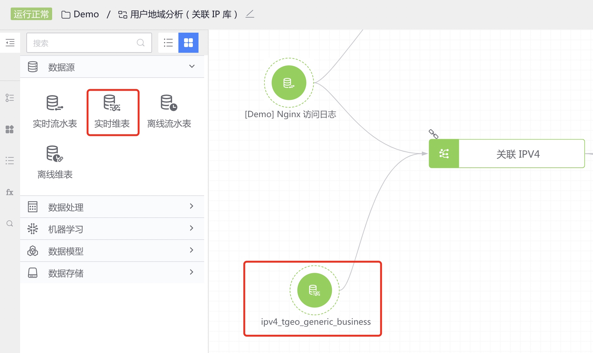
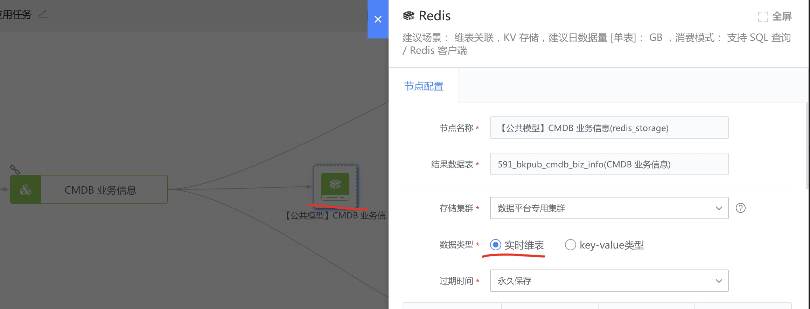
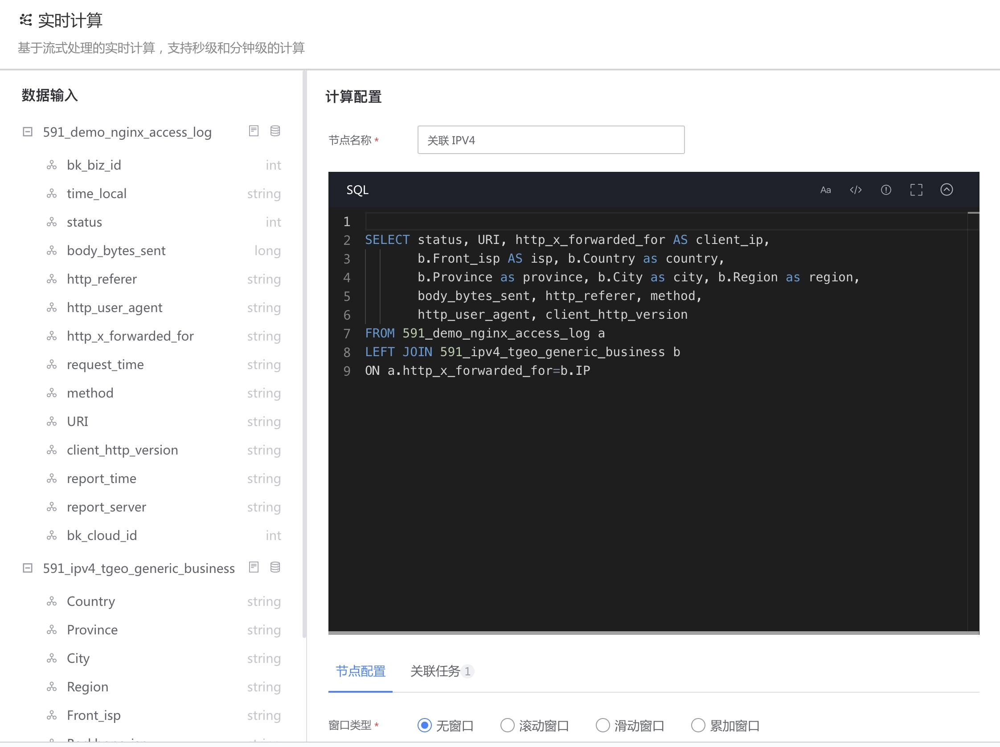

# 实时维表

入库到 Redis 时开启 "实时维表" 特性的结果表，在实时计算中可用于关联计算（如 LEFT JOIN)，其中实时维表的数据窗口为所有数据。

#### 实时维表的来源
- 入库到 Redis 时开启 "实时维表" 特性的结果表

- 平台自身提供的公共关联数据，例如：IP 库、CMDB 库

#### 使用方式
在数据开发画布中，先选择实时流水表，然后选择需要的实时维表节点，将这两个数据源连线到实时计算节点上。实时维表的使用规则：

- 实时维表需要配合实时流水表、实时计算节点使用
- 一个 "实时计算" 节点可以关联 1 至多个 "实时维表" 节点

#### 可以连接的下游节点类型
- 实时计算

