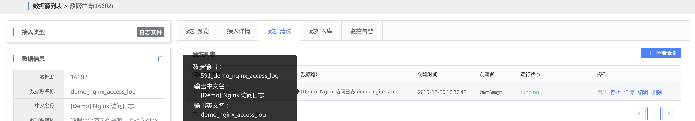
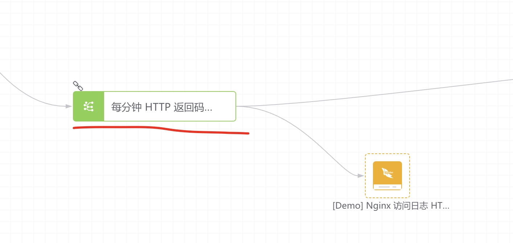
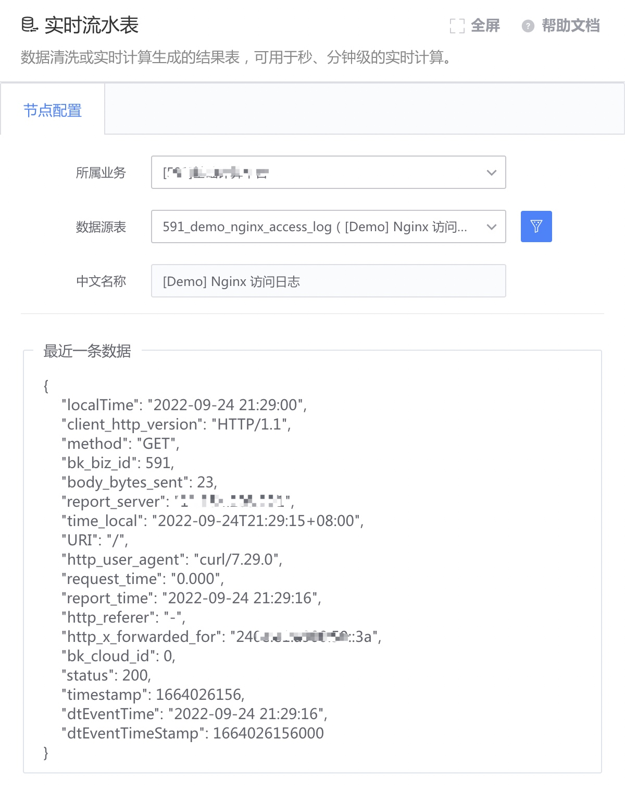

# 实时流水表

数据清洗或实时计算生成的结果表，可用于秒、分钟级的实时计算。

#### 实时流水表的来源
- 数据集成清洗的结果表

- 实时计算生成的结果表，下游必须选择有效存储节点

#### 使用方式
- 配置实时流水表节点
  - 指定所属业务
  - 选择所属业务下实时数据表，可在界面查看最近一条数据
  - 若不存在可选业务或可选实时数据表，可申请业务数据或新接入数据源

- 连接实时计算或其它合法下游节点，对实时数据进行计算处理

#### 可以连接的下游节点类型
- 实时计算
- 大部分存储节点（如 HDFS 等）
