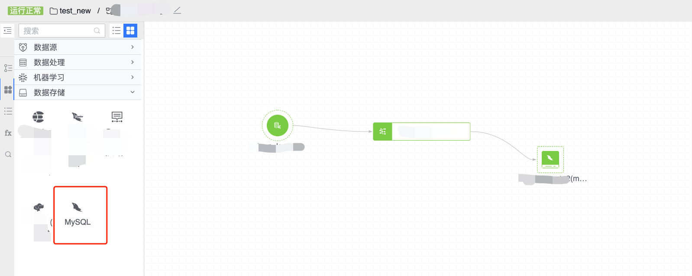
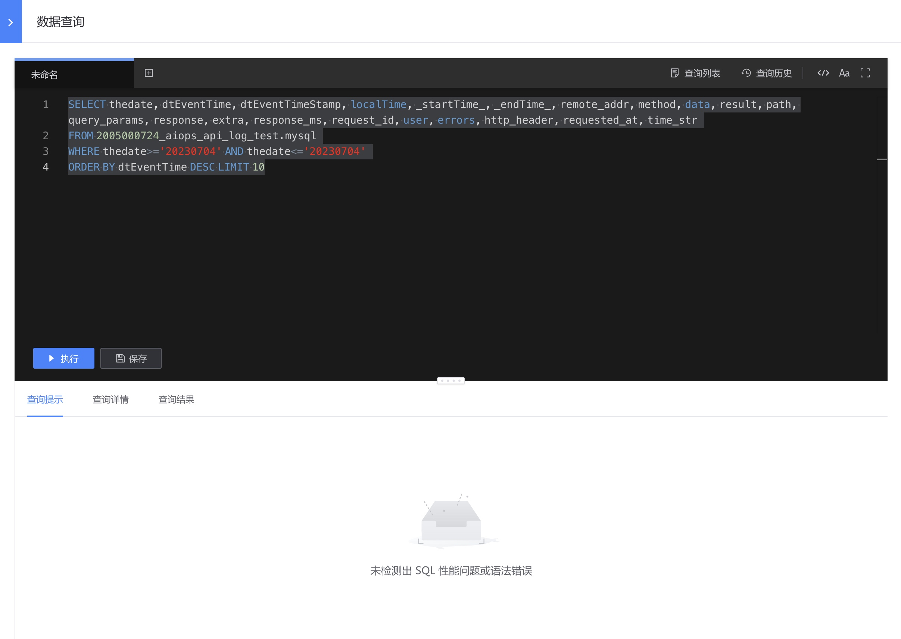

# MySQL
图例，MySQL 节点

#### 使用方式
- 节点名称： 自动生成，由上游结果表和当前节点类型组成
- 结果数据表：从上游节点继承过来
- 存储集群：通常可选有默认集群组集群，其它可选集群与任务所属项目相关
- 过期时间：数据入库后保存的过期时间

除此之外，MySQL 节点可根据上游节点结果表的输出情况，指定字段是否为索引字段或者唯一键。

配置例子如下：

对于运行中的任务，鼠标悬浮在存储节点上，点击 SQL 图标可对 MySQL 中的数据进行查询：

