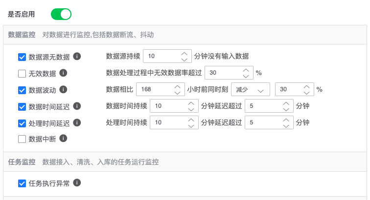

### 功能简介

用户计算任务有可能会因为 **数据源有问题** 、 **数据链路异常** 和 **任务异常** 等原因而导致数据的质量达不到用户的预期，而且如果这种问题不及时发现，有可能会对依赖该结果数据的上层应用造成不良的影响，而数据流监控告警功能可以从 **数据源无无数据** 、 **无效数据** 、 **数据波动** 、 **数据时间延迟** 、 **处理时间延迟** 、 **数据中断** 、 **任务异常** 这七种种策略对数据的质量进行监控，用户只需要在 **`监控告警`** 页面配置监控的参数，就可以在 **数据开发任务** 数据质量不满足时收到告警通知，从而可以及时介入解决数据源或任务可能存在的问题

### 监控告警策略说明

* **数据源无数据** ——数据源持续一段时间内没有 **数据上报** 或者清洗、入库或计算任务持续一段时间没有 **数据输出** ，对于有持续上报或输出的数据；该策略可以及时发现服务不可用等异常情况，保证数据的 **持续性**
* **数据无效** ——数据在流转或处理过程中 **不符合计算逻辑** 或 **格式错误** 等原因而主动丢弃；该策略主要用于发现因无效数据过多导致资源浪费等情况，保证数据的 **有效性**
* **数据波动** ——数据源、清洗、入库和计算任务的数据量相对于上一周期同比减少（增长）超过预设的比例，该策略主要用于发现数据因为异常而出现不符合预期的波动情况，保证数据的 **稳定性**
* **数据时间延迟** ——数据在流转或处理过程中，数据本身的时间相对于本地时间的延迟，该策略主要用于发现因数据延迟过大导致结果查询不全的情况，以保证结果数据的 **实时性**
* **处理时间延迟** ——数据在流转或处理过程中，处理数据的时间相对于本地时间的延迟，该策略主要用于发现因处理延迟过大导致数据积压的情况，以保证中间数据能及时地被处理
* **数据中断** ——清洗、入库和计算任务在执行过程中被中断或无法跟踪任务执行情况，该策略主要用于发现任务实际运行情况与状态不一致的问题，以保证数据的 **可靠性**
* **任务异常** ——数据在接入，清洗，入库和计算的过程中，任意一个环节的任务出现异常，该策略主要用于发现任务的异常情况，保证任务的 **可用性**

### 告警收敛策略说明
* **触发条件** ——告警必须在设定的周期内，触发达到一定次数才会告警，主要为了解决告警指标瞬时抖动导致的告警泛滥问题
* **告警收敛** ——把原始检测生成的告警根据一定时间进行屏蔽，可以减少有效告警产生的频率，防止告警雪崩，默认屏蔽时间是 **60** 分钟，每种监控告警策略屏蔽时间相互独立
* **告警汇总** ——把收敛后的有效告警汇总到一次消息通知中，减少告警通知用户的频率，默认汇总时间为 **10** 分钟

### 如何配置数据开发监控告警

首先进入某个数据开发任务的`详情编辑页`，点击数据开发画布右上角工具栏中的`告警配置`

点击后会打开一个告警配置面板

监控配置主要分为两大类，分别是`数据监控`和`任务监控`，监控配置默认不启用，用户可以通过点击开关启用监控告警，启用后才可以进一步配置告警策略

每种`告警策略`都可以独立打开或关闭，告警策略的参数可以参考上面`监控告警策略说明`进行配置

配置完告警策略后需要配置`收敛策略`，具体参数可以参考上面`告警收敛策略说明`进行配置

配置完策告警略和收敛策略后，需要配置告警的 **通知方式** 和 **接收人** ，当且仅当有至少有一个接收人和至少打开一种通知方式才可以把告警配置以打开的方式保存成功

