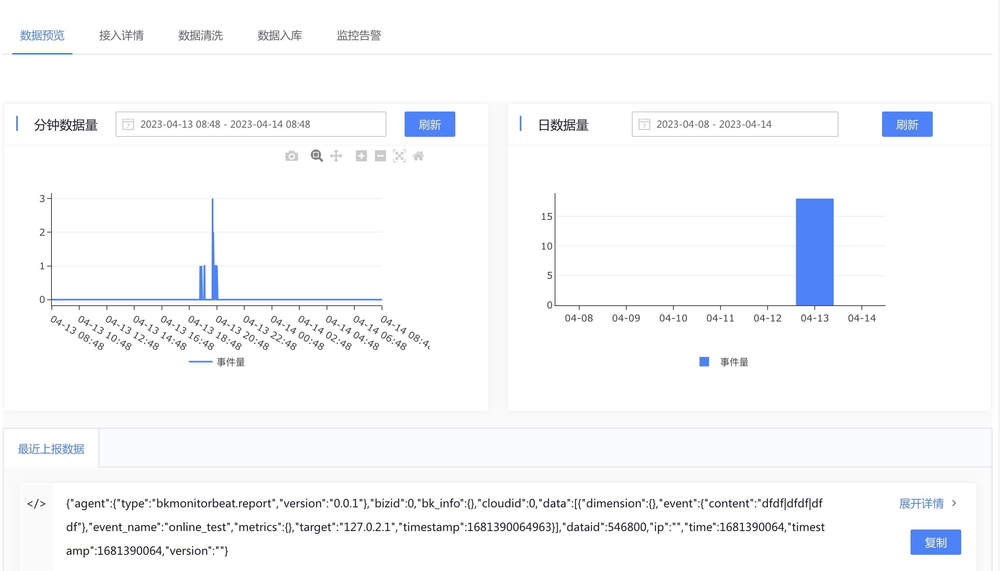

# 自定义上报 使用方式

通过 GSE 插件 `bkmonitorbeat` 上报数据。

注：`gsecmdline` 的上报方式已调整为 `bkmonitorbeat`。

## 前置条件

### 获取 数据 ID
进入平台的 接入集成 -> 新接入数据源 -> 接入类型（自定义），提交后获取 数据 ID。

> 注：数据 ID 将在 bkmonitorbeat 的  `-report.bk_data_id` 参数中指定。

### bkmonitorbeat 插件已安装

如未安装，前往 节点管理 安装插件

### 获取 bkmonitorbeat 路径 
通过 `ps -ef | grep gse` 可以获取 GSEAgent 的安装路径，例如 `/usr/local/gse_bkte/`，补充 `plugins/bin/bkmonitorbeat` 得到 `bkmonitorbeat` 的路径  `/usr/local/gse_bkte/plugins/bin/bkmonitorbeat`

```bash
$ ps -ef | grep gse     
root     76989     1  0 Apr03 ?        00:00:00 ./gse_agent -f /usr/local/gse_bkte/agent/etc/agent.conf
root     76990 76989  0 Apr03 ?        00:03:15 ./gse_agent -f /usr/local/gse_bkte/agent/etc/agent.conf
```

### 获取 GSEAgent IPC 路径
从上面命令的结果中，可以获取 `GSEAgent 的配置 `（例如 `/usr/local/gse_bkte/agent/etc/agent.conf`)，查看配置中的 `dataipc`，可以获取 IPC 路径（例如 `/usr/local/gse_bkte/agent/data/ipc.state.report`)

> 注：IPC 路径将在 bkmonitorbeat 的  `-report.agent.address` 参数中指定。


## 主要参数说明

```bash
./bkmonitorbeat  \
-report \  ## 固定为 report
-report.type agent \  ## 固定为 event
-report.message.kind event \  ## 固定为 event
-report.bk_data_id 546800 \   ## 计算平台分配的 数据 ID
-report.event.target 127.0.0.1 \  ## 指定目标 IP
-report.event.name "online_test" \ ## 上报的事件名
-report.event.content "dfdf|dfdf|dfdf" \ ## 上报的自定义内容
-report.agent.address  "" ## 指定 IPC 路径
```

## 数据上报案例
### 上报自定义数据

```bash
./bkmonitorbeat -report \
-report.type agent \
-report.message.kind event \
-report.bk_data_id 546800 \
-report.event.target 127.0.0.1 \
-report.event.name "online_test" \
-report.event.content "dfdf|dfdf|dfdf" \
-report.agent.address /usr/local/gse_bkte/agent/data/ipc.state.report
```

> 注：请将 `bk_data_id`, `-report.agent.address` 改成你的配置。


平台收到的数据

```json
{
    "agent": { "type": "bkmonitorbeat.report", "version": "0.0.1" },
    "bizid": 0,
    "bk_info": {},
    "cloudid": 0,
    "data": [
        {
            "dimension": {},
            "event": { "content": "dfdf|dfdf|dfdf" },
            "event_name": "online_test",
            "metrics": {},
            "target": "127.0.0.1",
            "timestamp": 1681472452062
        }
    ],
    "dataid": 546800,
    "ip": "",
    "time": 1681472452,
    "timestamp": 1681472452,
    "version": ""
}
```


### 上报 JSON 数据

```bash
./bkmonitorbeat -report \
-report.type agent \
-report.message.kind event \
-report.bk_data_id 546800 \
-report.agent.address /usr/local/gse_bkte/agent/data/ipc.state.report \
-report.message.body '{
    "access_token":"",
    "data":[{
        "event_name":"input_your_event_name",
        "target":"127.0.0.1",
        "event":{
            "content":"user xxx login failed"
        },
        "dimension":{
            "amodule":"db",
            "aset":"guangdong"
        },
        "metrics":{
            "field1":1.1
        },
        "timestamp":1591067660370,
        "test": 202383883838
        }
    ]}'
```    

> 注：请将 `bk_data_id`, `-report.agent.address` 改成你的配置。
    
    
平台收到的数据

```json
{
    "agent": { "type": "bkmonitorbeat.report", "version": "0.0.1" },
    "bizid": 0,
    "bk_info": {},
    "cloudid": 0,
    "data": [
        {
            "dimension": { "amodule": "db", "aset": "guangdong" },
            "event": { "content": "user xxx login failed" },
            "event_name": "input_your_event_name",
            "metrics": { "field1": 1.1 },
            "target": "127.0.0.1",
            "test": 202383883838,
            "timestamp": 1591067660370
        }
    ],
    "dataid": 546800,
    "ip": "",
    "time": 1681471090,
    "timestamp": 1681471090,
    "version": ""
}
```    


## 查看数据上报结果

数据上报成功后，可以在数据源详情页中查看数据上报的情况。



确认无误后，接下来可以进行 [数据清洗](../../data-clean/detail.md)，将原始数据清洗为能在平台中流转的 [结果表](../../../../Introduction/Terms.md)。


