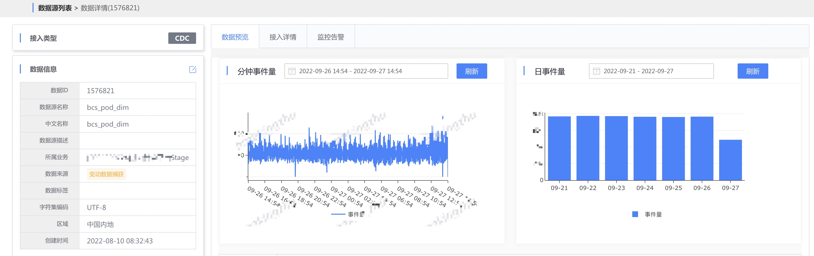

# MongoDB 接入

将 MongoDB 中的集合同步到 bkbase，用做离线计算的离线流水表、离线维表，以及数据探索。

## 功能介绍
### 同步原理
> 变更数据捕获（Change Data Capture，简称 CDC），是一种用于捕获数据库中数据变更的技术。MongoDB 基于 Change Streams 同步变更数据。

下图为 变更数据捕获逻辑架构图。

### 适用场景
和原始 DB 保持一致，用做离线维表、离线流水表和数据探索
直接入数据湖（HDFS），目前只能支持离线计算，不能入库到其他存储
可以捕获数据更新 / 删除

### 接入条件
支持 4.0 或以上版本，集群部署方式为 Replica Sets 或者 Shared Clusters
存储引擎为 WiredTiger
提供一个包含 read 和 readAnyDatabase 角色权限的账户
建议 Oplog 至少能保存 24h 日志，以便 CDC 任务故障恢复

## 提交数据接入任务
在 "数据集成" 菜单中，点击 "新接入数据源"，在接入类型中选择  "数据库"，数据库类型选择 "mongodb"。

在接入对象中，填写集群的连接信息。

> 点击集合下拉框右侧的预览 icon，可以查看其中 1 条数据。

填写输出结果表的信息，包含 HDFS 存储集群，以及结果表类型：

- 离线维表：在离线计算中可用于关联计算（如 LEFT JOIN)，其中离线维表的数据窗口为所有数据。
- 离线流水表：可用于小时、天级别的离线计算

注意：当选择离线流水表时，请选择集合中“创建后不更新的时间字段” 作为时间字段，如“创建时间”，否则接入后的数据和源表不一致。

确认信息无误后，提交接入任务。

等待 2~10 分钟，接入完成。

## 查看数据预览 

- 查看数据预览

- 查看接入详情

可以找到输出的表名。

> 该示例的结果表类型为维表

- 根据数据源的情况，可以配置 数据源无数据 和 数据波动 告警策略。

## 消费结果表
数据接入完成后，可以在 [数据探索](../../../datalab/queryengine/sql-query/concepts.md) 或 数据开发 中消费数据。

### 数据探索
在数据探索中查询该结果表。

### 数据开发
在数据开发申请该结果表权限，根据接入时的配置，可用于 [离线流水表](../../../dataflow/components/source/batch-source.md) 或 [离线维表](../../../dataflow/components/source/batch-dim.md)。

- 离线维表

- 离线流水表

