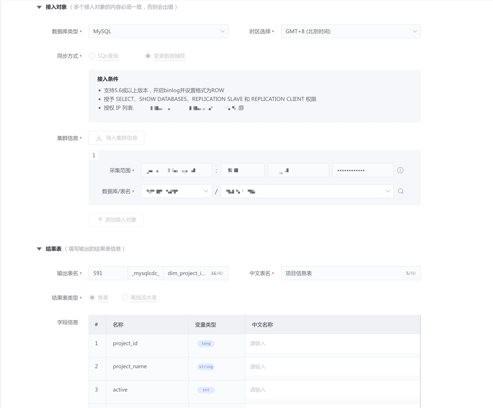

# 基于动态变更捕获 CDC

将 MySQL 中的数据同步到 BK-Base，用做离线计算的离线流水表、离线维表，以及数据探索。

## 功能介绍
### 同步原理
> 变更数据捕获（Change Data Capture，简称 CDC），是一种用于捕获数据库中数据变更的技术。MongoDB 基于 Binlog 同步变更数据。

下图为 变更数据捕获逻辑架构图。

### 适用场景
- 和原始 DB 保持一致，用做离线维表、离线流水表和数据探索
- 直接入数据湖（HDFS），目前只能支持离线计算，不能入库到其他存储
- 可以捕获数据更新 / 删除

### 接入条件
- 支持 5.6 或以上版本，开启 `binlog` 并设置格式为 `ROW`
- 授予 `SELECT`、`SHOW DATABASES`、`REPLICATION SLAVE` 和 `REPLICATION CLIENT` 权限
- 授权 IP 列表

## 提交数据接入任务
在 "数据集成" 菜单中，点击 "新接入数据源"，在接入类型中选择  "数据库"，数据库类型选择 "MySQL"，同步方式为 `变更数据捕获`。

在接入对象中，填写集群的连接信息。

> 点击集合下拉框右侧的预览 icon，可以查看其中 1 条数据。

填写输出结果表的信息，包含 HDFS 存储集群，以及结果表类型：

- 维表：用作实时维表、离线维表，在实时、离线计算中可用于关联计算（如 LEFT JOIN)，其中维表的数据窗口为所有数据。
- 离线流水表：可用于小时、天级别的离线计算

注意：当选择离线流水表时，请选择集合中“创建后不更新的时间字段” 作为时间字段，如“创建时间”，否则接入后的数据和源表不一致。

确认信息无误后，提交接入任务。

等待 2~10 分钟，接入完成。

## 查看数据预览 

和 [MongoDB 接入](../mongodb/mongodb.md) 相同

## 消费结果表
和 [MongoDB 接入](../mongodb/mongodb.md) 相同

## FAQ
### CDC表的保存周期
- CDC表都是永久保留
- 如果 MySQL 删除数据是通过 delete 语句执行，删除会同步到 CDC 表
- 如果删除数据是通过 drop partition 来操作，删除不会同步到 CDC 表