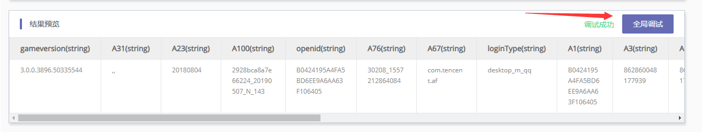
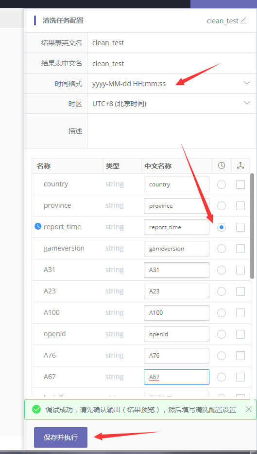
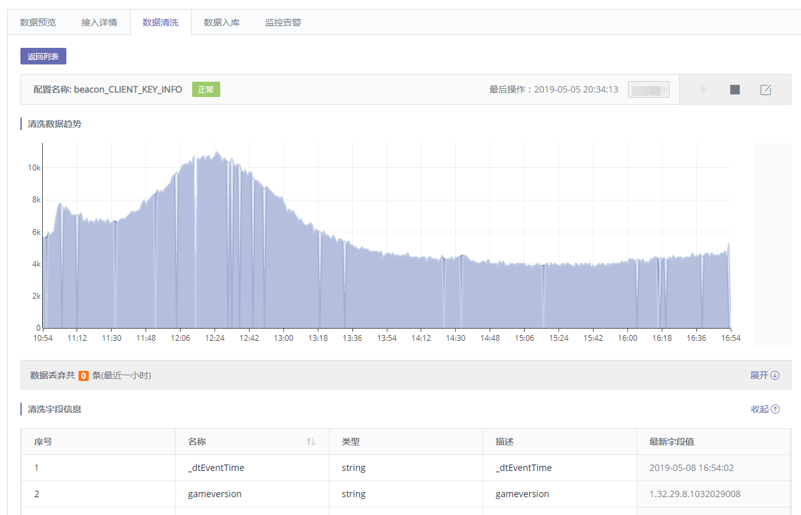

## 数据清洗

## 为什么数据需要清洗

用户上报的数据可能是多种格式的，例如竖线分隔的数据，json 格式的数据，普通的行日志数据等等。如果需要在平台中使用上报的数据，首先需要将数据标准化，转换为统一 schema 的一行行记录。

## 前置条件
- 已完成 [数据源接入](../data-access/concepts.md)

下面以文件接入为例，[文件数据源接入](../data-access/file-upload/detail.md)

### 如何配置清洗

首先进入“数据详情”->“数据清洗”页面，点击右上角的“添加清洗”按钮增加清洗配置。通常情况下，用户只需要配置一个清洗规则即可，用户也可以对同样的数据源配置多个清洗规则。

* 进入清洗配置页面后，首先会加载一条上报的数据


* 根据上报数据的格式，选择合适的清洗算子


* 点击“全局调试”按钮，测试清洗配置是否工作正常



* 调试成功后，在右边出现的输入框内给清洗配置设置名称，配置时间字段等，然后点击“保存并执行”



* 清洗配置成功后，会跳转到清洗列表页面


* 点击清洗任务对应的“详情”链接，可以进入数据清洗详情页，在页面上能看到输入和输出的数据趋势图、清洗丢弃的数据量和原因、清洗的字段列表、最新清洗出的结果数据、关联此清洗数据的任务列表




```plain
注意：有一些字段名称是系统保留的，或者是 SQL d中的关键字，无法作为清洗输出的字段名称。
```


### 清洗算子列表

| 算子名称 | 算子描述 | 输出类型 | 示例 |
| --- | --- | --- | --- |
| JSON 反序列化 | 反序列化 JSON 字符串成对象 | Object | 输入字符串”{\”a\”:1}” 解析通过会得到对象; {a:1}解析失败会报错 |
| JSON 列表反序列化 | 反序列化 JSON 字符串成列表 | List | 输入字符串”[1,2,3]” 解析通过会得到列表; {"a":1}解析失败会报错 |
| CSV 反序列化 | 反序列化 CSV 数据成列表 | List | 输入字符串"a,b,c" 解析通过会得到列表; [“a”,”b”,”c”]解析失败会报错 |
| URL 反序列化 | 反序列化 URL ENCODING 字符串成对象 | List | 输入字符串”a=1&b=2" 解析通过会得到对象{a:1, b:2} |
| 遍历 | 通过“迭代器”的方式遍历列表，将元素依次传入后续算子 | Any | 输入列表[1,2,3] 下游算子会被依次传入 1，2，3，每次一个元素 |
| 切分 | 按分隔符切分字符串 | List | 输入字符串” 1&#124;2&#124;3”, 填写分隔符参数为”&#124;” 解析后会得到列表[1,2,3] |
| 替换 | 替换字符串中的子串`a`为给定字串`b` | String | 输入字符串”hello world”, 填写参数将”world”替换为”china” 解析后会得到字符串”hello china" |
| 取值 | 按照数字索引或者 key 提取数据 | Any | 输入对象{a:1}, 填写按 key 取”a”字段，会得到数据 1; 输入列表[1,2,3]，填写按 index 取 1 索引，会得到数据 2 |
| 正则提取 | 使用正则表达式的命名分组来提取数据 | dict| <div>输入字符串`a123b`, 正则表达式为`a(?P<name1>\d+)b`, 会得到数据字典`{"name1":"123"}`</div><div>请注意:</div><div>1.每个正则表达式中只能有一个命名分组，如有多个需要提取的，请用两个正则表达式来分别提取。 </div><div>2.给命名分组命名时，请不要在名字中出现`_`. </div>|
| 赋值 | 按照数字索引或者 key 将数据赋值给输出字段 | None |<div>输入对象{a:1}, 填写按 key 取”a”字段，字段 f1,会将数据 1 赋值字段 f1;</div><div>输入列表[1,2,3]，填写按 index 取 1 索引，字段 f2,会将数据 2 赋值字段 f2;</div><div>输入数字或者字符串，选择 direct，字段 f3，会将数字或字符串直接赋值给字段 f3</div>|
