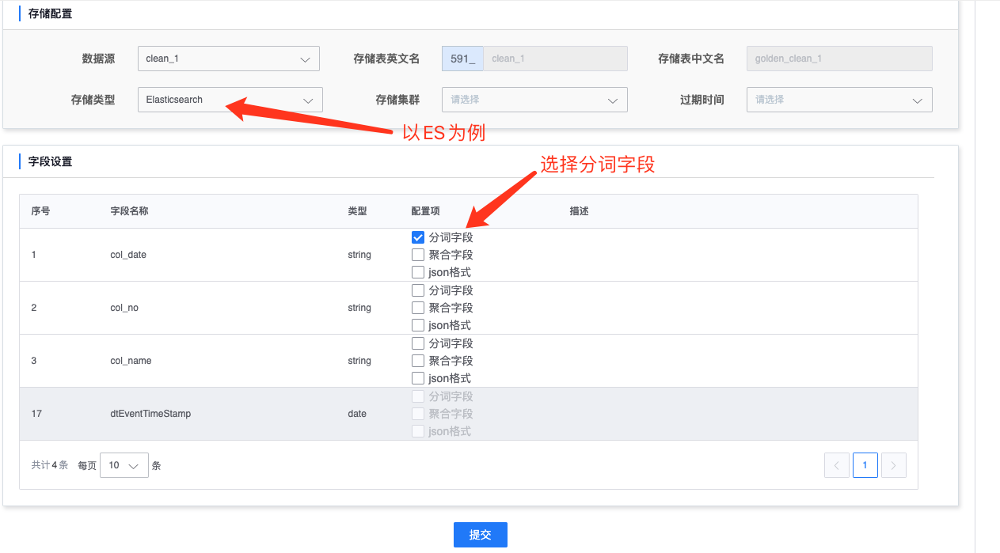

# 数据入库

### 功能简介

数据入库是一个方便用户将清洗完毕的数据直接分发到存储中的功能，支持多种存储类型，比如 ElasticSearch、Queue 等等。用户可以在页面上简单配置下，即可启动数据分发的任务，并可以数据入库任务的详情页面中直接查询已入库的数据。

## 前置条件
- 已完成 [数据源接入](./data-access/concepts.md)
- 已完成 [数据源清洗](data-clean/detail.md)

* 以 [数据源清洗](data-clean/detail.md) 中的该表为例


### 如何配置清洗

首先进入“数据详情”->“数据入库”页面，点击右上角的“添加入库”按钮增加入库任务。

* 进入添加入库面后，首先选择需要入库的清洗数据作为数据源，然后选择需要入库的存储类型


* 以 ElasticSearch 存储为例，此时需要选择分词字段、聚合字段等信息，然后保存



* 这时会回到数据入库列表页，可以看到刚才添加的入库任务


* 点击入库任务对应的“详情”链接，可以进入详情页，在页面上能直接查询入库的数据


```plain
注意：
1. 对于无法自动增加字段的存储，比如 MySQL、Tspider，用户修改清洗任务，增删改字段后，数据入库这里无法将变化后的 schema 同步到存储中。此时需要用户重新配置一个新的清洗规则，然后再创建一个新的入库任务。
2. 对于 ElasticSearch、Queue 等存储，清洗任务的配置变化会实时反应到入库的数据中。
```


### 目前平台所支持的入库方式


|   入库方式   | 类型 | 描述 | 建议使用场景 | 建议日数据量(单表) | 查询模式 |
| :--- | ---- | ---- | ---- | ---- | ---- |
|   HDFS   | 分布式文件系统 |      | 海量数据离线分析，对查询时延要求不高 | TB/PB | 可对接离线分析/即席查询/数据分析等方式 |
| MySQL | 关系型数据库 |      | 关系型数据库 | GB/千万级以内 | 点查询/关联查询/聚合查询 |
| Elasticsearch | 分析数据库，Log Search |      | 全文检索及数据分析 | GB/TB 级 | 检索查询（支持分词） |
| Queue | 消息队列 | Kafka 消息队列 | 数据订阅 | GB/TB 级 | 客户端连接消费 |

