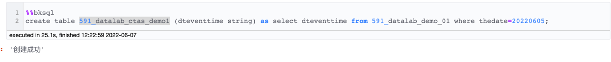
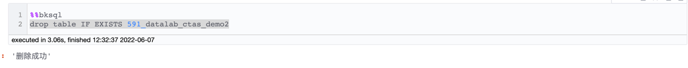

# DDL(数据定义)语句
- [`SHOW CREATE TABLE`](#show-create-table)
- [`SHOW TABLES`](#show-tables)
- [`CREATE TABLE`](#create-table)
- [`CREATE TABLE AS`](#create-table-as)
- [`DROP TABLE`](#drop-table)

## `SHOW CREATE TABLE`
- ### 语法说明
  查看通过 Notebook 产生的结果表建表语句

- ### 语法格式
  ```mysql
  SHOW CREATE TABLE table_name
  ```
 

- ### 参数说明
  - `table_name`：结果表名
  
- ### 样例
  ```mysql
  SHOW CREATE TABLE 591_datalab_ctas_table;
  ```

  

- ### 使用限制
  - 在 [Notebook](../notebook/bksql.md) 页面操作或通过或通过异步查询接口(`v3_queryengine_query_async`) 调用
  - 结果表为 Notebook 生成的表

## `SHOW TABLES`
- ### 语法说明
  查看通过 Notebook 生成的结果表

- ### 语法格式
  ```mysql
  SHOW TABLES
  ```
- ### 参数说明
  - 无

- ### 示例
  ```mysql
  SHOW TABLES;
  ```

  

- ### 使用限制
  - 在 [Notebook](../notebook/bksql.md) 页面操作或通过或通过异步查询接口(`v3_queryengine_query_async`) 调用
  - 结果表为 Notebook 生成的表
  
## `CREATE TABLE`
- ### 语法说明
  创建一张结果表，并指定列名和列类型
  
- ### 语法格式
  ```mysql
  CREATE TABLE [ IF NOT EXISTS ] table_name
  [ ( col_name col_type, ... ) ]
  ```
- ### 参数说明
  - `table_name`：要创建的结果表名
  - `col_name`：列名
  - `col_type`：列类型
  
- ### 示例
  ```mysql
  CREATE TABLE 591_datalab_create_demo (
    id int,
    name string,
    weight double
  )
  ```

  
  
- ### 使用限制
  - 在 [Notebook](../notebook/bksql.md) 页面操作或通过或通过异步查询接口(`v3_queryengine_query_async`) 调用
  - 生成的结果表为一张临时表，只能在 Notebook 任务中使用，如果要
  在其他模块中使用，需要使用[Notebook 指令](../notebook/command.md) `ResultTable.save`发布为一张正式表

## `CREATE TABLE AS`
- ### 语法说明
  通过子查询(`select`)来创建一张表

- ### 语法格式
  ```mysql
  CREATE TABLE [ IF NOT EXISTS ] table_name
    [ ( col_name col_type, ... ) ]
    AS select_statement
  ```
- ### 参数说明
  - `table_name`：要创建的结果表名
  - `col_name`：列名
  - `col_type`：列类型
  - `select_statement`：子查询语句
  
- ### 示例
  ```mysql
  CREATE TABLE 591_datalab_ctas_demo1 (
        dteventtime string
    )
  AS
  SELECT dteventtime
  FROM 591_datalab_demo_01
  WHERE thedate = 20220605;
  ```

  

- ### 使用限制
  - 在 [Notebook](../notebook/bksql.md) 页面操作或通过或通过异步查询接口(`v3_queryengine_query_async`) 调用
  - 拥有子查询结果表的查询权限
  - 生成的结果表为一张临时表，只能在 Notebook 任务中使用，如果要
  在其他模块中使用，需要使用[Notebook 指令](../notebook/command.md) `ResultTable.save`发布为一张正式表

## `DROP TABLE`
- ### 语法说明
  删除名为`table_name`的结果表

- ### 语法格式
  ```mysql
  DROP TABLE [IF EXISTS] table_name；
  ```
- ### 参数说明
  - `table_name`：要删除的结果表名
  
- ### 示例
  ```mysql
  DROP TABLE IF EXISTS 591_datalab_ctas_demo2
  ```
  
  
  
- ### 使用限制
  - 在 [Notebook](../notebook/bksql.md) 页面操作或通过或通过异步查询接口(`v3_queryengine_query_async`) 调用
  - 目标表为 Notebook 生成的表
