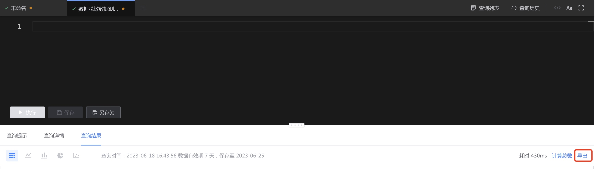
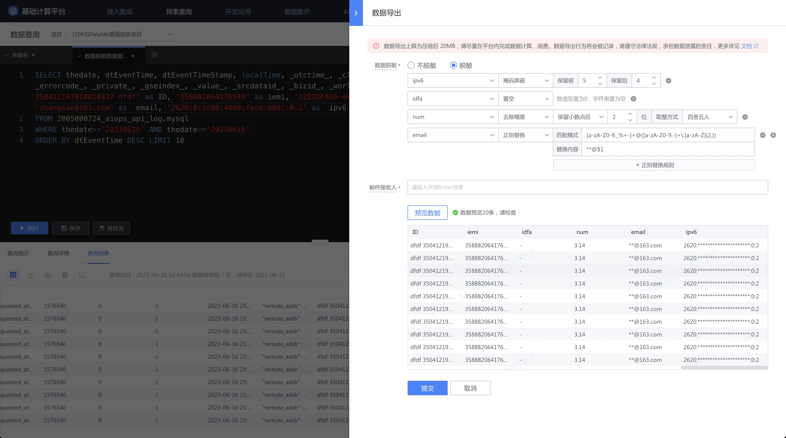

# 数据导出
导出数据查询的查询结果。

数据导出上限为压缩后 20MB，请尽量在平台内完成数据计算、消费。

> [计算任务](../../dataflow/ide/concepts.md)： 数据处理（包含实时计算、离线计算）、机器学习节点的编排与应用
> 
> [Notebook](../notebook/concepts.md)：使用 SQL 和 Python 交互式探索分析

## 信息安全提示
数据导出行为将会被记录，请遵守法律法规，承担数据泄露的责任。

## 使用流程
### 入口
数据查询结果的右侧，点击导出，弹出 数据导出侧滑。

### 数据脱敏
> 数据脱敏是指从原始环境向目标环境进行敏感数据交换时，通过一定的方法消除原始环境中数据的敏感性，并保留目标环境业务所需的数据特性或内容的数据处理过程，在避免敏感数据泄露和滥用的同时，又能保留数据统计学价值。

计算平台提供常见脱敏算子可供数据脱敏使用:

| 脱敏算子 | 作用                                              | 示例                       | 备注 | 
|---|---|---|---|
| 掩码屏蔽 | 通过 * 替换原有字符 | 保留前 3 后 2：13234345678 -> 132******78 | 一般来说，建议覆盖 60% 以上的字符 |
| 置空     | 数值型置为 0，字符串置为空 | 13234345678 ->  0   abc -> |   |
| 降低精度         | 降低数据的精度    |   12345.67 --> 12300 （保留 3 位有效数字，四舍五入）  3.1415926  -->  3.14 （保留小数点后 2 位，四舍五入） | 输入字段类型限制：数值型 |
| 正则替换         | 通过正则匹配到字符后替换， 适用于非结构化字段的内容脱敏                                              |  zhangsan@example.com -> **@example.com | 兼容 PCRE 风格的正则表达式   一个字段支持使用多个正则替换规则，按顺序依次替换  |

## 邮件推送到邮箱
点击提交后，数据导出文件会发送到指定邮箱。

> 数据导出上限为压缩后 20MB，请尽量在平台内完成数据计算、消费。

## FAQ

### 显示邮件发送成功，但收不到邮件
1. 排查是否有启动邮件过滤，如果有可以在垃圾箱或者删除文件中查找
2. 排查是否有启用邮件退订，可以联系邮箱管理员确认
3. 检查是否设置了邮件黑名单，如果使用企业微信邮箱，在 [邮件设置] -> [更多] -> [黑名单] 中移除黑名单。
4. 邮件服务器发送延迟，高峰期可能 5 分钟左右收到邮件