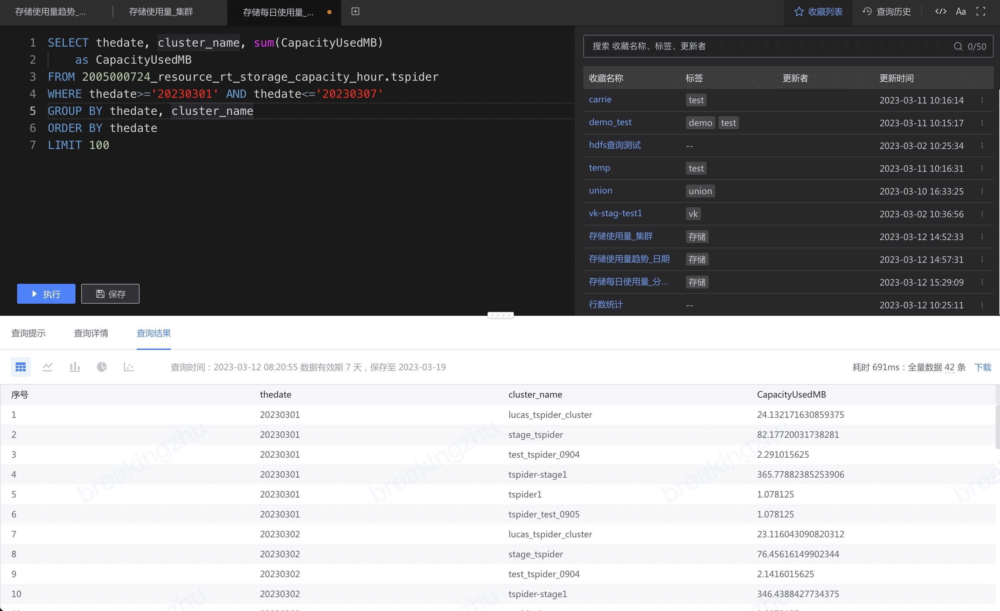
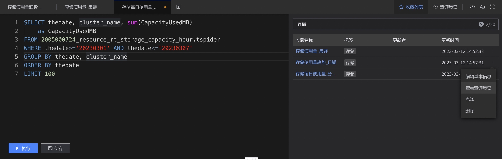

# 收藏查询
当查询结果符合预期时可以保存查询，便于后续使用。

保存的查询可以在 SQL 编辑器右上角中找到。

可以通过查询名称、标签、更新者来搜索，其中可点击标签列实现快速搜索。

在收藏列表的最后一列，可以进行收藏查询的操作：编辑基本信息、查看查询历史、克隆和删除。

## 分享 SQL
收藏查询后，可以将 URL 分享给数据项目内的成员，可以快速查看对应的查询 SQL 及查询结果。