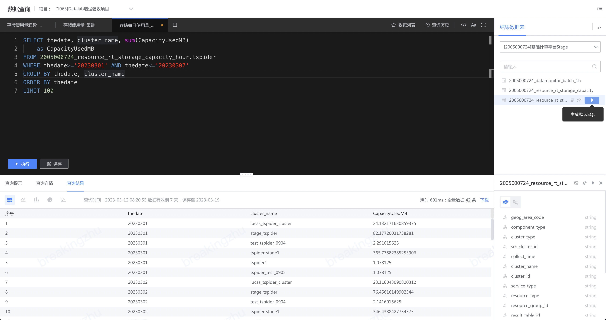

# 数据查询介绍

通过标准的 SQL 查询语法低门槛地完成数据分析需求。

接入到平台的数据源通过清洗成为结果表，根据使用场景入库到不同的存储类型（HDFS、MySQL 等），在数据查询中可以通过 SQL 来分析这些结果表的数据。

<video src="media/dataquery.mp4" controls></video>

以下是数据查询功能中几个关键概念：

- 项目：分为数据项目、以用户名命名的个人项目
数据项目可以查询该项目下有权限的结果表，个人项目可以查询个人拥有权限的结果表
- SQL 编辑框：在 SQL 编辑框可以完成 SQL 的编写，[查询提示](./codecheck.md) 和 [自动补全](./autocomplete.md) 将提升 SQL 编写的正确性和效率。
- [查询列表](./favorites.md)：当查询结果符合预期时可以保存查询，便于后续使用。
- [查询历史](./history.md)：记录每一次查询记录，包含 SQL、查询详情、查询结果。
- 格式化：提升 SQL 的可读性
- [查询结果可视化](./query_result_visual.md)：数据查询的结果可以通过表格、折线图、柱状图、饼图、散点图来呈现，满足数据分析场景下的可视化需求。
- 结果表检索区域：检索项目下有权限的结果表，可查看结果表的表结构
- 函数列表：列出平台支持的 SQL 函数

## 附录
### SQL查询语法
SQL 查询语法主要分为 3 种：
- 显示的指定存储类型（如 result_table_id.hdfs），可以使用该存储类型的方言 SQL 语法
- 不显示的指定存储类型，使用统一的 [BKSQL 语法](../bksql/dql.md) 来完成数据分析操作
- 多源结果表联合查询，使用查询引擎 [Trino SQL 语法](https://trino.io/docs/current/sql/select.html)

