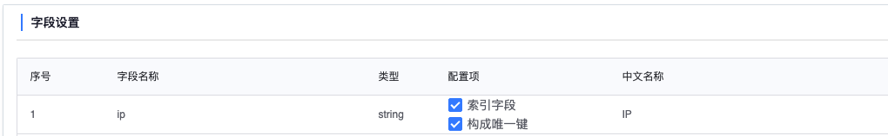

## Notebook 指令集

### 功能介绍

Notebook 作为平台数据操作的入口，提供结果表操作的相关指令集，支持对结果表数据的更新操作（插入数据、删除数据、修改数据等）和结果表的创建删除操作。


### 预备知识：Notebook 生成的结果表类型

Notebook 任务和清洗任务、数据开发任务都能生成结果表，Notebook 中产生的结果表包括两种类型：临时结果表和快照结果表。

#### 临时结果表

临时结果表可以理解为用户创建的一份草稿表，可以在创建结果表的 Notebook 内自由进行结果表数据的更新操作。

临时结果表的作用域在产生此结果表的 Notebook 任务内（在同个 Notebook 内支持结果表的数据修改，在同个项目内支持结果表的数据查询）。

临时结果表默认关联的存储类型是 HDFS，不支持指定其他存储类型。

#### 快照结果表

临时结果表的数据如果满足用户要求，想要在平台其他地方使用这份数据，此时可以完成临时结果表的上线操作，上线成为平台正式的快照结果表。

快照结果表是平台正式的结果表，平台不会对快照表补充时间字段，支持关联 HDFS 存储和 Ignite 存储，可以作为静态关联数据应用于数据开发任务。


### 结果表相关指令集

- #### 基于 DataFrame 数据创建临时结果表

##### 指令说明

创建临时结果表，往临时结果表中导入 Pandas DataFrame 中的数据

##### 适用范围

基于此指令创建的结果表是临时结果表，如需转成平台正式结果表，请参考下面文档 “临时结果表上线成平台正式结果表”

##### 使用方式

```python
ResultTable.create(dataframe, result_table_id)
"""
:param dataframe: pandas dataframe
:param result_table_id: 创建的结果表 id

:return: 执行结果，成功或失败
"""
```

##### 使用样例

```python
import pandas as pd
df = pd.read_csv('文件路径', encoding='utf-8-sig')
ResultTable.create(dataframe=df, result_table_id='591_test')
```


- #### 插入数据

##### 指令说明

往结果表中插入数据，只支持对 HDFS 存储类型执行数据插入操作

##### 适用范围

目前数据插入操作只能作用于此 Notebook 生成的临时结果表，不能操作其它 Notebook 生成的临时结果表，暂时不支持平台正式结果表的插入操作

##### 使用方式

```python
ResultTable.insert(result_table_id, column_names, column_values)
"""
:param result_table_id: 结果表 id
:param column_names: 字段名
:param column_values: 字段值

:return: 执行结果，成功或失败
"""
```

##### 使用样例

```python
ResultTable.insert(
    result_table_id='591_test',
    column_names=['user', 'ip'],
    column_values=[['zhang', '127.0.0.1'], ['liu', '0.0.0.0']]
)
```

##### 等同于 SQL

```sql
INSERT INTO 591_test (user, ip) VALUES ('zhang', '127.0.0.1'), ('liu', '0.0.0.0');
```


- #### 删除数据

##### 指令说明

结果表删除数据，只支持对 HDFS 存储类型执行数据删除操作

##### 适用范围

目前数据删除操作只能作用于此 Notebook 生成的临时结果表，不能操作其它 Notebook 生成的临时结果表，暂时不支持平台正式结果表的删除操作

##### 使用方式

```python
ResultTable.delete(result_table_id, conditions)
"""
:param result_table_id: 结果表 id
:param conditions: 删除条件

:return: 执行结果，成功或失败
"""
```

##### 使用样例

```python
ResultTable.delete(
    result_table_id='591_test',
    conditions=[
        {'column_name': 'thedate', 'operator': '<', 'right_value': 20210101, 'condition': 'and'},
        {'column_name': 'ip', 'operator': '=', 'right_value': '0.0.0.0'}
    ]
)
```

##### 等同于 SQL

```sql
DELETE FROM 591_test WHERE thedate < 20210101 AND ip = '0.0.0.0';
```


- #### 修改数据

##### 指令说明

结果表修改数据，只支持对 HDFS 存储类型执行数据修改操作

##### 适用范围

目前数据修改操作只能作用于此 Notebook 生成的临时结果表，不能操作其它 Notebook 生成的临时结果表，暂时不支持平台正式结果表的修改操作

##### 使用方式

```python
ResultTable.update(result_table_id, conditions, values)
"""
:param result_table_id: 结果表 id
:param conditions: 更新条件
:param values: 更新内容

:return: 执行结果，成功或失败
"""
```

##### 使用样例

```python
ResultTable.update(
    result_table_id='591_test',
    conditions=[
        {'column_name': 'thedate', 'operator': '<', 'right_value': 20210101, 'condition': 'and'},
        {'column_name': 'ip', 'operator': '=', 'right_value': '0.0.0.0'}
    ],
    values={'user': 'lili', 'ip': '1.1.1.1'}
)
```

##### 等同于 SQL

```sql
UPDATE 591_test SET user = 'lili', ip = '1.1.1.1' WHERE thedate < 20210101 AND ip = '0.0.0.0';
```


- #### 临时结果表上线成平台正式结果表


##### 指令说明

​	Notebook 中可以完成临时结果表的上线操作，上线完成后，可以作为平台正式的快照结果表使用（不会补充时间字段）

##### 适用范围

目前上线操作适用于将临时结果表上线成平台正式结果表，正式结果表关联的存储类型暂时只支持 HDFS 和 Ignite。不支持平台正式结果表的上线操作

##### 使用方式

```python
ResultTable.save(src_rt, dst_rt, storage, storage_config, cluster_name)
"""
:param src_rt: 源表结果表名
:param dst_rt: 目标表结果表名

以下三项为选填项，不填默认创建关联 HDFS 存储的结果表
:param storage: 存储类型（选填，暂时只支持 HDFS 和 Ignite 存储类型）
:param storage_config: 存储配置（选填）
:param cluster_name: 集群名（选填）

:return: 执行结果，成功或失败
"""
```

##### 使用样例

```python
# 生成关联 HDFS 存储的结果表 591_snapshot
ResultTable.save(
    src_rt='591_queryset',
    dst_rt='591_snapshot'
)
```

```python
# 生成关联 Ignite 存储的结果表 591_snapshot2，storage_keys 代表 “构成唯一键”，indexed_fields 代表 “索引字段”
storage_config = {
    'storage_keys': ['ip'],
  	'indexed_fields': ['ip']
}
ResultTable.save(
    src_rt='591_queryset',
    dst_rt='591_snapshot2',
    storage='ignite',
    storage_config=storage_config
)
```

##### Tips：storage_keys 和 indexed_fields 等同于数据入库页面的如下配置




- #### 删除结果表

##### 指令说明

删除 Notebook 中生成的临时结果表

##### 适用范围

目前删除结果表操作只能作用于此 Notebook 生成的临时结果表，不能操作其它 Notebook 生成的临时结果表，暂时不支持删除平台正式结果表

##### 使用方式

```python
ResultTable.drop(result_table_id, storage)
"""
:param result_table_id: 结果表 id
:param storage: 存储类型（必填项，暂时填 'all'，代表删除结果表及其关联的所有存储）

:return: 执行结果，成功或失败
"""
```

##### 使用样例

```python
ResultTable.drop(result_table_id='591_test', storage='all')
```

##### 等同于 SQL

```sql
DROP TABLE 591_test;
```

