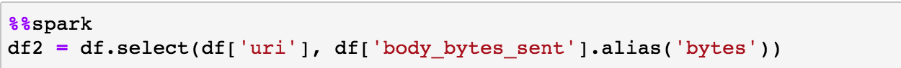
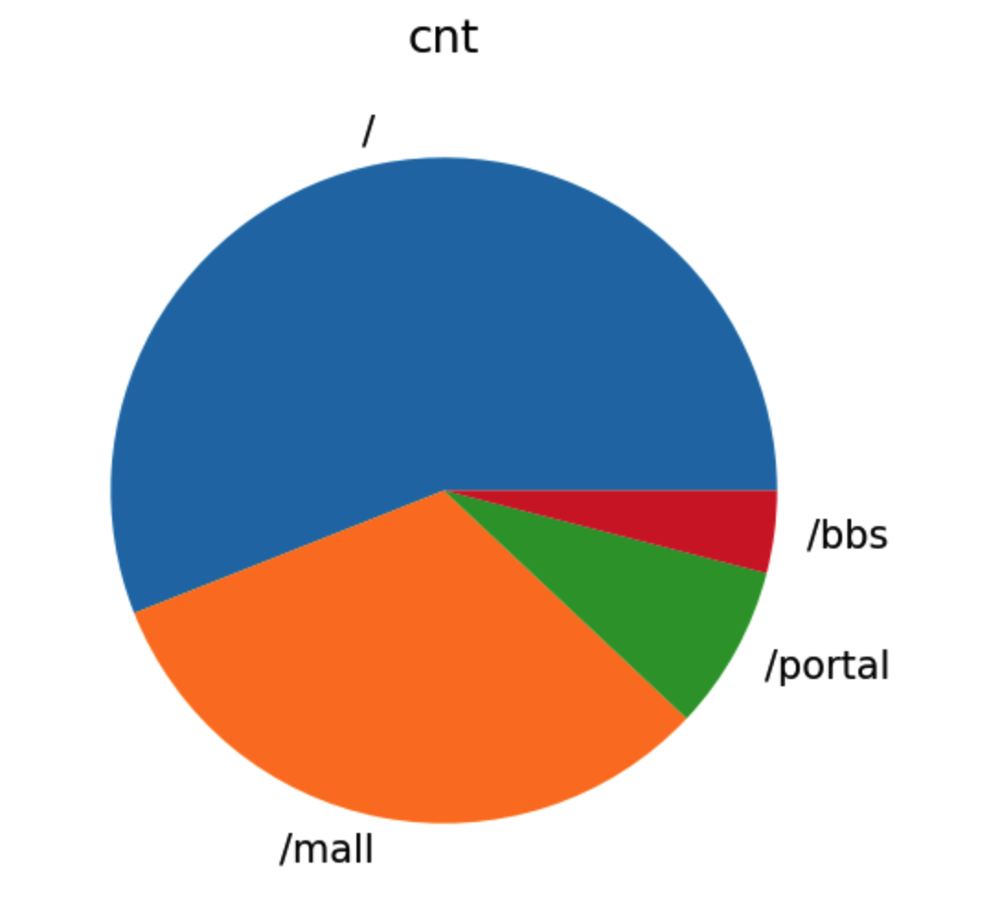
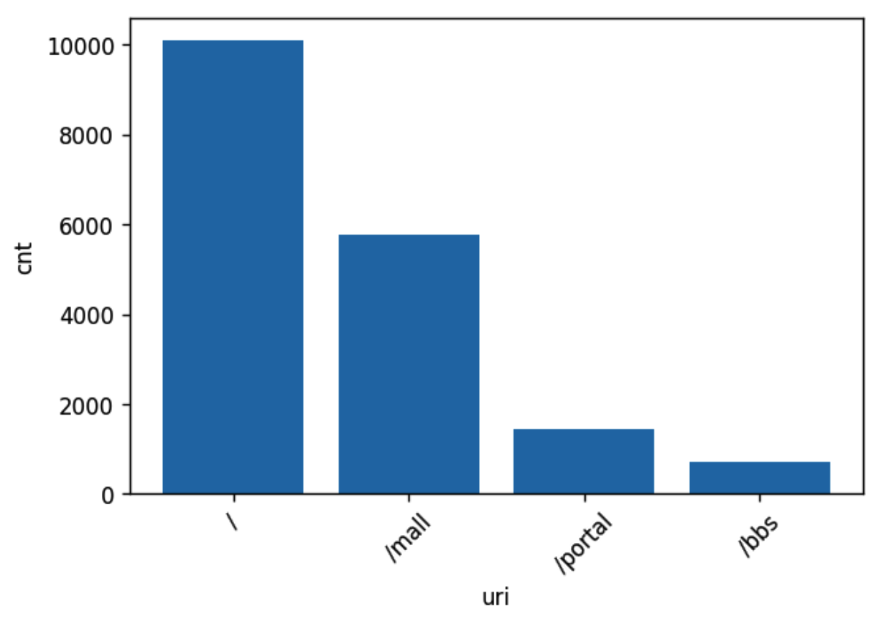

## Spark 教程

Notebook 中使用平台特有的 %%spark 语法提供 Spark 计算能力，并支持在 Notebook 中创建临时结果表，将 Spark 计算后的结果存储到新生成结果表中，使用方式如下

### 基于平台现有结果表数据创建 DataFrame

示例：

```sql
%%spark
partition = {'range':[{'start':'2020-07-01-10','end':'2020-07-01-12'}]}
df = spark_session.create_dataframe('591_demo_nginx_access_log', partition)
```


### 对上面创建的结果表进行处理，选取两列

示例：

```python
%%spark
df2 = df.select(df['uri'], df['body_bytes_sent'].alias('bytes'))
```




### 创建结果表

示例：

```sql
%%bksql
create table 591_spark_demo(uri string, bytes long)
```


### 将 DataFrame 中的数据写入结果表

示例：

```python
%%spark
spark_session.save_dataframe(df2, '591_spark_demo', 'append')
```


### 查询新生成结果表中数据，并将结果集赋值

示例：

```python
%%bksql 
SELECT 
    uri, COUNT(*) AS cnt 
FROM 591_spark_demo
GROUP BY uri 
ORDER BY cnt DESC
LIMIT 10 
```

```python
result = _
```


### 结果集生成饼图

示例：

```python
result.pie();
```



### 结果集生成柱状图

示例：

```python
result.bar();
```


