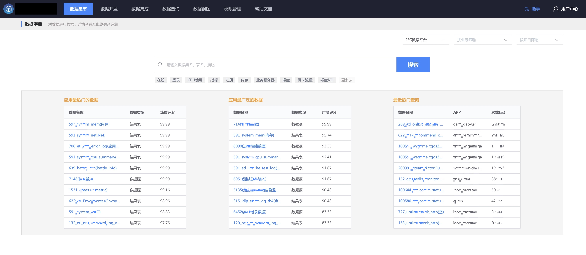

## 介绍

数据集市是一个帮助数据使用者 **便捷查询** 和 **共享数据** 的平台，包含数据地图、数据盘点、数据字典、数据标准。

## 数据集市的作用

- 数据地图：平台中有哪些数据主题及数据
- 数据资产：数据也是 **资产**，从各个维度了解资产的运营状况
- 数据字典：对数据进行检索，详情查看及血缘关系追溯
- 数据标准：对数据进行标准化，统一数据口径，实现数据规范化和用户共享

