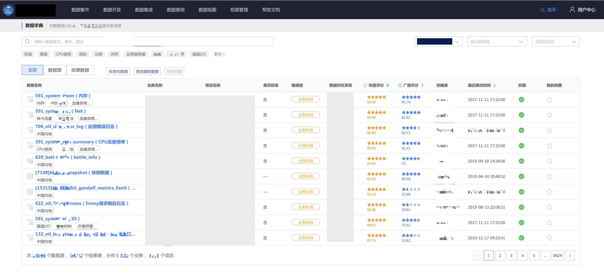
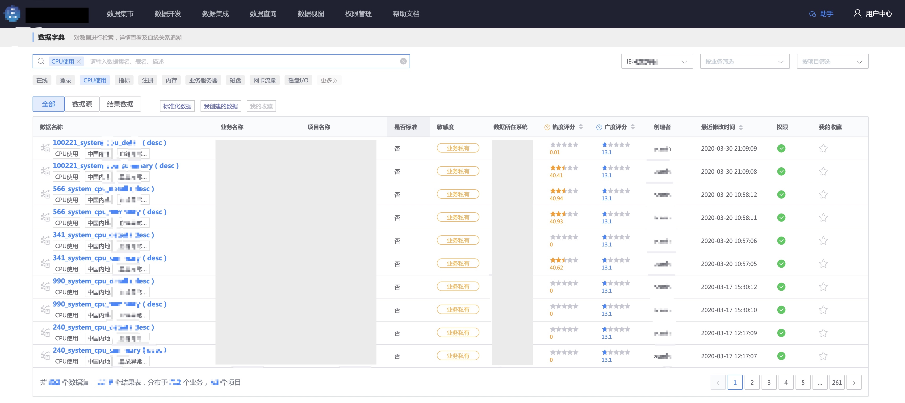
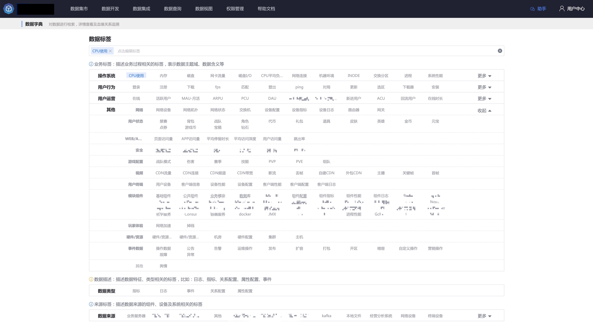
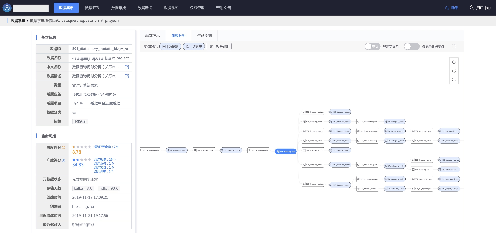

## 介绍
数据字典：对数据进行检索，详情查看及血缘关系追溯。

## 数据检索
通过数据源、结果数据表的名称，以及 描述、标签，可以检索数据。

## 数据字典详情

### 基本信息

可以查看数据的名称、类型、存储周期、创建时间等基础信息，同时还呈现了数据流量趋势、关联任务以及最新的数据预览。

如果想查看或调整产生数据的任务，可以在该页面快速跳转。

### 血缘分析
基于元数据的血缘分析功能，可以查询一个数据是 **由哪个任务产生**，以及其 **产生了哪些数据**。

在血缘分析的最左侧，可以看到图中的所有数据都源于一个日志文件数据源。

另外，点击链接也可以跳转至该数据源的数据字典详情页面。

### 生命周期
在生命周期页面，可以查看数据的 **热度、广度**，了解 **数据的价值**。

- **热度**
表示数据应用的频繁程度，评分（100 分制）越高应用越频繁。
主要由当前数据的被查询次数衡量（最近 7 日查询），
比如查询次数较高，则热度评分较高，反之较低。

- **广度**
表示数据应用的广泛程度，评分（100 分制）越高应用越广泛。
主要由当前数据被使用的业务、项目、计算生成的数据等因素衡量，
比如使用的业务、项目越多，数据开发产生的结果表越多，则广度评分较高，反之较低。

另外，也可以看到平台内的 **相似数据集** 以及 该数据的 **变更记录**。
