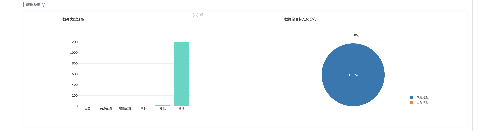
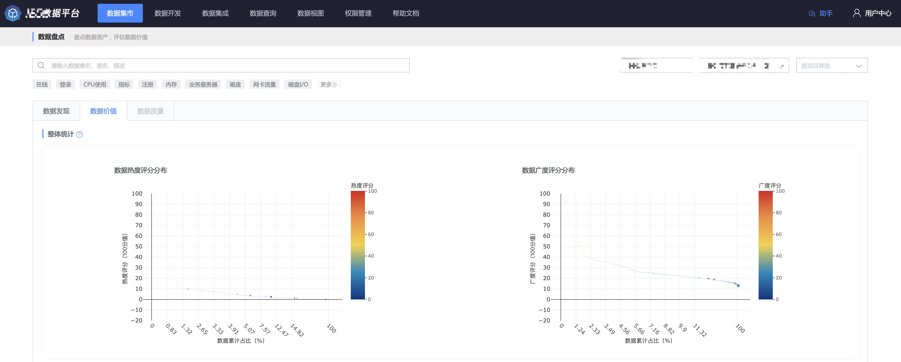
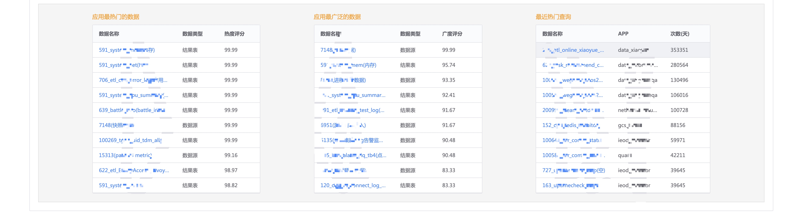

## 介绍

盘点数据资产，评估数据价值。

数据是企业的一种新型资产，通过数据盘点，可以知道业务的数据从哪里来，流向哪里，以及流通的热度和广度。

## 数据发现

可以按业务、项目、标签检索数据的概况，包括来源、类型以及应用分布。

## 数据价值

通过数据应用的两个重要指标（热度、广度）的整体分布了解数据流通的价值。

> 数据热度核心指标：查询次数、DataFlow 后继节点个数分布

> 数据广度核心指标：应用业务、项目、APP 个数分布

