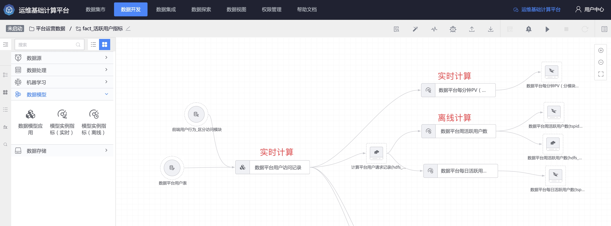

数据模型 FAQ
----

### 数据模型在解决什么问题
规范团队的数据开发规范，例如如何定义指标统计口径，如何生成指标，如何规范表名，具体详见 [为什么要有数据模型设计](../concepts.md)。

### 数据模型适合哪些数据开发团队
- 一个团队中存在多名数据开发员，期望通过工具统一数据开发规范
- 一套数据开发处理逻辑，可以应用到多款业务。例如手游对局分析场景，不同业务数据输入是标准的，则创建一个数据模型，即可应用到多款业务。( 调用数据模型 API，实例化数据开发任务）
- 通过数据开发 JSON 模板维护大量的通用、固定逻辑的数据开发任务模板，维护成本较高

### 数据模型应用节点背后是什么任务

在数据开发任务中，数据模型的 3 个节点背后实际是 实时计算或离线计算任务，无需担心该类节点的应用性能。
- 数据模型应用节点：实时计算（无窗口）
- 模型实例指标（实时）：实时计算
- 模型实例指标（离线）：离线计算