## 数据模型快速入门
## 情景

业务上线一般会设计用户活跃指标（包含 DAU、WAU、MAU、最近活跃总天数、每分钟/天 PV 等），方便业务上线后的运营活动。

## 梳理逻辑
- 设计[维度表](./concepts.md)：此处即用户表，扩展事实表（用户访问记录表）中的用户属性，从更多视角观察用户
- 设计事实表：设计用户访问记录表，通过关联用户表，扩展用户访问记录表中的用户的组织架构等维度
- 基于明细数据表，设计指标统计口径，如 uv（独立用户数）、pv（页面访问数）等
- 基于指标统计口径，设计指标，如 DAU（日活）、MAU（月活）等

## 1. 维度表数据模型设计
首先设计用户表的数据模型

### 1.1 填写模型基础信息

选中【数据集市】-> 【数据模型】菜单，找到维度表数据模型列表，点击新建，填写基础信息；

### 1.2 主表设计
如果已接入用户表的数据，可以直接引用用户表的表结构；

在主表设计中，点击【加载已有结果表】，选择对应的结果数据表及其字段；

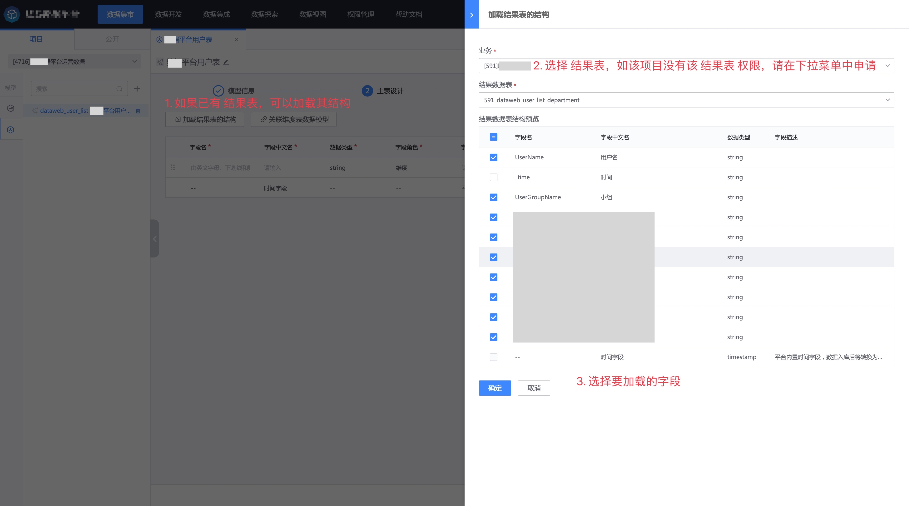

维度表必须设置主键，用于被事实表做关联的关联字段。此外，根据实际情况，修改字段名、字段中文名、数据类型、字段角色、字段描述等信息；

维度表数据模型如果只做维度关联，可以不需要做指标设计，直接进入模型预览页面。

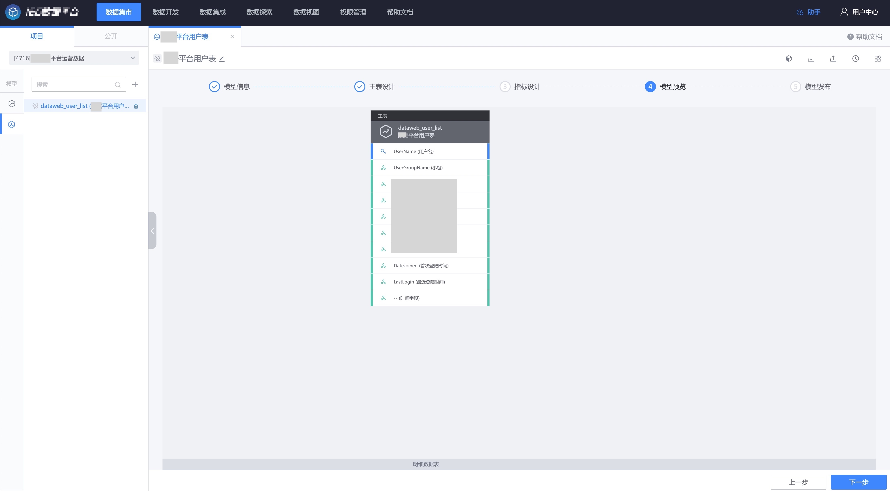

填写发布描述后，即可发布。

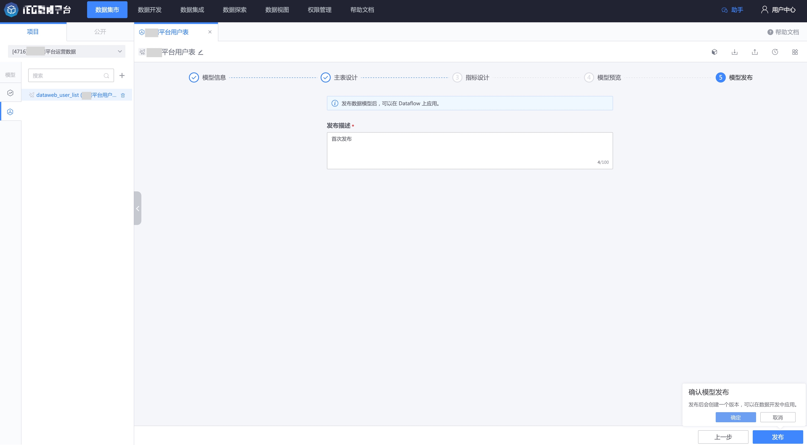

## 2. 维度表数据模型应用
数据模型发布后，创建数据开发任务，将结果数据作为数据模型应用节点的数据输入，即可完成数据模型实例化（即应用）。

创建一个数据开发任务，拖入实时数据源、数据模型应用节点。
> 在 Dataflow 中，维度表数据模型的输入表限定为 `实时数据源`。如果期望实例化后的维度表有全量数据，建议在数据开发任务启动成功后，全量上报输入表的数据，让全量数据过一遍模型应用任务。
> 当然，如果维度表数据模型和已经入库到 ignite 中的关联数据源表结构完全一致，可以不用实例化维度表数据模型。在事实表数据模型应用的时候，直接选择关联数据源即可。

双击【数据模型应用节点】，点击刚才创建的数据模型，并完成数据模型和结果表的字段映射。
> 如果模型输入和结果表输入字段一致，则字段将自动映射。

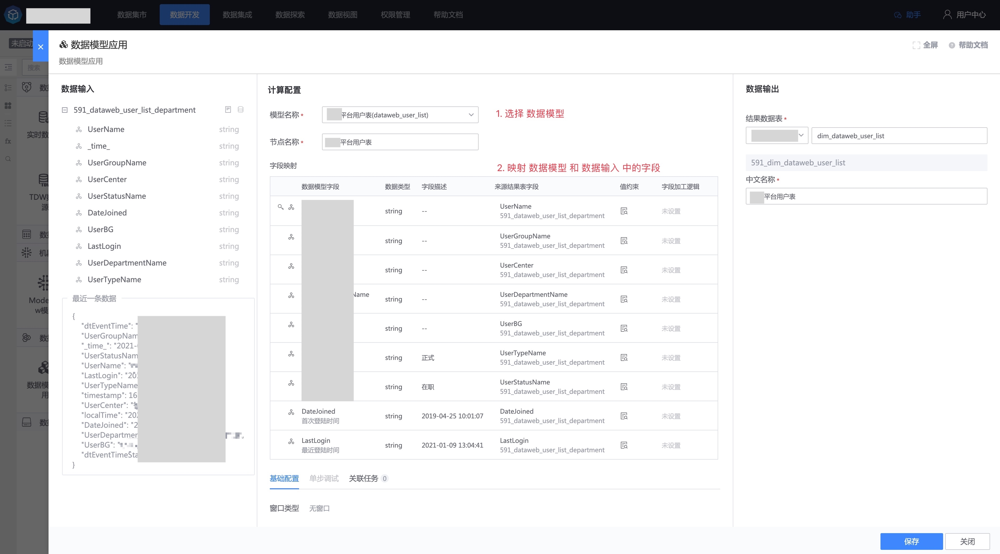

接着在画布中拖一个 Ignite 节点，设置 索引字段和唯一键（和数据模型主表设计中的主键保持一致）。

启动数据开发任务

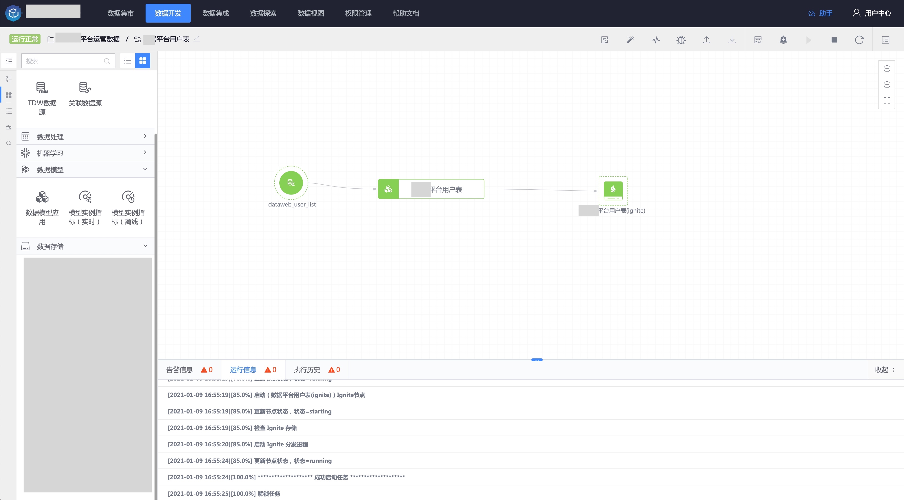

在数据探索中，可以查询刚刚数据模型应用之后的结果表。

## 3. 事实表数据模型设计
接着做事实表（用户访问记录表）的数据模型设计。

设计流程和维度表（用户表）的流程类似。

### 3.1 填写模型基础信息

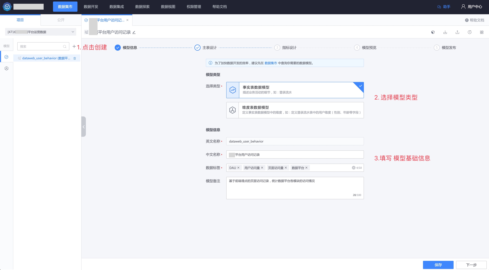

### 3.2 主表设计
如果已接入用户访问记录表的数据，可以直接引用其表结构；

在主表设计中，点击【加载已有结果表】，选择对应的结果数据表及其字段；

点击确定后，主表设计界面如下：

接下来，关联维度表数据模型，扩展访问用户的组织架构信息。

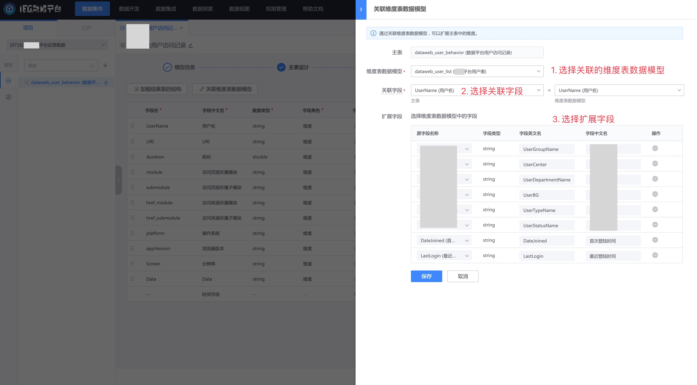

点击保存后，设置字段角色等其他信息；

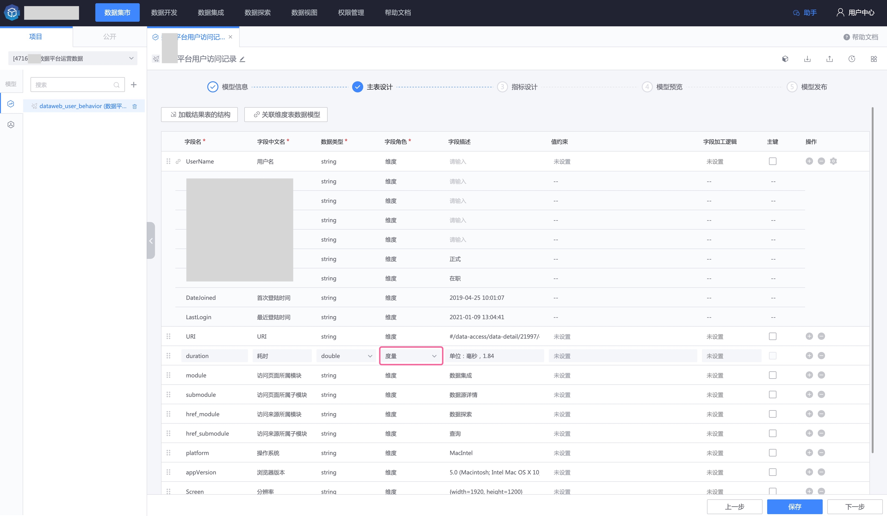

> 度量：在事实表中，可以度量某一次行为的效果的数据，设置为度量，一般为数据值字段，例如 订单金额、访问耗时等；

### 3.3 指标设计
先设计指标统计口径，然后设计指标。

- 首先创建指标统计口径 独立访问用户数（uv） 

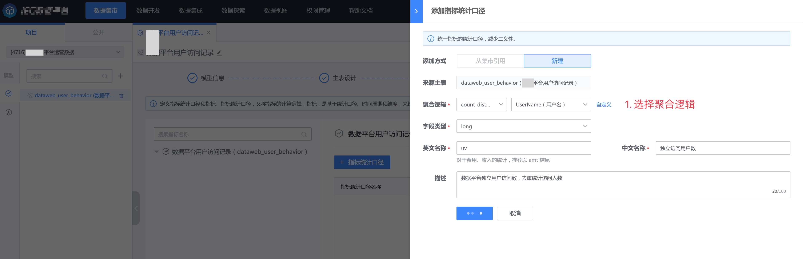

点击添加后，创建基于口径的指标

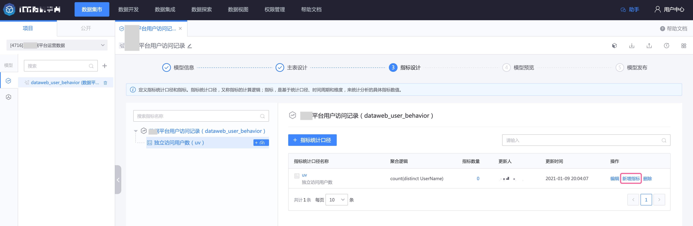

填写创建指标的参数，包含计算类型、统计频率、窗口长度。下图是创建 DAU 指标，每天统计昨日的独立访问用户数。

参照这种方式，创建 WAU、MAU、每日 PV、最近 30 天活跃天数等指标。

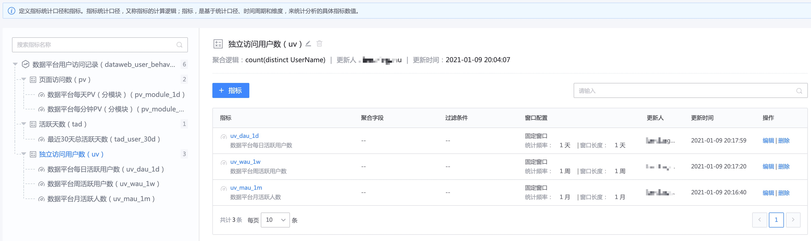

完成指标设计后，点击下一步可以进入模型预览。

点击下一步，填写发布描述，完成模型发布。

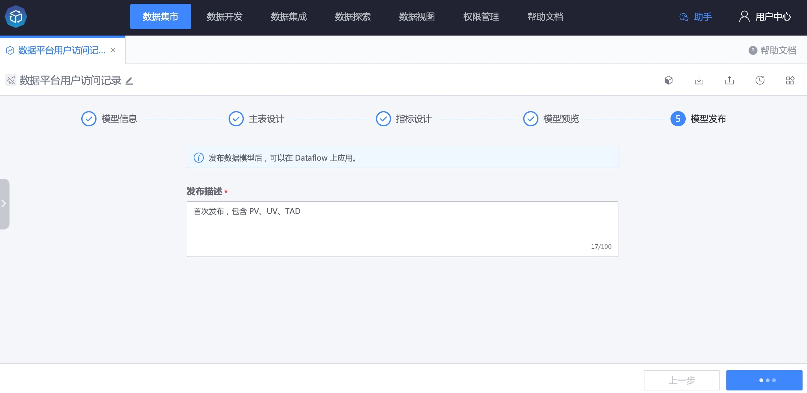

## 4. 事实表数据模型应用
接下来对刚创建的数据模型做应用。

创建数据开发任务，拖入 1 个实时数据源节点（用户访问记录表的数据源）和 1 个关联数据源（用户表，第 2 步中实例化后的用户表），连线至数据模型应用节点。

> 在数据开发任务中，事实表数据模型主表输入限定为 `实时数据源`，维度表限定为 `关联数据源`。其中 `关联数据源`的表结构需要和维度表数据模型中表结构保持一致，不要求是维度表数据模型实例化后的关联数据源。

双击数据模型应用节点，打开节点配置页面，选择刚创建的数据模型，并做字段映射（默认同名会自动映射）。

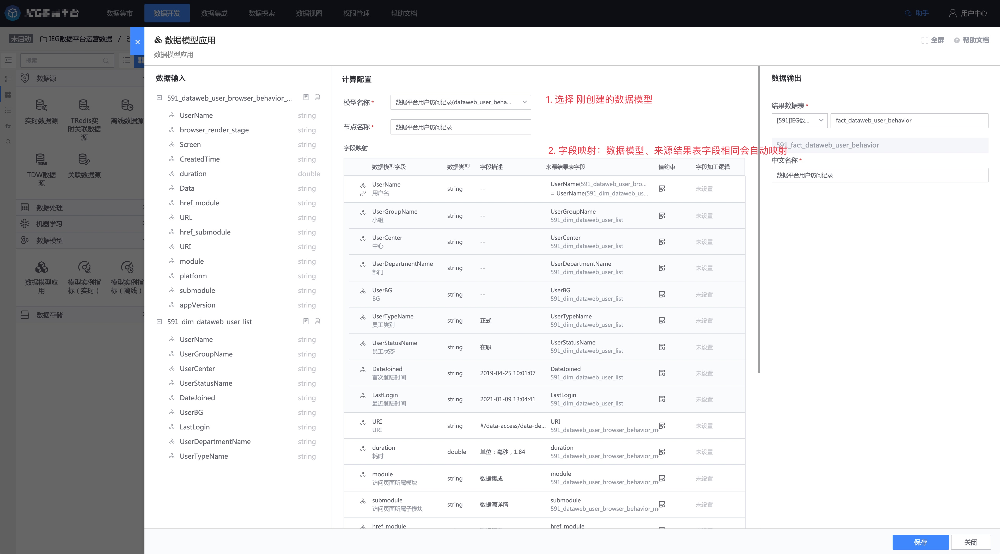

保存数据模型应用节点后，点击 `批量生成指标构建节点`

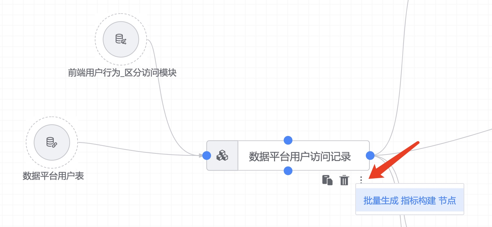

在弹窗中选择需要的指标即可。

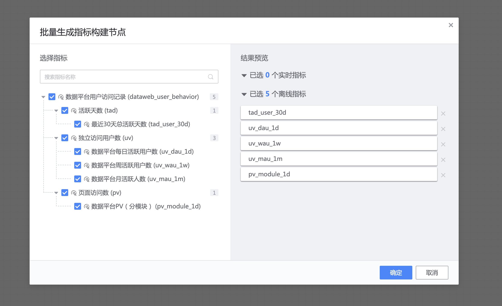

当然你也可以在左侧工具箱选择模型实例指标节点，在画布中创建只属于这个数据开发任务的指标。

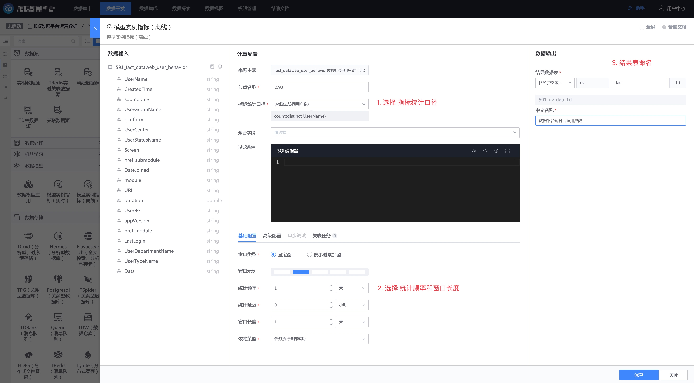

启动任务即可。离线指标可以使用顶部导航栏的补算功能对过去的数据进行补算。

## 5. 消费数据
可以在 [数据探索](../../datalab/queryengine/sql-query/concepts.md) 或可视化等消费场景中消费数据。

例如通过平台的数据视图模块 [SuperSet](../../dataview/concepts.md) 对上面的指标做数据可视化，下面是 DAU 的图表。 

