## 如何快速构建仪表板

### 数据集准备
可参考 [10 分钟玩转大数据开发](../../quick-start/dataflow.md) 的流程创建 **可查询** 的结果表

### 创建仪表板
通过`首页` **Home** 下拉菜单里 **New dashboard** 、 **创建仪表板** 按钮和`管理仪表板`页面的 **New Dashboard** 按钮都可以创建新的仪表板

点击后会跳转到一个空白的 **Dashboard** 页面，并默认初始化好一个空白的 **Panel**

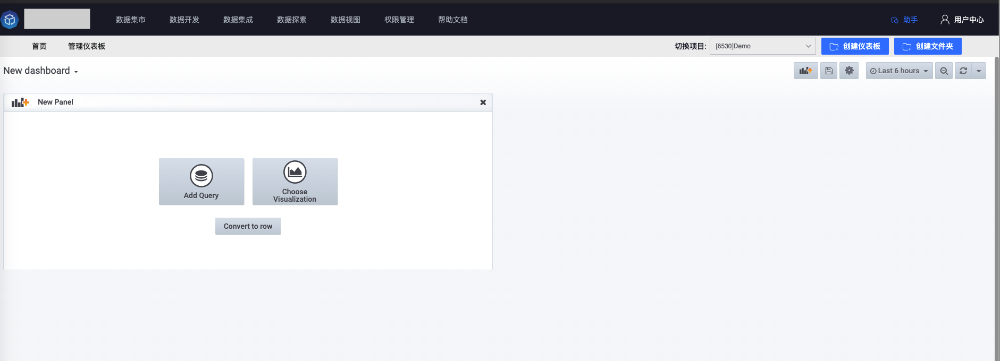

### 配置 SQL 查询
点击上述空白 **Panel** 的 **Add Query** 按钮可以进入到 **Panel** 的 `查询( Query )` 配置页面

配置页面中默认选中该项目 **数据源** ，用户无需修改，该 **数据源** 下拥有项目所有有权限的结果表

选择需要用于 **展示图表** 的 **结果表** 及 **查询数据** 最终所用的 **存储** ，选好后表单会默认填充第一个字段的 **count** 统计指标和基本的 **WHERE** 和 **GROUP BY** 语句，并用查询结果以 **时间序列** 的格式绘制一条线图

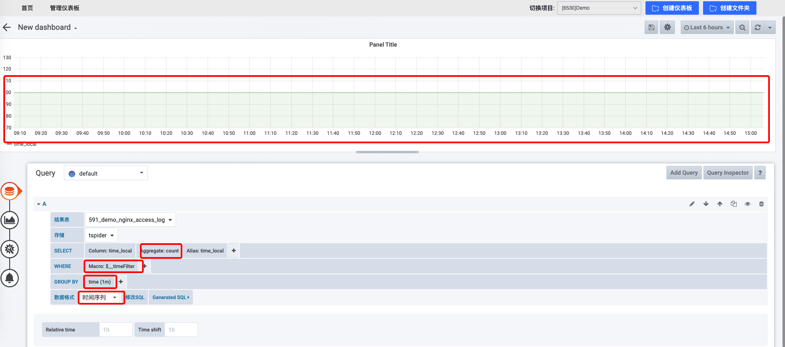

用户可以基于默认的配置对 SQL 表单进行编辑，对于 **SELECT** 栏目，用户可以增加其他需要查询的指标，可以修改指标的 **别名( Alias )** ，每次修改表单都会默认发出查询以让用户实时查看图表

对于 **WHERE** 栏目，默认会用右上角的 **时间工具栏** 中的 **时间范围** 对数据进行过滤，用户可以继续添加更多的 **过滤表达式( Expression )** ，每个表达式包含三部分： **左值** 、 **操作** 和 **右值** ，左值一般可以选择该结果表的某个字段，操作目前支持 `=` 、 `!=` 、 `>` 、 `>=` 、 `<` 、 `<=` 、 `IN` 、 `NOT IN` ，点击右值时，默认会从结果表的数据中拉取可以使用的候选值，以供用户快速选择右值，用户也可以手动填写右值

对于 **GROUP BY** 栏目，线图默认会把时间按分钟进行分组，这样产生的曲线就会每分钟有一个点，用户可以修改默认的 **1m** 值，如果需要一小时一个点，可以改成 **1h** ，如果需要一天一个点，可以改成 **1d** ，以此类推。如果用户需要用维度字段对序列进行 **分组** ，可以在当前栏目选择对应维度，每一个 **维度的值组合** 对于每一个指标都会产生一条序列

如果上述表单配置无法满足用户的需求，用户可以点击 **修改 SQL** 切换到 **SQL 编辑器** 模式，手动构建 SQL

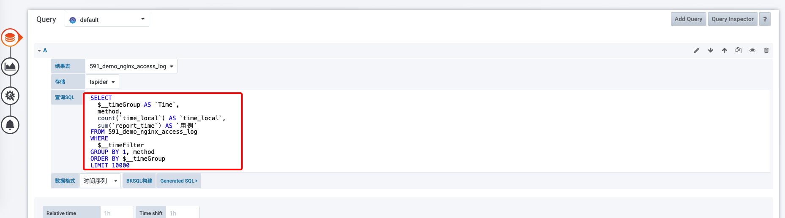

不管哪种模式，如果构建的 SQL 在查询时有异常，表单下面会有具体的错误提示

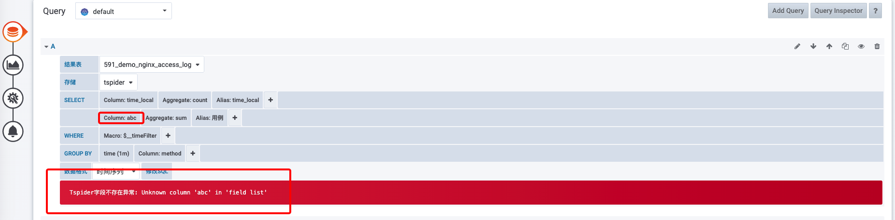

对于一次没有异常的查询结果，可以点击 **Generated SQL** 查看实际发起查询的 SQL

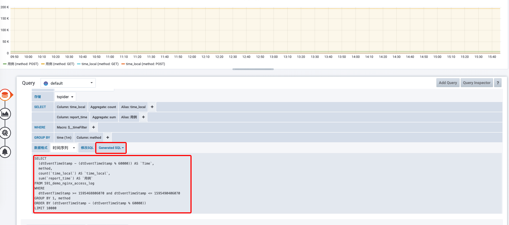

### 修改 Panel 可视化类型
构建完 SQL 后，用户可以通过修改 **数据格式** 和 **可视化类型** 来产生不同的图表，比如：如果要把线图改成表格，可以把数据格式切换成 **表格数据**

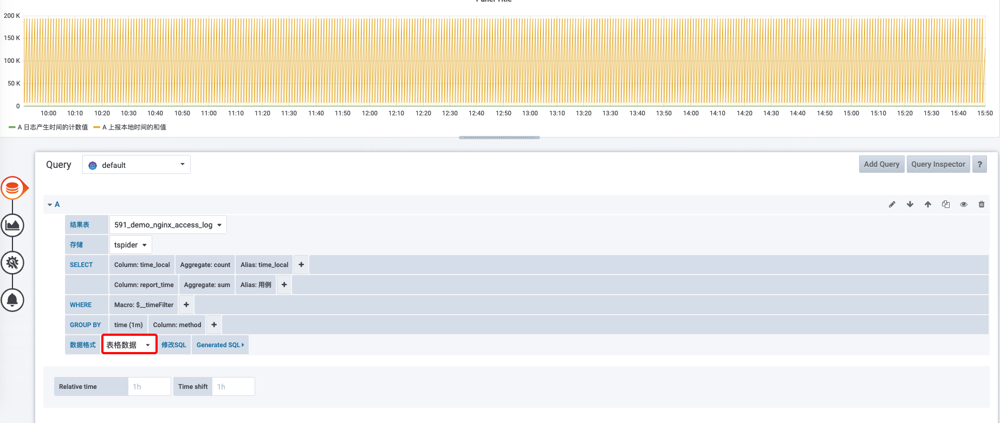

然后切换到`可视化`栏目( Visualization )，选择表格( Table )类型，选择后图表就变成表格了

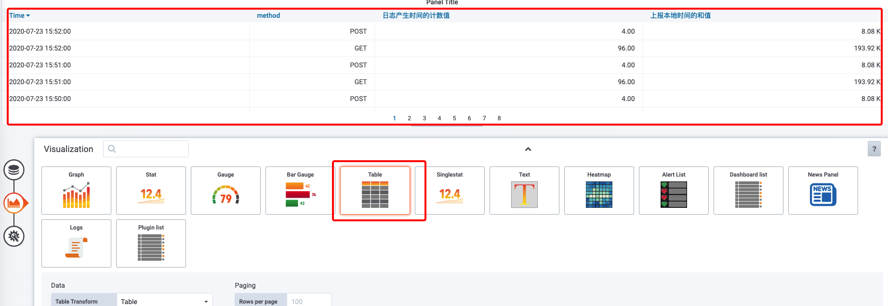

对于表格的标题，用户可以点击下侧的 `Add column style` 按钮添加表格样式，并配置相关选项即可，用户也可以修改 **单位( Unit )** 、 **对齐方式( Align )** 等图例信息

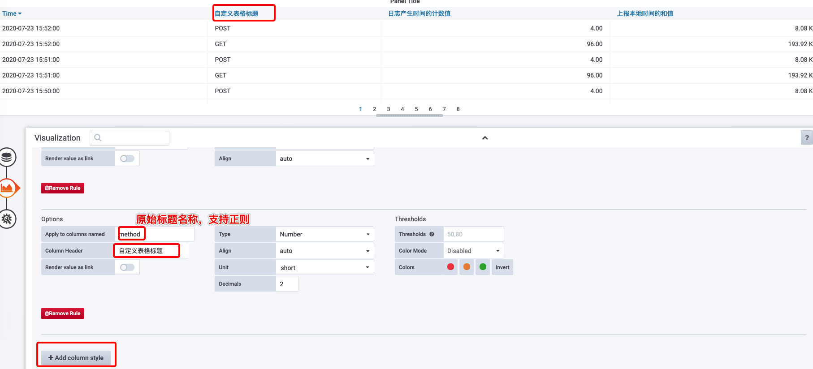

### 修改 Panel 标题
切换到 Genaral 栏目可以对面板的 **标题( Title )** 和 **描述( Description )** 等信息进行修改

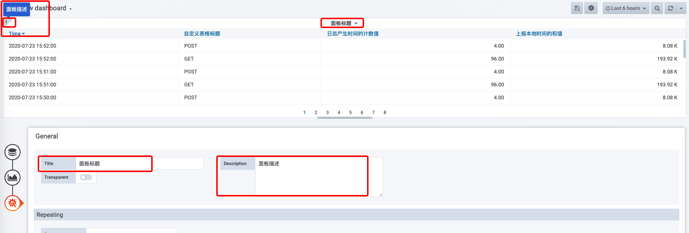

### 保存仪表板
编辑好 Panel 后，切记一定要进行保存，否则所有的临时编辑状态都会丢失，保存按钮在右上角 **管理工具栏** 中

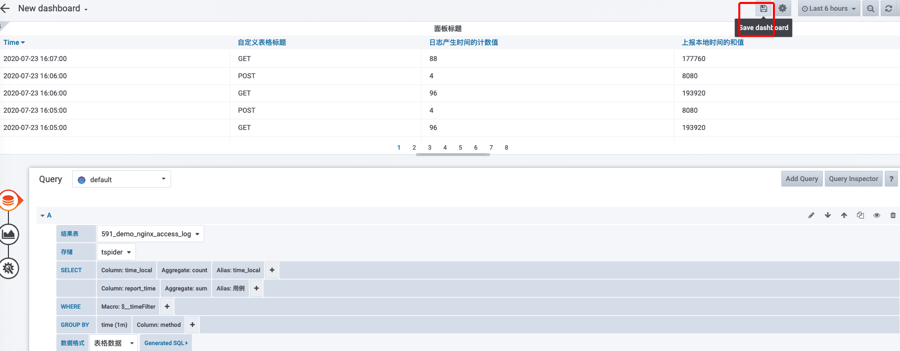

保存时可以给 Dashboard 命名并选择需要保存的 文件夹( Folder )

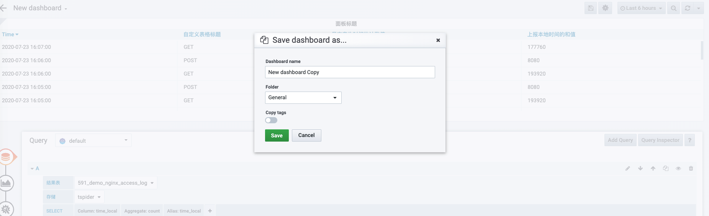

保存完后会自动跳转回 Dashboard 的全局页面

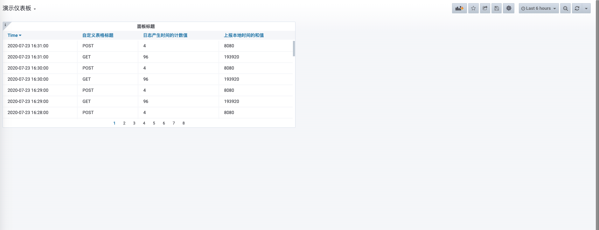

### 结语

按照以上流程操作下来，一个简单的仪表板便构建出来了。诚然，Grafana 还有很多更高级的功能去辅助用户更好地描述自己要表达的内容， **但是要记住一点，我们使用 Grafana 的最终目的并不是要去构建一个如何复杂、如何丰富、如何功能强大的仪表板，而是希望通过这个工具来更直观地、更具洞察力地去辅助我们解决特定业务场景下的问题**

更多详细功能，请参考[Grafana 官方文档](https://grafana.com/docs/grafana/latest/panels/panels-overview/)
