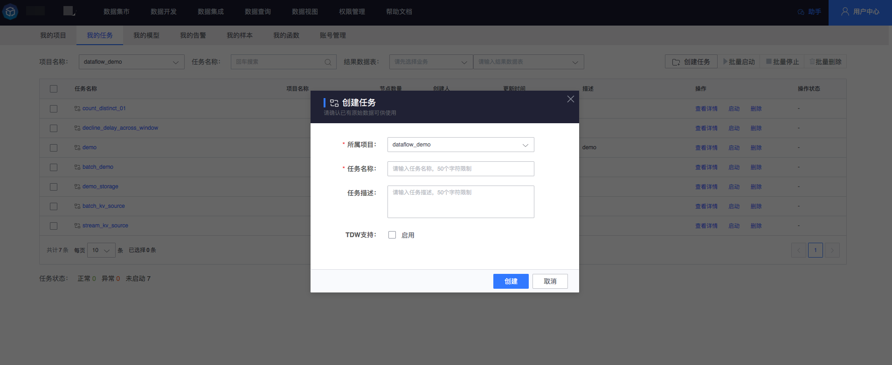

# 我的任务

我的任务列表展示了我有权限的所有任务，可以查看任务的详情、操作状态；提供任务的快速过滤、查询、运行状况统计以及单个任务启停、批量任务启停、单个任务删除、批量任务删除功能。

### 任务总览

进入我的任务系统自动拉取当前用户名下所有有权限的任务列表，用户可以查看当前所有任务的基本信息，运行状态统计。

### 任务过滤查询

我的任务界面提供了通过任务所属项目过滤、通过任务名称过滤功能，用户可以选择查看单个项目下面的任务或者通过任务名称进行过滤查看，也可以基于结果数据表进行过滤查看。

### 创建任务

- 1、在我的项目中，右上侧可以看到创建任务按钮，点击按钮进行任务创建操作
  

- 2、系统弹出新建任务弹框

  > 任务所属项目：必填

  > 任务名称：限制长度 50 个字符，必填

  > 任务描述：描述任务信息，非必填

### 任务详情

选择单个任务，点击任务详情，可以跳转到当前任务的详情编辑页面，可以对任务进行详细处理

- 1、点击查看详情

- 2、跳转任务详情页面

  任务编辑请参考：[画布工作台](../../user-guide/dataflow/ide/concepts.md)

### 单个任务的启停、删除操作

针对单条任务，用户可以进行启动、停止、删除操作

> 已经启动的任务不允许删除，如果要删除请先停止任务

> 任务配置节点为 0 时，不允许启动操作

### 单个任务操作状态查看

针对运行中的任务用户可以查看最近运行状态

- 找到需要查看运行状态的任务，点击列表最右侧操作状态按钮

- 系统会弹出页面，拉取当前任务的最近操作状态信息

### 任务批量操作（启动、停止、删除）

我的任务界面可以进行任务的批量操作，可以对多个任务进行批量启动、批量停止、批量删除

> 批量启动、批量停止必须是同一个项目的任务，目前暂不支持跨项目批量启停

> 批量删除可以选择任意多个任务，不受同一个项目限制

> 批量操作针对的是当前页面选中的所有任务，不在当前页面内容属于未选中状态

