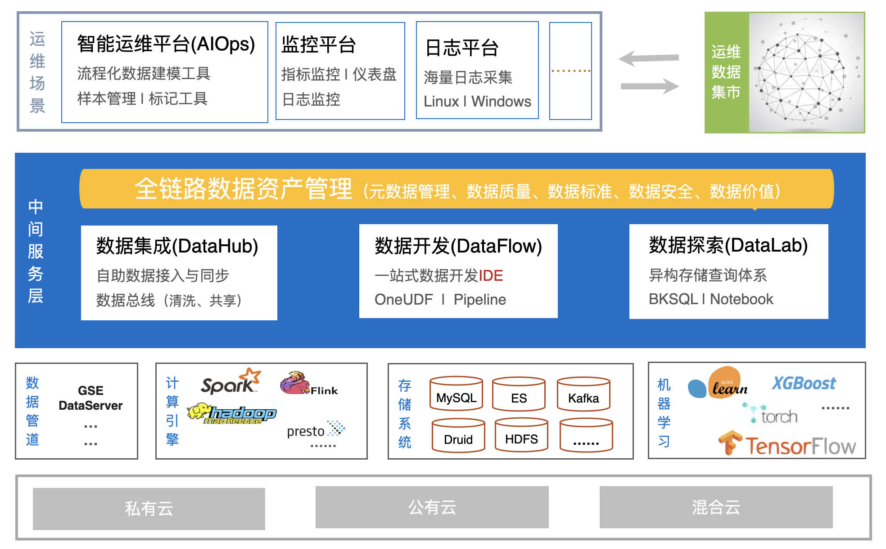

### 平台架构

平台架构总体分为四层（自上而下）：

- 资源层：可支持部署在私有云、公有云和混合云等云环境中。
- 组件层：可支持多种开源和腾讯自研的大数据组件

> 1. 数据管道：开源 Beats 采集器、腾讯自己研发的 GSE Agent 采集等。
>
> 2. 计算引擎：MapReduce、Flink 和 Spark 等。
>
> 3. 存储系统：关系型 MySQL 、用于日志检索 ElasticSearch、KV 型存储 redis、以及分布式文件系统 HDFS 等。
>
> 4. 机器学习框架和算法库：TensorFlow、Pandas 和 SK-learn 等。

- 中间服务层：

> 1. 数据集成服务，主要由 Kafka 消息队列为核心的数据总线组成，功能有数据接入、数据缓存、数据预处理、数据分发，它像一根总线连接着数据处理和存储查询。
>
> 2. 数据开发服务，隐藏各种计算框架的复杂性形成统一计算服务，基于 SQL 和图形拖拽将实时流处理和离线批处理结合，可以使用统一计算对数据进行实时、离线、聚合、关联等复杂数据处理。
>
> 3. 数据探索服务，查询引擎支持多种存储系统，包括关系型数据库 MySQL、离线存储 HDFS、全文检索 Elasticsearch、时序型数据库 TSDB 和 KV 存储 Redis 等，现阶段最新版本支持 ANSI SQL 和文本检索两类查询方式。
>
> 4. 全链路数据资产管理，提供元数据管理、血缘分析、数据标准、数据质量和数据权限管理等服务。

- 数据应用层：智能运维平台（AIOps）、监控平台、日志平台等。
