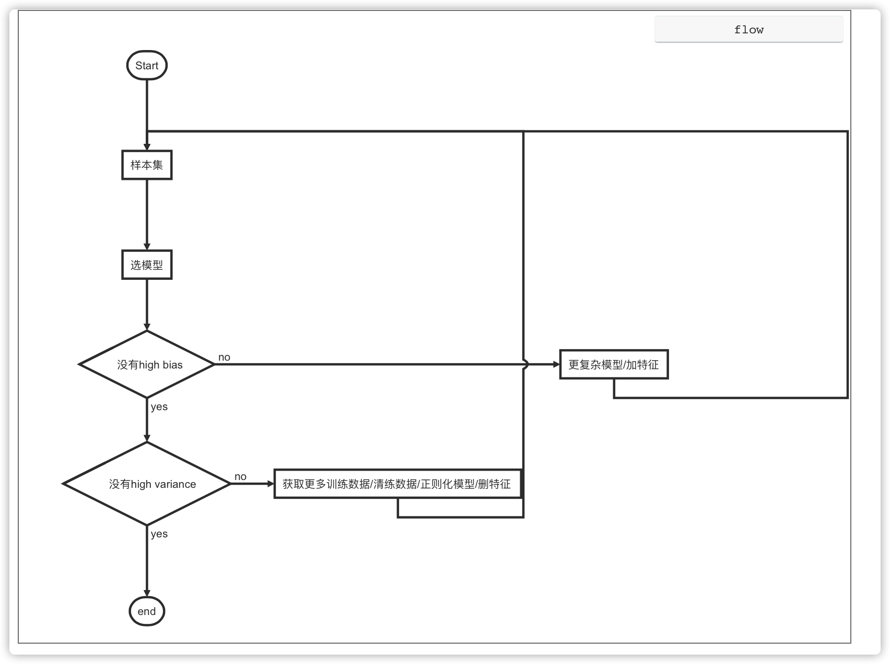

# 场景化建模常见问题

## 样本管理

### 样本添加

**1. 样本集有什么用？**

样本集是一份带有异常标记的时序数据，可能来自多个曲线。机器学习算法通过对样本数据进行学习，得到异常检测模型。

**2. 如何选择样本集中的曲线？**

- 首先需要确定监控的业务指标类型，如成功率。

- 然后在样本集中导入同类型指标的历史数据，最好包含故障区间，如接口调用成功率。

**3. 创建样本集时，异常样本数量有何要求？**

建议异常样本多于 100 个，在总样本中占比不少于 10%。

**4. 创建样本集时，如果真实故障比较少该怎么办？**

建议使用平台提供的公共样本集，将公共样本集复制到项目下直接使用；或者继续添加自己的业务数据，经过调试后进行使用。

**5. 当添加的曲线形状类似，但量纲差距很大时如何处理？**

可以在特征准备中添加归一化节点，来消除数据中量纲差距过大带来的影响。

**6. 训练模型需要构造哪些特征？**

建议优先使用默认配置的特征；之后可以根据【模型实验】中的评估结果来调整（具体参考 1.2.3 ）。

### 异常标注

**1. 异常标注有什么用 ？能否不进行标注？**

业务上需要告警的区域，称为异常。异常标注相当于给模型提供了一份标准答案，然后通过训练机器学习模型，使得模型异常预测结果与标记结果一致。

目前针对单指标异常检测场景，平台只提供了有监督的算法，所以异常标注是必须的，且异常标注的质量对模型的检测性能影响较大。

**2. 如何进行异常标注？**

- 根据上 1 天和上 1 周的参考线，来手动判断是否异常；
- 根据业务经验指定异常条件，并进行异常标注；
- 采用平台提供的自动识别异常功能进行异常标注。

**3. 自动标注有什么用？如何使用？原理是什么？**

自动标注是平台提供的一个辅助标记工具，旨在提升标记样本的效率。

一般先采用自动标注功能进行初筛，之后再人工对自动标注结果进行微调。

自动标注的原理是 3-sigma 异常检测。

**4. 在异常标注时，选取何种片段进行标注？**

选择故障发生前后的一段时间序列进行异常标注。

## 模型实验

**1. 如何选择特征？**

可以参考【数据分布】中给出的特征重要性和特征质量进行选择；或者根据人工经验选择。

**2. 当特征重要性和人工经验不一致时，如何处理？**

建议排查是否因为样本数据不足或标注有误，导致计算的结果有偏差。

**3. 当模型评估效果为差时，如何排查和优化？**

按照下列指引进行排查：

- 样本数据：检查样本数据是否不足或标注有误；
- 特征：更换样本特征；（提示：若更换特征后，模型效果始终没有提升，可能是因为样本质量不高，需要重新处理样本数据）
- 模型超参：根据相关算法解释文档，调整超参；
- 阈值：根据模型评估的指标调整最佳阈值。

排查流程图如下：

**4. 模型评估中的阈值有什么用？如何调整阈值？**

 模型评估中的阈值用于决策当前的异常概率是否需要告警。即，当异常概率小于阈值则判为正常，异常概率大于或等于阈值则判为异常，需要告警。

调整阈值相关指引：

- 阈值调大，告警减少，漏告增加，误告减少；

- 阈值调小，告警增加，漏告减少，误告增加。

当漏告率和误告率均达到业务上线标准时（参考评估右侧的检测结果统计面板），即调整完毕。
