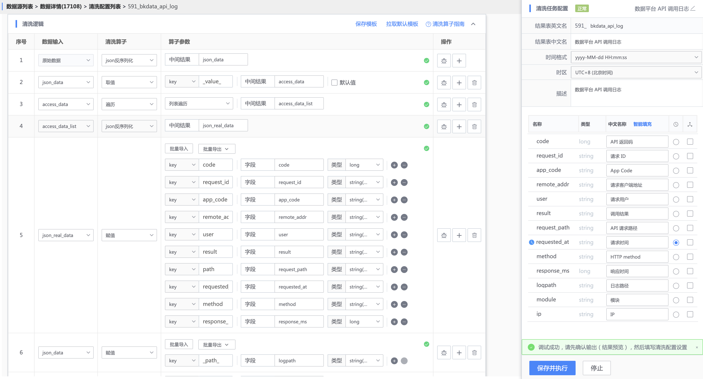
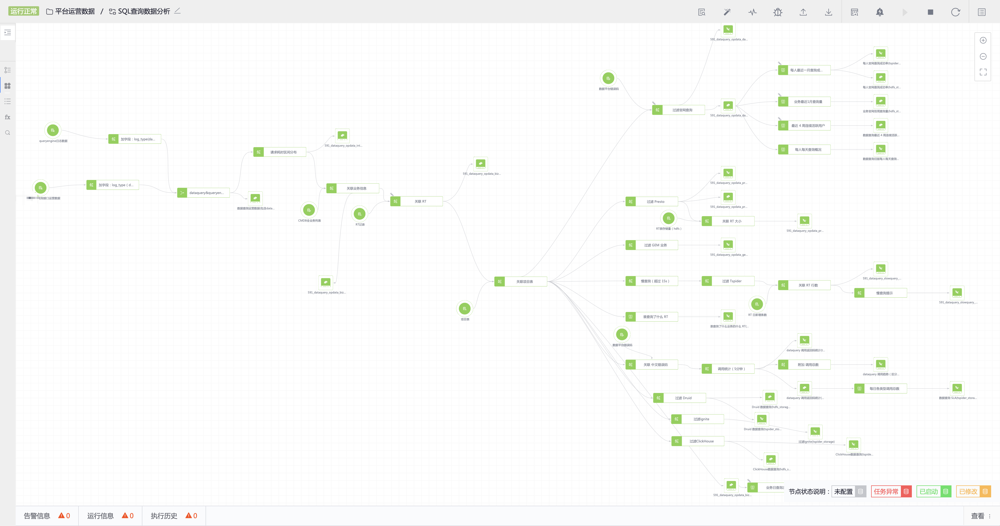

如何做数据运营：设计、落地、使用指标体系
----
没有度量就没有增长，在数据运营领域的套话是构建指标体系。

这里以内部平台为例，介绍内部系统做数据运营的 3 个步骤：设计指标体系、落地指标体系、使用指标体系。

## 1. 构建指标体系
好比用 **一句话定义你的产品** 一样，**首先选定北极星指标**（如同北极星一样，指引方向，《增长黑客》中的术语，有些地方叫核心指标），指导团队全力拼杀。

不同阶段的北极星指标不一样，有些阶段可能是用户的广度、用户使用功能的广度，有些阶段可能是用户使用功能的深度，亦或是构建 **基本增长等式** =活跃用户数量 * 产品使用的深度。

有了北极星指标后，接下来将指标分解，结合用户的使用流程拆解到各个功能模块中；

### 1.1 平台全局指标
- 核心指标：例如用户和用户资产的增长趋势
- 用户指标
    - 活跃数据：DAU/WAU/MAU/用户最近 30 天活跃天数、新增用户、各模块 UV/PV、各部门 PV、激活用户增长趋势、激活用户部门分布
    - 激活用户详情：单个用户在平台各功能模块的有效资产数、单个用户最近 1 周在各个功能模块的 PV、有效资产的气泡图、有效资产的直方图分布
    - 接入业务详情：单个业务在平台各功能模块的有效资产数、有效资产的直方图分布
    - 终端数据：分辨率、操作系统
- 服务指标
    - 数据源数量、接入类型分布、数据入库量、各存储使用情况、每日查询次数、查询应用分布
    - 数据开发任务量、处理数据量
- 性能指标与成本
    - 各模块每日可用性
    - 数据查询相应时间分布
    - 存储空间按业务分布

### 1.2 各功能模块指标
除了整个平台层面的指标外，各个功能模块一样需要量化指标，以数据探索的查询可视化为例，我们需要知道
- 每天有多少人在使用，用了多少次
- 最近 30 天最活跃的用户是哪些
- 是在查询还是在 Notebook 中使用
- 是在哪些项目中使用
- 用哪种类型的图表比较多
- 图表中开启分组、设置排序、设置标题多少次

## 2. 落地指标体系
设计了指标体系后，接下来需要在平台中落地；

### 2.1 数据集成：把数据接进来
#### 2.1.1 数据接入 

- 日志
各个模块的 API 调用日志，便于统计接口调用成功率、错误码分布

- DB
各功能模块的配置表（例如项目表、数据源配置表、Dataflow 配置表等），用于统计用户使用情况，以及用作维度表与其他流水表做关联

- 接口
有些模块的 HTTP API 有统计数据，例如离线任务数、HDFS 容量

- 文件上传
一般用作维表，例如 返回码 和 返回码中文含义对照表，用于把模块 API 调用日志的返回码扩展为返回码中文含义

- 自定义
对于平台不支持的接入类型，可以使用自定义调用命令行完成数据上报。

    - 例如后台数据流的埋点数据存储在 influxdb，可以通过编写 Shell等脚本查询后再调用命令行做自定义接入；
    - 例如还有用户在前端页面的访问、点击行为，可以通过监听前端操作事件发送至自己封装接口，接口再调用自定义接入的命令行完成数据接入，这些数据可以用于计算 DAU、PV、模块特有的交互数据；

#### 2.1.2 数据清洗
将上面接入的数据清洗为结构化的数据

#### 2.1.3 数据入库
- 如果直接用于实时计算，可以不用入库，因为数据默认会在 Kafka 中待一段时间；
- 如果对明细数据进行探索分析，每日数据量在在千万级以上，建议入库到 HDFS，可以利用 Trino 的分布式查询引擎加快查询速度；
- 如果数据直接用于离线计算，入库为 HDFS；
- 如果用作维度表，被其他表做关联，入库到 ignite；

### 2.2 数据探索：通过 SQL 查询 和 Notebook 探索数据
通过数据探索的查询或 Notebook 来探索数据，验证无误后转换成数据开发中的实时、离线计算任务；

### 2.3 数据开发：使用 SQL 做实时、离线计算
常规任务使用 SQL 即可解决，**提前做好数据计算**，最后在可视化报表中直接查询计算后的结果数据，加快图表加载速度。

- 实时计算
    - 无窗口：做数据清洗、维表关联，生成可信任的明细数据表，例如 关联 项目表，将项目 ID 扩展为项目名称
    - 滚动窗口：每分钟的聚合计算，例如每分钟平台用户的 SQL 查询次数
- 离线计算
    - 固定窗口：例如每天统计昨天每个业务的查询次数
    - 滑动窗口：例如每天统计每人最近 1 月的查询次数     

### 2.4 数据可视化：通过 SuperSet 出报表，推送邮件报告
最后我们需要通过可视化的组件如 SuperSet、Grafana 来呈现指标，实时了解用户的使用情况。

## 3. 使用指标体系
### 3.1 宏观
- 领导：**发现数据中的问题，提出问题，并关注问题的解决**
- 平台层面运营人员：通过运营数据了解平台当前运营情况，**运营计划有的放矢**

### 3.2 微观
- 产品原型设计阶段：从数据中找出潜在用户，让**用户一起参与讨论、验证方案**
- 产品灰度上线阶段：从数据中找出潜在用户，让用户一起验证产品是否能解决问题（大话就是 **PMF，产品市场匹配度**）
- 产品正式上线：
    - 主动发现问题：例如专门创建用户慢查询报表，发现海量数据查询超时建议用户落 HDFS 存储，使用基于 Trino 的分布式查询方案，并优化到产品交互中，好东西会传播，基于 Trino 的查询量很快上涨起来
    - 挖掘用户需求：发现核心用户，**到用户中去，从用户处挖掘需求**，例如平台模块有最近 30 天用户活跃天数，找出活跃 Top5，挖掘他们的需求
    - 用户咨询： 通过用户标签查询用户在各个功能模块所处的等级，了解用户才能更好的与用户沟通
    - 质量：通过 SLA 指标刺激各模块提升服务可用性
    - 通过数据验证产品设计：例如查询结果可视化的标题，排序、分组功能，这些高级功能有多少人在使用

### 3.3 其他
- 众人划桨开大船，让开发同学也参与进来，大家一起构建各个功能模块的运营报表，**加强数据运营的意识**
- **把数据埋点加入到产品功能规划**，从产品设计之初就想到数据运营
