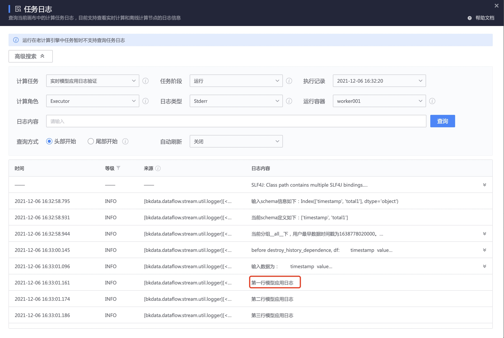

# 查看模型应用打点数据和日志

## 查看模型应用打点数据

在模型应用的数据开发任务中，点击工具栏的 ` 数据流监控 ` ，可以查看模型应用的打点数据。


将光标移动到模型应用节点，可以查看这个节点的数据量趋势


如果是实时模型，可以查看计算延迟。

> 上图示例中对模型应用节点的资源扩容后，计算延迟从 20 分钟下降到 3 分钟.


如果是离线模型，可以查看最近的执行记录。


## 查看模型应用日志
在模型应用的数据开发任务中，点击工具栏的 ` 任务日志 ` ，可以查看模型应用的运行日志。

任务日志是数据开发任务的通用能力，详细帮助请参考 [计算任务日志查看](../../dataflow/tasklog.md)，以下是模型应用节点的使用差异：

- 执行记录  ：` 实时模型 ` 显示为模型应用节点的启动时间，` 离线模型 ` 可以选择最近的执行记录
- 日志类型：选择 Stderr(因框架限制)


模型应用节点默认会输出如上图所示的通用日志，如果想主动输出自定义日志，可在算法中可以通过 `log_in_serving` 打印。


```python
# -*- coding:utf-8 -*-

import logging  ## 实验内日志
from aiops.logic.toolkit.logger import log_in_serving ## 模型应用日志

# 可通过此 logger 打印实验内日志
logger = logging.getLogger('ai_ops.serving')

def fit(dataframe, dataframe_schema, **kwargs):
    ...
    ## 打印实验内日志
    logger.info(f'第一行实验内 fit 日志')
    ...
    
def predict(dataframe, dataframe_schema, model, **kwargs):
    ...
    ## 打印实验内日志
    logger.info(f'第一行实验内 predict 日志')
    
    ## 打印模型应用日志
    log_in_serving('第一行模型应用日志', level=logging.INFO)
    ...    
```

以下是通过 `log_in_serving` 打印日志的效果：



