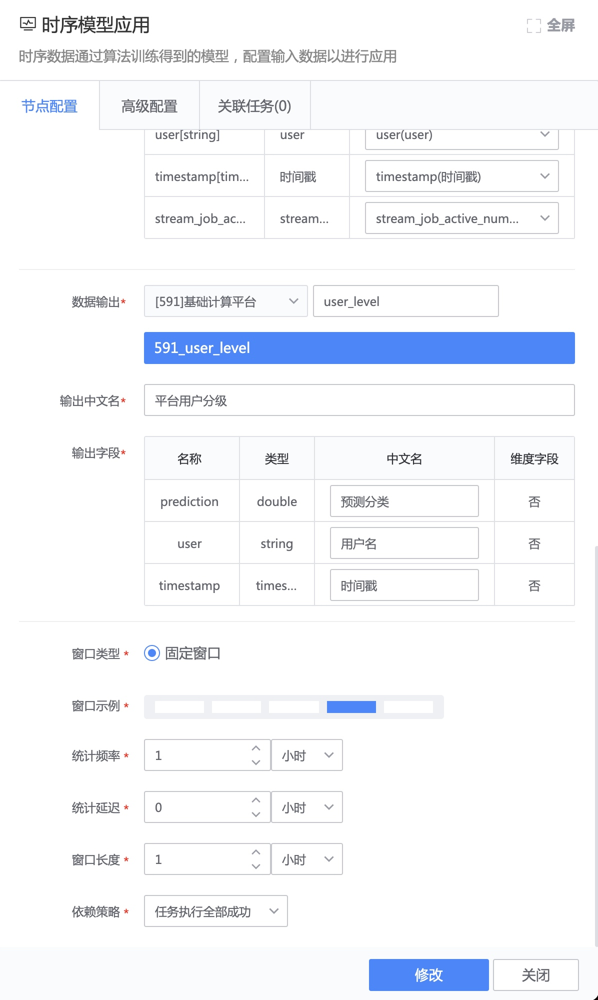

# 模型应用
模型应用是将已发布的 ` 线上版 ` 模型在数据开发任务中作为 ` 时序模型应用 ` 节点，提供模型预测服务。

该模型应用方法的请求输入是结果表，如果希望蓝鲸应用直接用 API 来请求模型服务，请使用 [模型 API 应用](./api_serving.md)

## 添加数据源
在 [数据开发任务](../../dataflow/ide/concepts.md) 中，为时序模型应用节点添加数据源，支持 [实时数据源](csource/stream-source.md)、[离线数据源](../../dataflow/components/source/batch-source.md)。

## 添加时序模型应用节点
接下来添加 ` 时序模型应用 ` 节点，将数据源连线至该节点，双击该节点，选择 [已发布的模型](../release.md)。
> 可选模型范围：该项目下的模型、应用权限为公开的模型。如无，可按项目 [申请模型的应用权限](./apply_permission.md)。

接下来，完成数据输入的字段映射。如果模型输入字段和数据源保持一致，则会自动映射。

填写输出结果表的名称，保存该节点。

在模型应用节点后连一个 [数据存储](../../dataflow/components/storage/tspider.md)，然后启动数据开发任务，即可完成模型应用。

## 特性介绍
### 调度模式
模型应用节点的调度模式取决于所连接数据源类型。
- [实时数据源](../../dataflow/components/source/stream-source.md)：模型应用节点将以 ` 实时计算（无窗口）` 进行调度。
- [离线数据源](../../dataflow/components/source/batch-source.md)：模型应用节点将以 ` 离线计算（固定窗口）` 进行调度。

### 更新通知：有新的模型版本时，以邮件通知

模型应用如果开启 ` 更新通知 `，则模型有可用更新时，会以邮件方式通知模型应用者。

### 自动更新：有新的模型版本时，自动应用最新模型

模型应用如果开启 ` 自动更新 `，则有新的模型版本时，会自动应用最新版本的模型。

更新时间默认为 ` 立即更新 `，当然也可以 ` 延迟至指定时间 ` 再应用最新模型。

### 分组应用：按照分组字段值分别应用模型

#### 分组训练模型分组应用
开启 [分组训练](../experiment/partition_model.md) 的模型背后不是一个模型，而是每条曲线都训练了一个模型。

对于分组模型，在应用时开启 ` 分组应用 `，选择分组字段（该分组字段名与训练该分组模型所使用的样本集的分组字段名保持一致）完成分组模型应用。

开启分组应用后，模型应用时数据源中的每条曲线通过 ` 结果表名 - 分组字段名 ` 将匹配与之对应的分组模型。

> 注：对于新应用的结果表（未参与训练），开启 ` 反馈数据：自动将应用数据添加至样本集 ` 特性后，则在持续训练后会产生与之对应的分组模型，之后再提供预测服务；

举个例子，一个业务有一个结果表是 100 台服务器的 CPU 使用率，分组字段是服务器 IP，模型在应用的时候，每条曲线（这个结果表中每个 IP 的 CPU 使用率）都会找到同名的模型。

#### 未分组训练模型分组应用
如果模型训练时未开启 [分组训练](../experiment/partition_model.md)，模型应用时数据源带有分组字段（比如服务器 IP），也可以开启分组应用。

举个例子，数据源是 100 台服务器的 CPU 使用率，分组字段是服务器 IP，模型在应用的时候，每条曲线（即每个 IP 的 CPU 使用率）都将分别（即互不影响）作为同一个模型的数据输入。

### 反馈数据：自动将应用数据添加至样本集
模型应用如果开启 ` 反馈数据 `，则模型应用输入的数据将自动添加至训练该模型的样本集。

