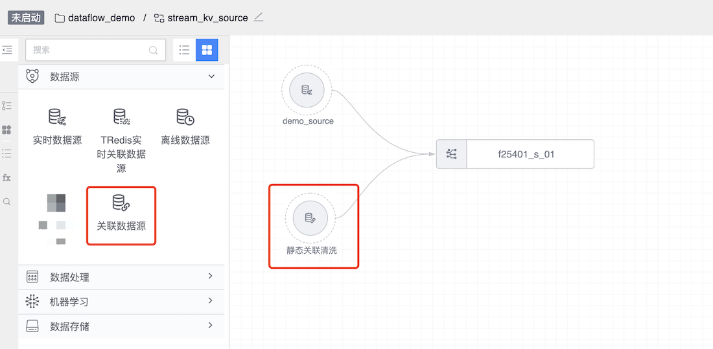
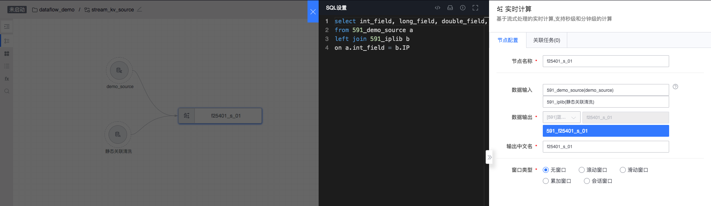
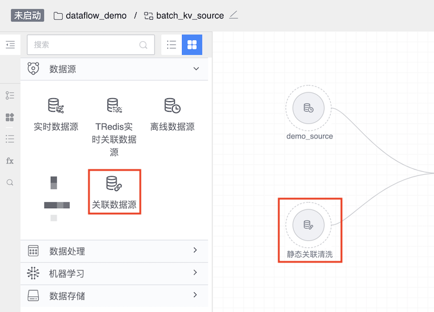

# 关联数据源

## 实时关联数据

实时关联数据支持一个实时动态数据与一个静态（更新不频繁）的关联计算。

图例，关联数据

#### 实时关联数据的来源
- 数据处理节点若下游接入 Ignite，其产生的结果表可作为关联数据
- 平台自身提供的公共关联数据，例如：cc 转换，ip 转化等
- 可通过平台数据集成中关联数据接入业务自己的关联数据集，具体操作请参照关联数据接入

#### 使用方式
实时关联数据是以一个数据节点的方式在数据开发中存在的。将关联数据拖拽到画板上就可以，选择相关的结果表，关联数据的使用规则：

- 使用关联数据节点时画板上一定要有一个 "实时数据" 节点和一个 "实时计算" 节点
- 关联数据与实时数据节点进行关联计算
- 关联数据与实时计算节点进行关联计算
- 一个"实时计算"节点可以关联多个"关联数据"节点
- 关联的 JOIN 语句左表为实时数据，右表为关联数据源

列举一个使用关联数据的案例：

选择关联数据节点之后，双击点击编辑，首先选择关联的数据集，如果你没有你想要的数据可以申请数据源。关联数据作为数据开发的开始节点，不存在上游节点。

#### 实时关联数据可以连接的子节点类型
- 实时计算

## 离线关联数据

离线关联数据支持一个离线数据源/离线计算与一个关联数据源（更新不频繁）的关联计算，这也是最常用的使用场景。

图例，关联数据

#### 离线关联数据的来源
- 数据处理节点若下游接入 Ignite，其产生的结果表可作为关联数据

#### 使用方式
离线关联数据是以一个数据节点的方式在数据开发中存在的。将关联数据拖拽到画板上就可以，选择相关的结果表，关联数据的使用规则：

- 关联数据与离线数据进行关联计算
- 关联数据直接连接下游离线计算

列举一个使用关联数据的案例：

选择关联数据节点之后，双击点击编辑，首先选择关联的数据集，如果你没有你想要的数据可以申请数据源。关联数据作为数据开发的开始节点，不存在上游节点。

#### 离线关联数据可以连接的子节点类型
- 离线计算
