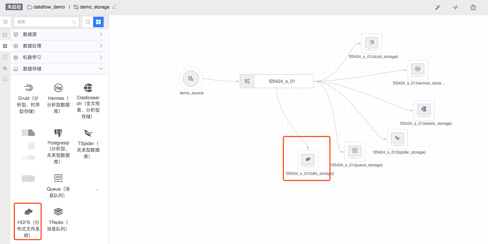
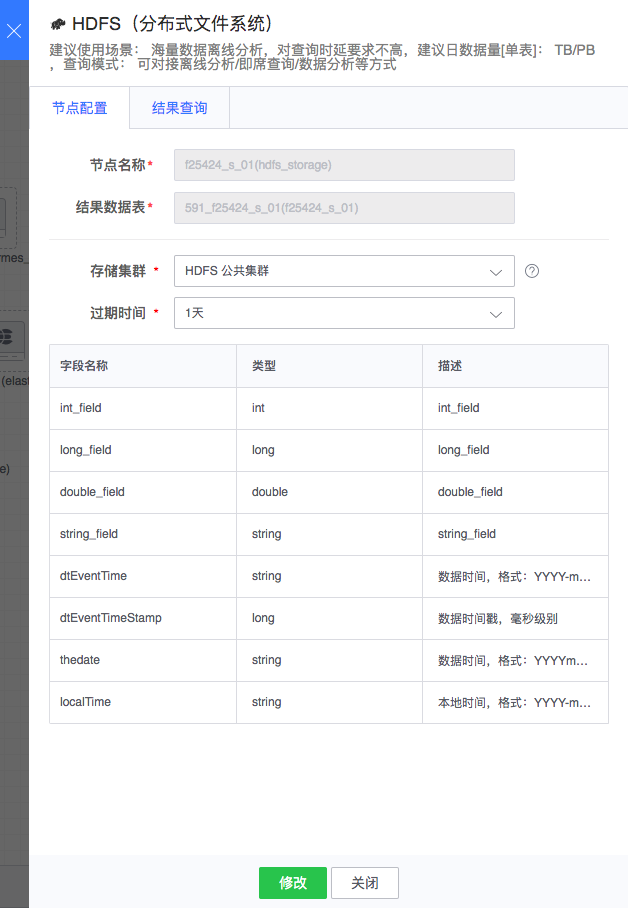

# HDFS

数据处理节点可以选择性地为其下游增加离线存储节点，若选择 HDFS 存储节点，计算输出的结果数据就会落一份在 HDFS 上。

离线计算的传递媒介为 HDFS，因此，其它数据处理类型需将计算输出的结果数据存入 HDFS ，离线计算才可从 HDFS 将数据取出，进行周期计算并输出周期内的结果数据。

图例，HDFS 节点

#### 节点配置
- 节点名称： 自动生成，由上游结果表和当前节点类型组成
- 结果数据表：从上游节点继承过来
- 存储集群：通常可选有默认集群组集群，其它可选集群与任务所属项目相关
- 过期时间：数据入库后保存的过期时间

配置例子如下：

对于运行中的任务，双击节点后，在数据查询标签页可对 HDFS 中的数据进行查询：

