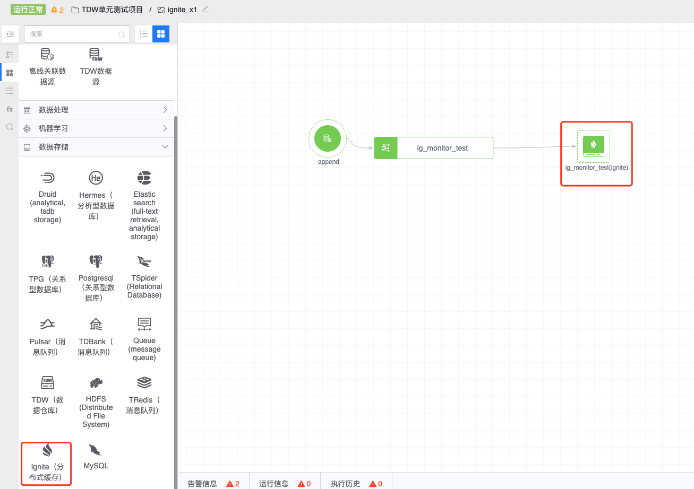
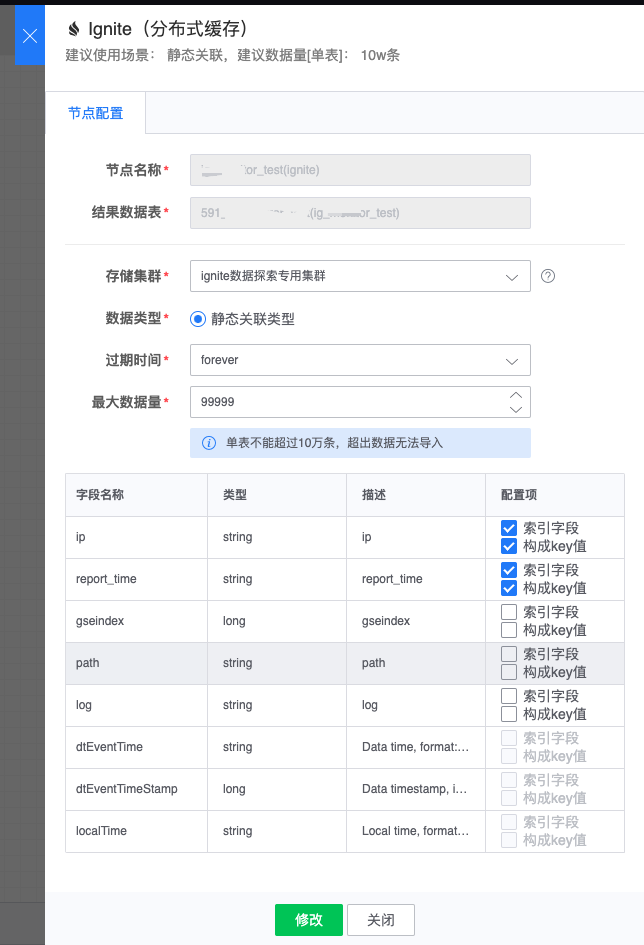

# Ignite

可以为数据节点配置 Ignite 下游节点，可将计算结果数据导入 Ignite 系统中，从而支持分布式内存数据库功能，并提供 SQL 访问接口。

图例，Ignite 节点

#### 节点配置
- 节点名称： 自动生成，由上游结果表和当前节点类型组成
- 结果数据表：从上游节点继承过来
- 存储集群：通常可选有默认集群组集群，其它可选集群与任务所属项目相关
- 过期时间：数据入库后保存的过期时间
- 最大数据量：配置允许的最大数据量

配置例子如下：

