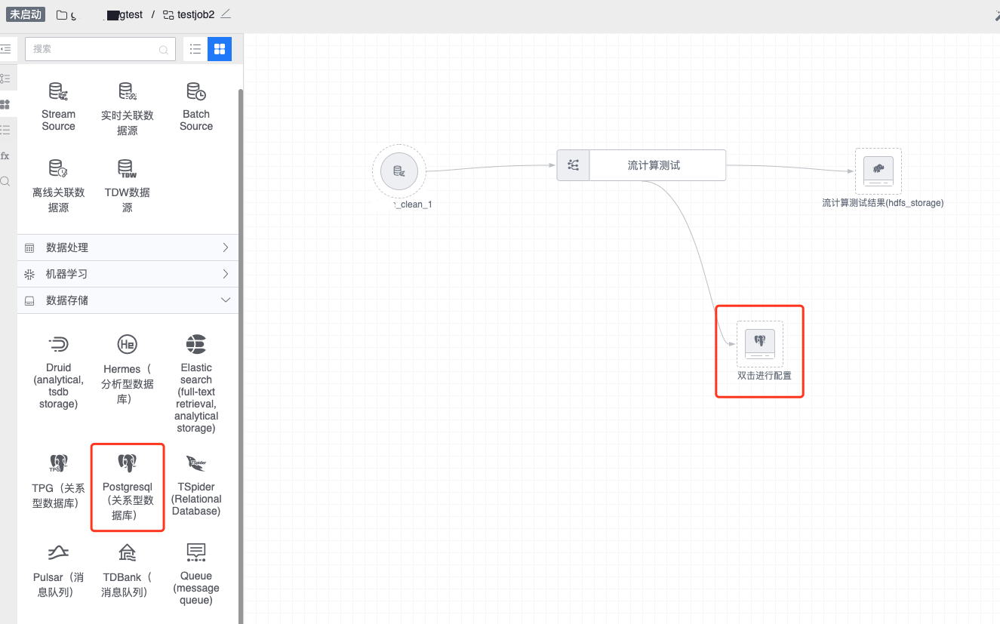
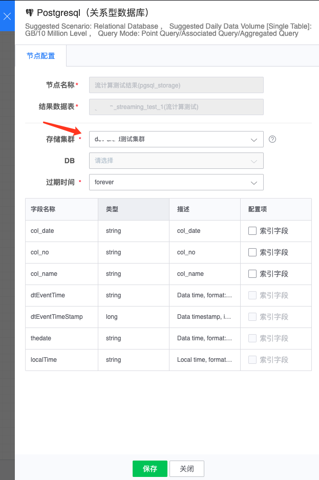

# PostgreSQL

通过为数据处理配置 PostgreSQL 下游节点，可将计算结果数据导入 PostgreSQL 系统中，从而支持关系型数据库的各种分析操作。

图例，PostgreSQL 节点

#### 节点配置
- 节点名称： 自动生成，由上游结果表和当前节点类型组成
- 结果数据表：从上游节点继承过来
- 存储集群：通常可选有默认集群组集群，其它可选集群与任务所属项目相关
- 过期时间：数据入库后保存的过期时间， PostgreSQL 只支持永久保存

配置例子如下：

